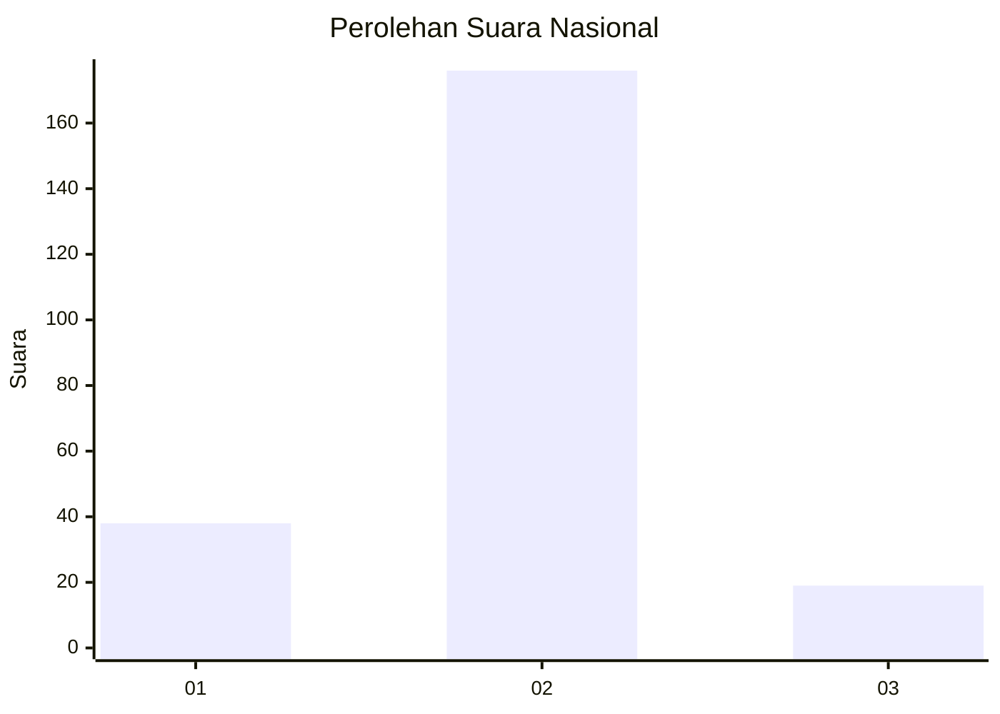
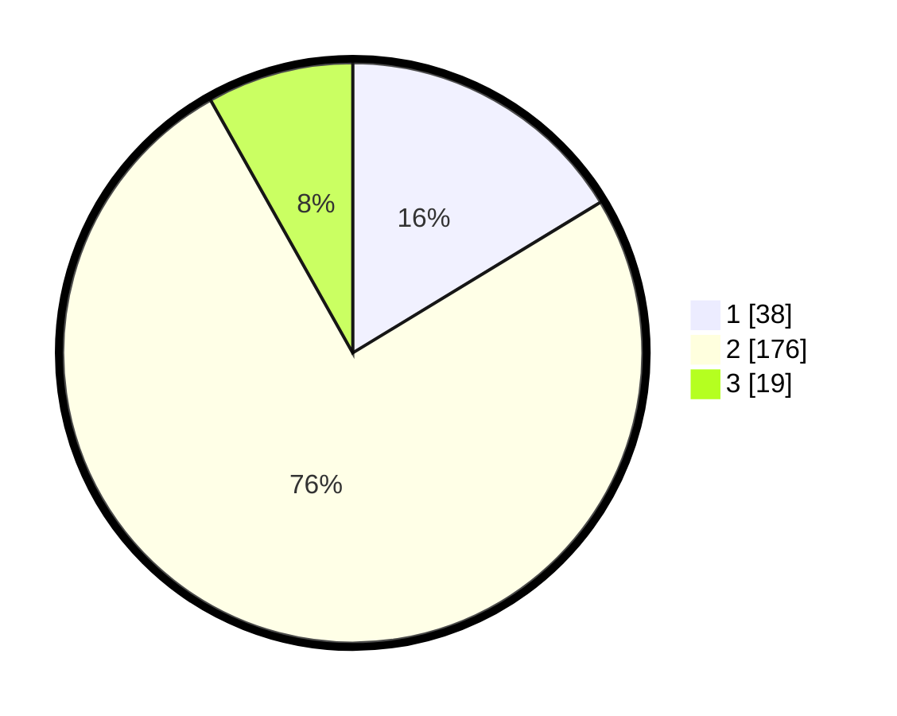

# Hasil

## Grafik

## Tabel

| No. | Nama Paslon    | Suara | Suara (raw) | Persentase |
|:--- |:-------------- | -----:| -----------:| ----------:|
| 1   | ANIES MUHAIMIN | 38    | [38][p-1]   | 16,31      |
| 2   | PRABOWO GIBRAN | 176   | [176][p-2]  | 75,54      |
| 3   | GANJAR MAHFUD  | 19    | [19][p-3]   | 8,15       |

[p-1]: https://github.com/gigit-pemilu/pemilu-2024/blob/main/pilpres/hitung-suara/sub/16-sumatera-selatan/sub/03-muara-enim/sub/23-belimbing/sub/2001-tanjung/sub/001-tps/sub/paslon-1.txt
[p-2]: https://github.com/gigit-pemilu/pemilu-2024/blob/main/pilpres/hitung-suara/sub/16-sumatera-selatan/sub/03-muara-enim/sub/23-belimbing/sub/2001-tanjung/sub/001-tps/sub/paslon-2.txt
[p-3]: https://github.com/gigit-pemilu/pemilu-2024/blob/main/pilpres/hitung-suara/sub/16-sumatera-selatan/sub/03-muara-enim/sub/23-belimbing/sub/2001-tanjung/sub/001-tps/sub/paslon-3.txt

## Foto C Plano

https://sirekap-obj-formc.kpu.go.id/8387/pemilu/ppwp/16/03/23/20/01/1603232001001-20240219-164830--1827da30-b9d9-4d12-8981-6b5121bec873.jpg

https://sirekap-obj-formc.kpu.go.id/8387/pemilu/ppwp/16/03/23/20/01/1603232001001-20240219-164935--93dfb129-103d-4468-b006-acc36f9d0f92.jpg

https://sirekap-obj-formc.kpu.go.id/8387/pemilu/ppwp/16/03/23/20/01/1603232001001-20240219-165027--c6b8b32d-2f6b-4461-81e1-55f4b0fcacc4.jpg

## Metadata

| Key        | Value               |
| ---------- | ------------------- |
| Time Stamp | 2024-02-24 22:31:28 |

