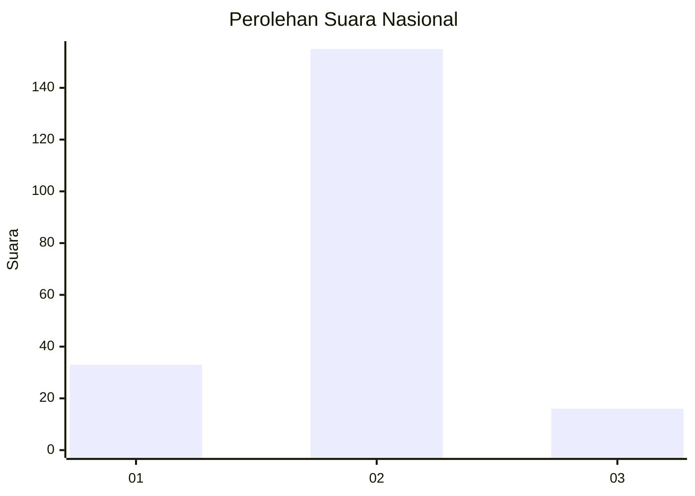
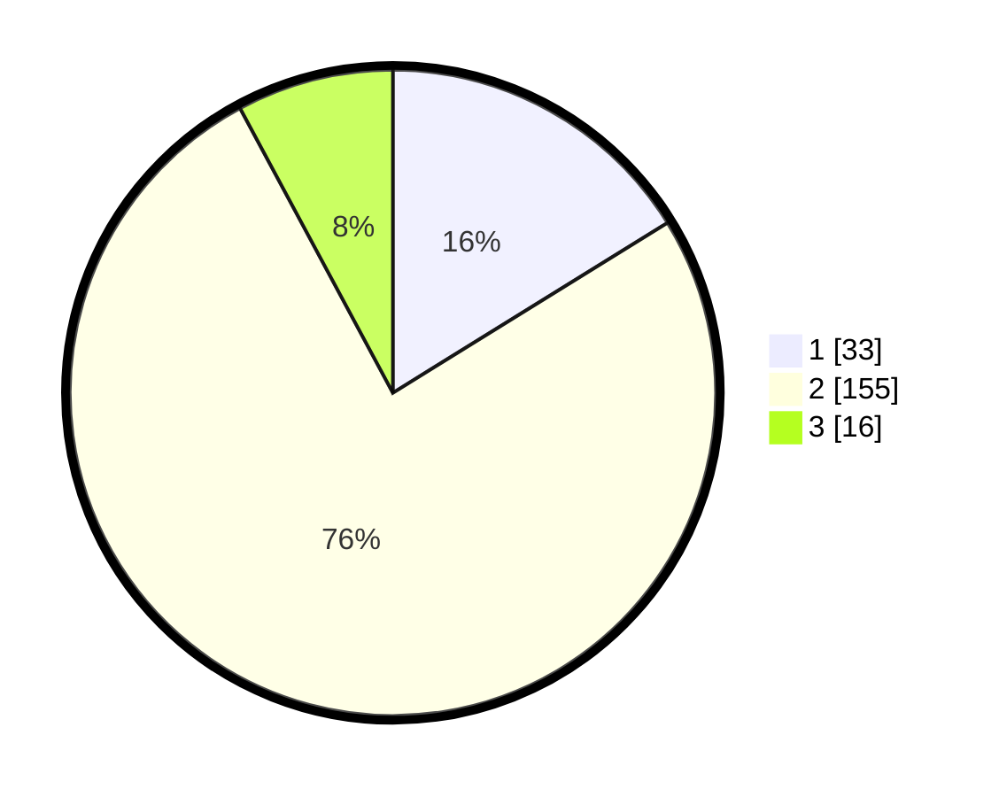

# Hasil

## Grafik

## Tabel

| No. | Nama Paslon    | Suara | Suara (raw) | Persentase |
|:--- |:-------------- | -----:| -----------:| ----------:|
| 1   | ANIES MUHAIMIN | 33    | [33][p-1]   | 16,18      |
| 2   | PRABOWO GIBRAN | 155   | [155][p-2]  | 75,98      |
| 3   | GANJAR MAHFUD  | 16    | [16][p-3]   | 7,84       |

[p-1]: https://github.com/gigit-pemilu/pemilu-2024/blob/main/pilpres/hitung-suara/sub/16-sumatera-selatan/sub/03-muara-enim/sub/23-belimbing/sub/2001-tanjung/sub/004-tps/sub/paslon-1.txt
[p-2]: https://github.com/gigit-pemilu/pemilu-2024/blob/main/pilpres/hitung-suara/sub/16-sumatera-selatan/sub/03-muara-enim/sub/23-belimbing/sub/2001-tanjung/sub/004-tps/sub/paslon-2.txt
[p-3]: https://github.com/gigit-pemilu/pemilu-2024/blob/main/pilpres/hitung-suara/sub/16-sumatera-selatan/sub/03-muara-enim/sub/23-belimbing/sub/2001-tanjung/sub/004-tps/sub/paslon-3.txt

## Foto C Plano

https://sirekap-obj-formc.kpu.go.id/dd19/pemilu/ppwp/16/03/23/20/01/1603232001004-20240219-225510--0efacaa0-fe6a-4177-bb38-a9201e223c57.jpg

https://sirekap-obj-formc.kpu.go.id/dd19/pemilu/ppwp/16/03/23/20/01/1603232001004-20240219-225619--7613e4e8-4c3f-4342-b953-ef2666775d6e.jpg

https://sirekap-obj-formc.kpu.go.id/dd19/pemilu/ppwp/16/03/23/20/01/1603232001004-20240219-225729--574b594a-a04e-4845-b8bb-6a7d345e2dc3.jpg

## Metadata

| Key        | Value               |
| ---------- | ------------------- |
| Time Stamp | 2024-02-24 22:31:28 |

