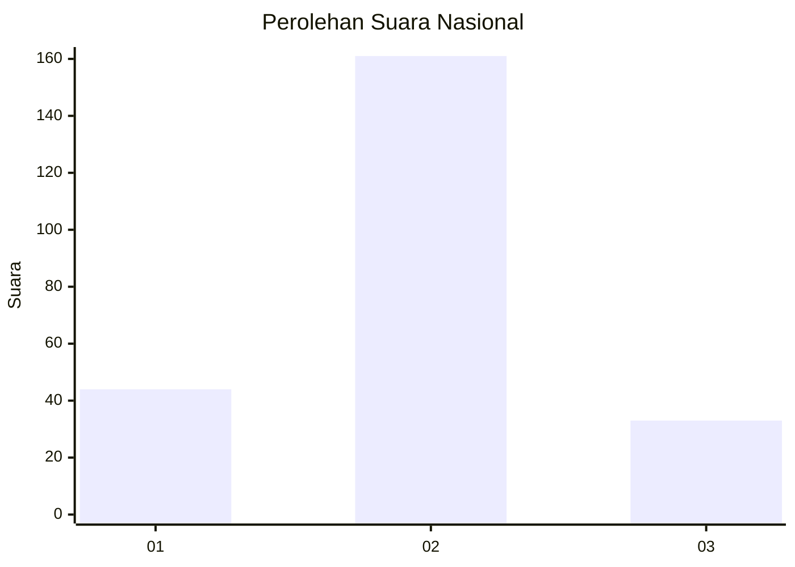
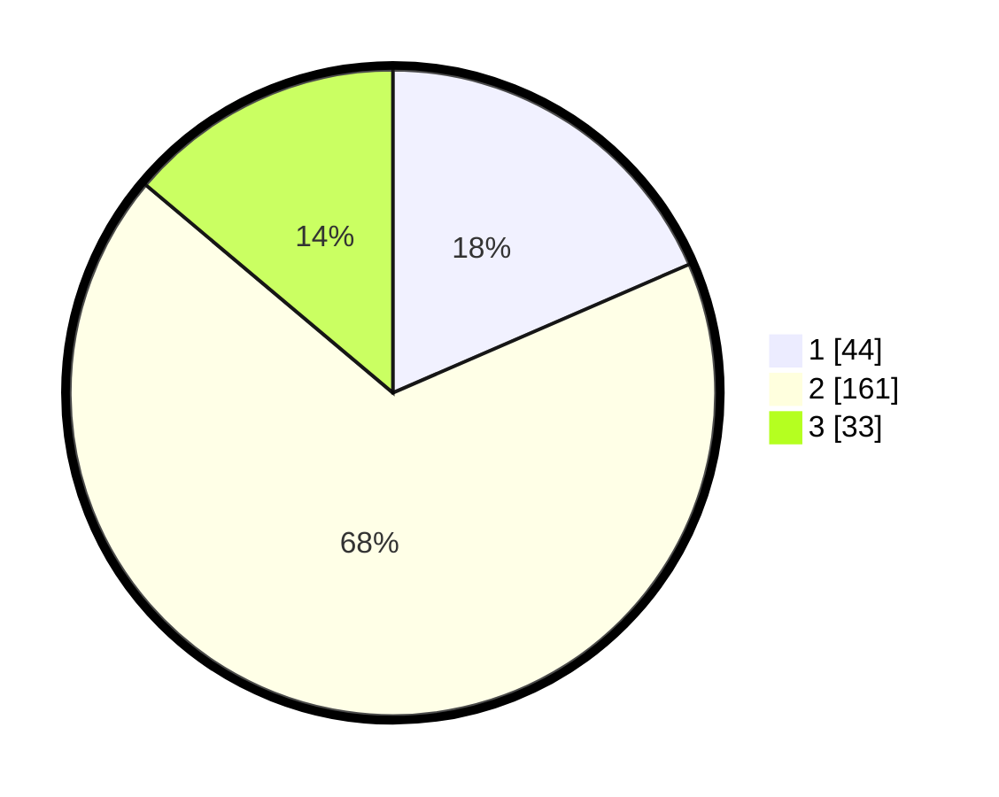

# Hasil

## Grafik

## Tabel

| No. | Nama Paslon    | Suara | Suara (raw) | Persentase |
|:--- |:-------------- | -----:| -----------:| ----------:|
| 1   | ANIES MUHAIMIN | 44    | [44][p-1]   | 18,49      |
| 2   | PRABOWO GIBRAN | 161   | [161][p-2]  | 67,65      |
| 3   | GANJAR MAHFUD  | 33    | [33][p-3]   | 13,87      |

[p-1]: https://github.com/gigit-pemilu/pemilu-2024/blob/main/pilpres/hitung-suara/sub/16-sumatera-selatan/sub/03-muara-enim/sub/23-belimbing/sub/2004-teluk-lubuk/sub/005-tps/sub/paslon-1.txt
[p-2]: https://github.com/gigit-pemilu/pemilu-2024/blob/main/pilpres/hitung-suara/sub/16-sumatera-selatan/sub/03-muara-enim/sub/23-belimbing/sub/2004-teluk-lubuk/sub/005-tps/sub/paslon-2.txt
[p-3]: https://github.com/gigit-pemilu/pemilu-2024/blob/main/pilpres/hitung-suara/sub/16-sumatera-selatan/sub/03-muara-enim/sub/23-belimbing/sub/2004-teluk-lubuk/sub/005-tps/sub/paslon-3.txt

## Foto C Plano

https://sirekap-obj-formc.kpu.go.id/edd1/pemilu/ppwp/16/03/23/20/04/1603232004005-20240218-225535--a6de2b72-bfd0-4341-aa54-0dda2ce82641.jpg

https://sirekap-obj-formc.kpu.go.id/edd1/pemilu/ppwp/16/03/23/20/04/1603232004005-20240218-225522--9de302d4-68ff-4552-9cd0-143beb03e34b.jpg

https://sirekap-obj-formc.kpu.go.id/edd1/pemilu/ppwp/16/03/23/20/04/1603232004005-20240218-225824--2d7fc48d-cf98-4eb1-bed1-fb2b17d1df77.jpg

## Metadata

| Key        | Value               |
| ---------- | ------------------- |
| Time Stamp | 2024-02-25 12:00:00 |

