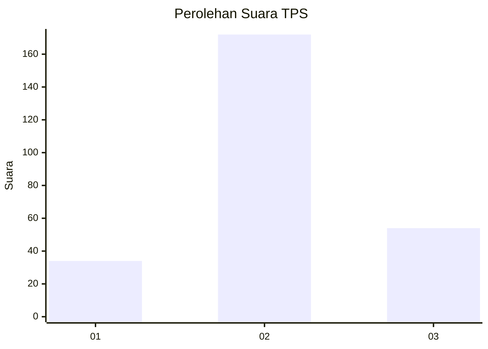
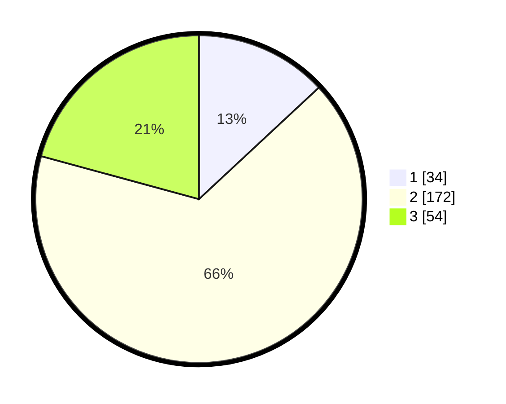

# Hasil

## Grafik

## Tabel

| No. | Nama Paslon    | Suara | Suara (raw) | Persentase |
|:--- |:-------------- | -----:| -----------:| ----------:|
| 1   | ANIES MUHAIMIN | 34    | [34][p-1]   | 13,08      |
| 2   | PRABOWO GIBRAN | 172   | [172][p-2]  | 66,15      |
| 3   | GANJAR MAHFUD  | 54    | [54][p-3]   | 20,77      |

[p-1]: https://github.com/gigit-pemilu/pemilu-2024-16-sumatera-selatan/blob/main/pilpres/hitung-suara/sub/16-sumatera-selatan/sub/03-muara-enim/sub/23-belimbing/sub/2004-teluk-lubuk/sub/008-tps/sub/paslon-1.txt
[p-2]: https://github.com/gigit-pemilu/pemilu-2024-16-sumatera-selatan/blob/main/pilpres/hitung-suara/sub/16-sumatera-selatan/sub/03-muara-enim/sub/23-belimbing/sub/2004-teluk-lubuk/sub/008-tps/sub/paslon-2.txt
[p-3]: https://github.com/gigit-pemilu/pemilu-2024-16-sumatera-selatan/blob/main/pilpres/hitung-suara/sub/16-sumatera-selatan/sub/03-muara-enim/sub/23-belimbing/sub/2004-teluk-lubuk/sub/008-tps/sub/paslon-3.txt

## Foto C Plano

https://sirekap-obj-formc.kpu.go.id/4592/pemilu/ppwp/16/03/23/20/04/1603232004008-20240219-201316--719077aa-e031-4489-bef1-4f6d71627759.jpg

https://sirekap-obj-formc.kpu.go.id/4592/pemilu/ppwp/16/03/23/20/04/1603232004008-20240219-201015--c4cf7a05-0822-4da6-bb3a-2e424cf95ec9.jpg

https://sirekap-obj-formc.kpu.go.id/4592/pemilu/ppwp/16/03/23/20/04/1603232004008-20240219-201103--c184be0e-0213-430f-a40d-516edd33dfb8.jpg

## Metadata

| Key        | Value               |
| ---------- | ------------------- |
| Time Stamp | 2024-02-24 22:31:28 |

