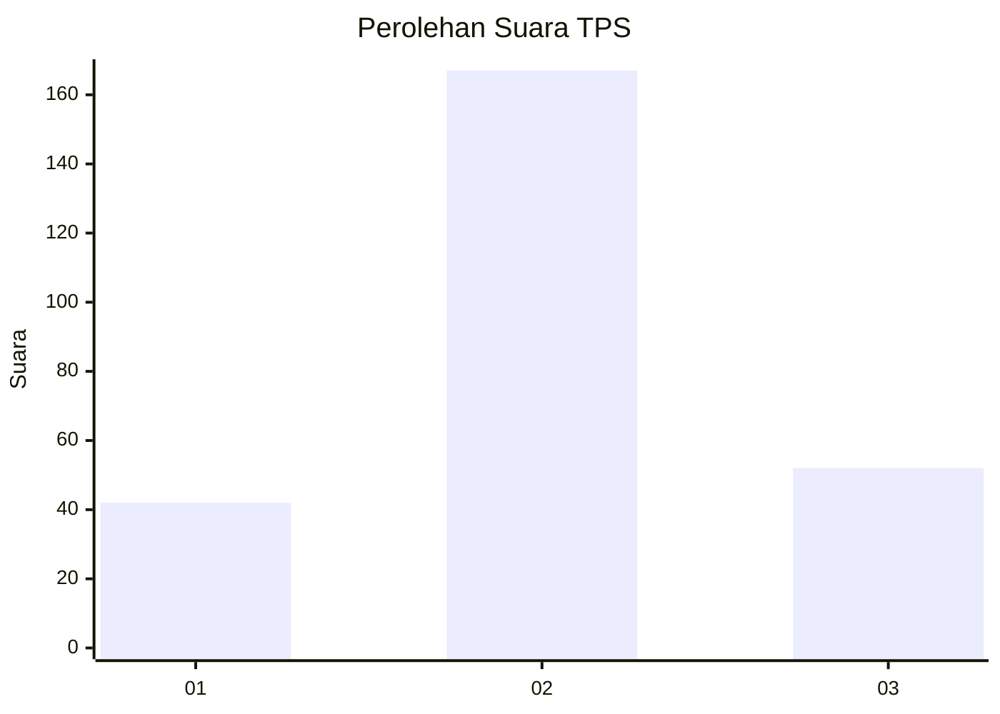
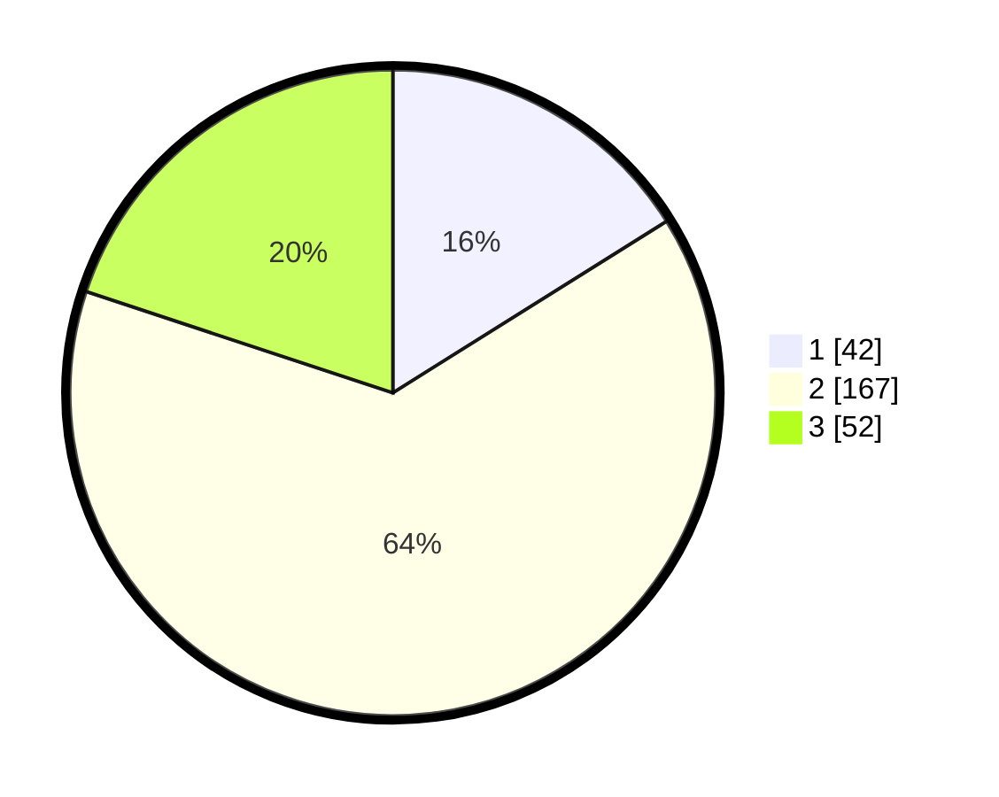

# Hasil

## Grafik

## Tabel

| No. | Nama Paslon    | Suara | Suara (raw) | Persentase |
|:--- |:-------------- | -----:| -----------:| ----------:|
| 1   | ANIES MUHAIMIN | 42    | [42][p-1]   | 16,09      |
| 2   | PRABOWO GIBRAN | 167   | [167][p-2]  | 63,98      |
| 3   | GANJAR MAHFUD  | 52    | [52][p-3]   | 19,92      |

[p-1]: https://github.com/gigit-pemilu/pemilu-2024-16-sumatera-selatan/blob/main/pilpres/hitung-suara/sub/16-sumatera-selatan/sub/03-muara-enim/sub/23-belimbing/sub/2004-teluk-lubuk/sub/011-tps/sub/paslon-1.txt
[p-2]: https://github.com/gigit-pemilu/pemilu-2024-16-sumatera-selatan/blob/main/pilpres/hitung-suara/sub/16-sumatera-selatan/sub/03-muara-enim/sub/23-belimbing/sub/2004-teluk-lubuk/sub/011-tps/sub/paslon-2.txt
[p-3]: https://github.com/gigit-pemilu/pemilu-2024-16-sumatera-selatan/blob/main/pilpres/hitung-suara/sub/16-sumatera-selatan/sub/03-muara-enim/sub/23-belimbing/sub/2004-teluk-lubuk/sub/011-tps/sub/paslon-3.txt

## Foto C Plano

https://sirekap-obj-formc.kpu.go.id/2d93/pemilu/ppwp/16/03/23/20/04/1603232004011-20240219-101214--6dd7e21c-b13f-4843-ba62-1fd543d69bbc.jpg

https://sirekap-obj-formc.kpu.go.id/2d93/pemilu/ppwp/16/03/23/20/04/1603232004011-20240219-101245--64f65e5f-2831-48f5-8258-cc73ed5235fc.jpg

https://sirekap-obj-formc.kpu.go.id/2d93/pemilu/ppwp/16/03/23/20/04/1603232004011-20240219-101322--d4faba79-8b3f-442b-bfbe-6c36327c9535.jpg

## Metadata

| Key        | Value               |
| ---------- | ------------------- |
| Time Stamp | 2024-02-25 11:00:00 |

