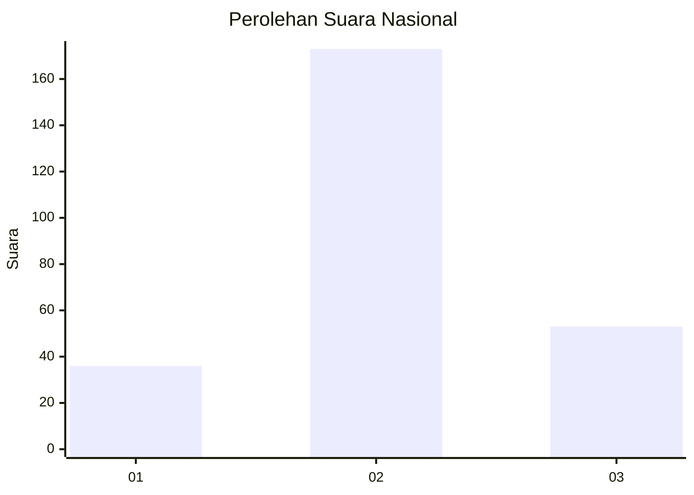
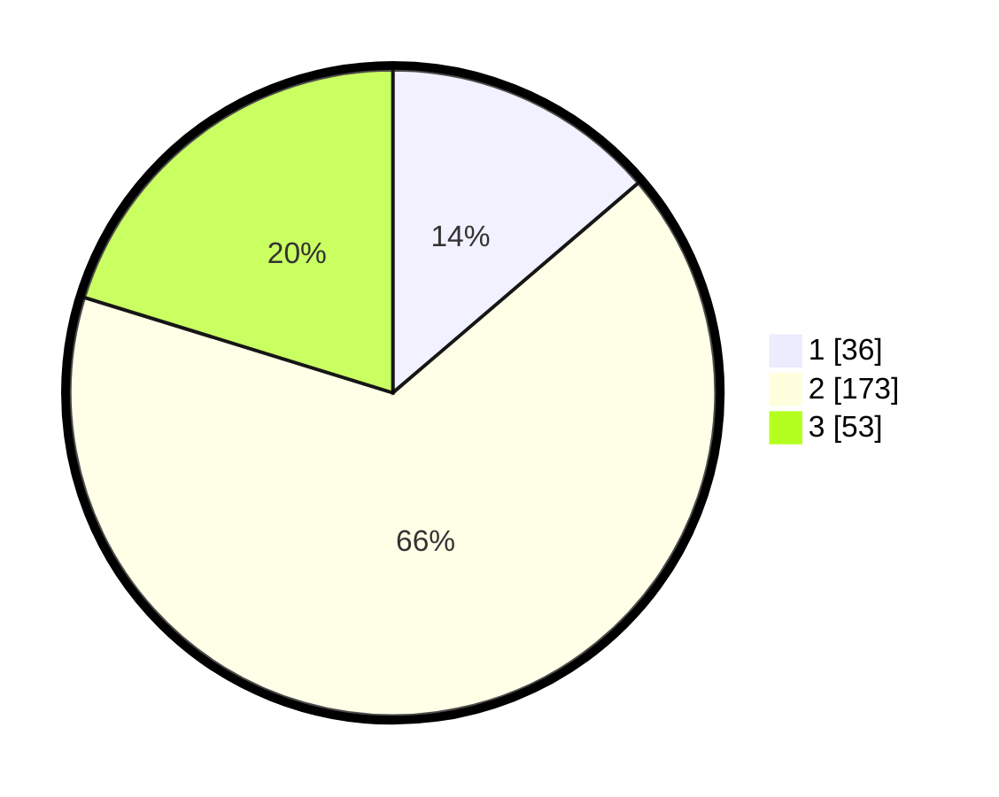

# Hasil

## Grafik

## Tabel

| No. | Nama Paslon    | Suara | Suara (raw) | Persentase |
|:--- |:-------------- | -----:| -----------:| ----------:|
| 1   | ANIES MUHAIMIN | 36    | [36][p-1]   | 13,74      |
| 2   | PRABOWO GIBRAN | 173   | [173][p-2]  | 66,03      |
| 3   | GANJAR MAHFUD  | 53    | [53][p-3]   | 20,23      |

[p-1]: https://github.com/gigit-pemilu/pemilu-2024/blob/main/pilpres/hitung-suara/sub/16-sumatera-selatan/sub/03-muara-enim/sub/23-belimbing/sub/2004-teluk-lubuk/sub/012-tps/sub/paslon-1.txt
[p-2]: https://github.com/gigit-pemilu/pemilu-2024/blob/main/pilpres/hitung-suara/sub/16-sumatera-selatan/sub/03-muara-enim/sub/23-belimbing/sub/2004-teluk-lubuk/sub/012-tps/sub/paslon-2.txt
[p-3]: https://github.com/gigit-pemilu/pemilu-2024/blob/main/pilpres/hitung-suara/sub/16-sumatera-selatan/sub/03-muara-enim/sub/23-belimbing/sub/2004-teluk-lubuk/sub/012-tps/sub/paslon-3.txt

## Foto C Plano

https://sirekap-obj-formc.kpu.go.id/9925/pemilu/ppwp/16/03/23/20/04/1603232004012-20240219-132512--f69c6f86-f087-4438-a30c-f0f1fad4200f.jpg

https://sirekap-obj-formc.kpu.go.id/9925/pemilu/ppwp/16/03/23/20/04/1603232004012-20240219-132325--c653ae89-eaca-4cc2-aa2f-76722e3b2320.jpg

https://sirekap-obj-formc.kpu.go.id/9925/pemilu/ppwp/16/03/23/20/04/1603232004012-20240219-132424--78a7c75d-0bd5-48b6-9cb3-612d2bf615ee.jpg

## Metadata

| Key        | Value               |
| ---------- | ------------------- |
| Time Stamp | 2024-02-25 16:00:00 |

