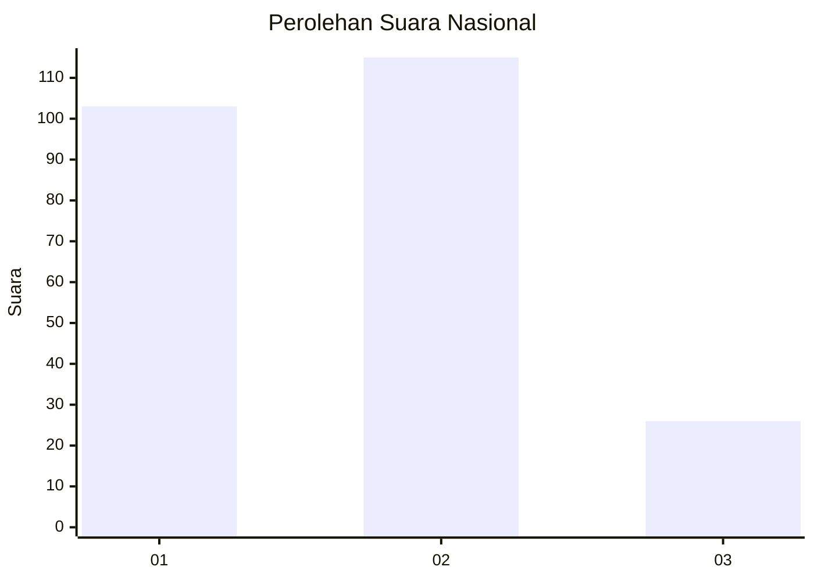
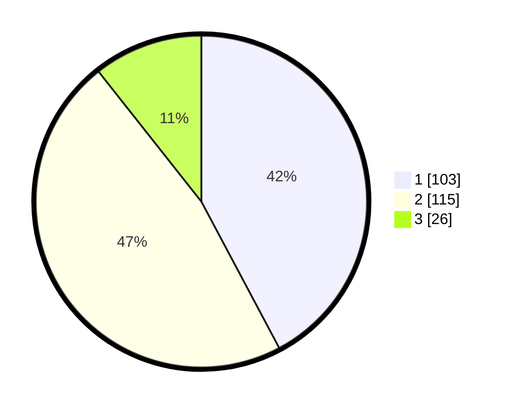

# Hasil

## Grafik

## Tabel

| No. | Nama Paslon    | Suara | Suara (raw) | Persentase |
|:--- |:-------------- | -----:| -----------:| ----------:|
| 1   | ANIES MUHAIMIN | 103   | [103][p-1]  | 42,21      |
| 2   | PRABOWO GIBRAN | 115   | [115][p-2]  | 47,13      |
| 3   | GANJAR MAHFUD  | 26    | [26][p-3]   | 10,66      |

[p-1]: https://github.com/gigit-pemilu/pemilu-2024/blob/main/pilpres/hitung-suara/sub/16-sumatera-selatan/sub/03-muara-enim/sub/24-belida-darat/sub/2001-tanjung-bunut/sub/002-tps/sub/paslon-1.txt
[p-2]: https://github.com/gigit-pemilu/pemilu-2024/blob/main/pilpres/hitung-suara/sub/16-sumatera-selatan/sub/03-muara-enim/sub/24-belida-darat/sub/2001-tanjung-bunut/sub/002-tps/sub/paslon-2.txt
[p-3]: https://github.com/gigit-pemilu/pemilu-2024/blob/main/pilpres/hitung-suara/sub/16-sumatera-selatan/sub/03-muara-enim/sub/24-belida-darat/sub/2001-tanjung-bunut/sub/002-tps/sub/paslon-3.txt

## Foto C Plano

https://sirekap-obj-formc.kpu.go.id/1f0d/pemilu/ppwp/16/03/24/20/01/1603242001002-20240215-104052--314a1bc3-7954-46b7-9df3-a0ff1a3f8afe.jpg

https://sirekap-obj-formc.kpu.go.id/1f0d/pemilu/ppwp/16/03/24/20/01/1603242001002-20240215-104309--20f57639-c431-4eb3-88ad-cc855f40b8e0.jpg

https://sirekap-obj-formc.kpu.go.id/1f0d/pemilu/ppwp/16/03/24/20/01/1603242001002-20240215-104347--f5db84b7-d707-49e2-a9cc-45eba8ffaa6e.jpg

## Metadata

| Key        | Value               |
| ---------- | ------------------- |
| Time Stamp | 2024-02-15 22:30:27 |

