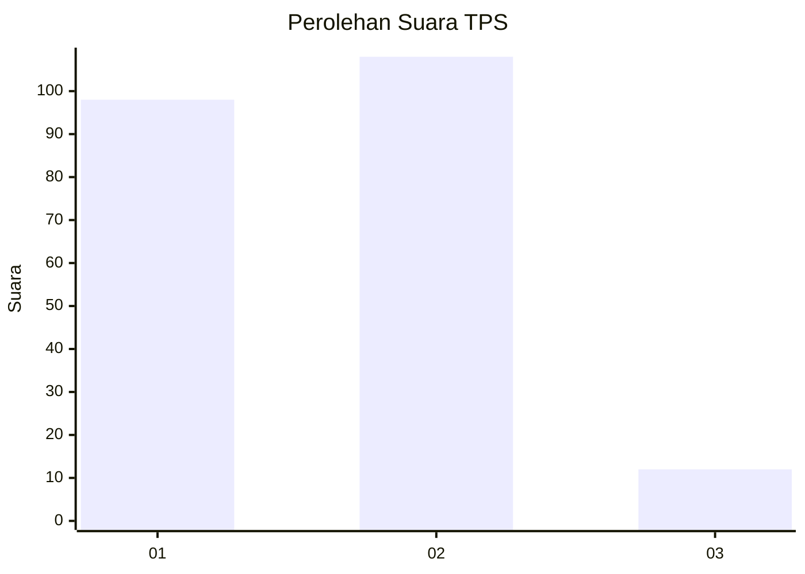
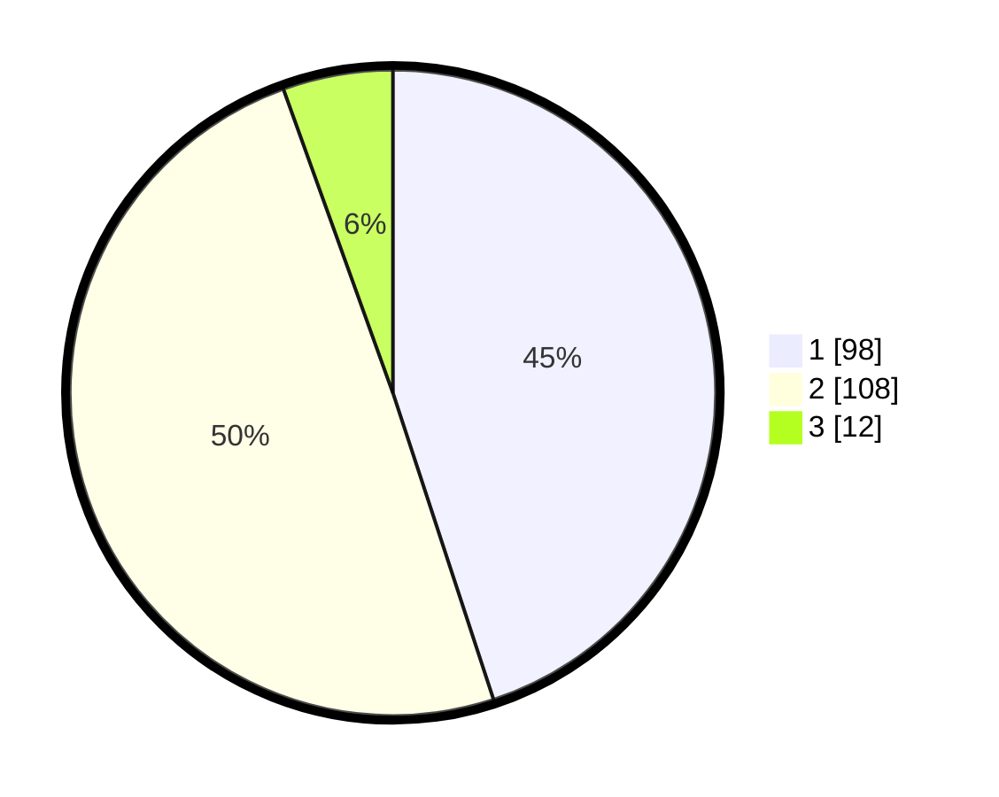

# Hasil

## Grafik

## Tabel

| No. | Nama Paslon    | Suara | Suara (raw) | Persentase |
|:--- |:-------------- | -----:| -----------:| ----------:|
| 1   | ANIES MUHAIMIN | 98    | [98][p-1]   | 44,95      |
| 2   | PRABOWO GIBRAN | 108   | [108][p-2]  | 49,54      |
| 3   | GANJAR MAHFUD  | 12    | [12][p-3]   | 5,50       |

[p-1]: https://github.com/gigit-pemilu/pemilu-2024-16-sumatera-selatan/blob/main/pilpres/hitung-suara/sub/16-sumatera-selatan/sub/03-muara-enim/sub/24-belida-darat/sub/2001-tanjung-bunut/sub/004-tps/sub/paslon-1.txt
[p-2]: https://github.com/gigit-pemilu/pemilu-2024-16-sumatera-selatan/blob/main/pilpres/hitung-suara/sub/16-sumatera-selatan/sub/03-muara-enim/sub/24-belida-darat/sub/2001-tanjung-bunut/sub/004-tps/sub/paslon-2.txt
[p-3]: https://github.com/gigit-pemilu/pemilu-2024-16-sumatera-selatan/blob/main/pilpres/hitung-suara/sub/16-sumatera-selatan/sub/03-muara-enim/sub/24-belida-darat/sub/2001-tanjung-bunut/sub/004-tps/sub/paslon-3.txt

## Foto C Plano

https://sirekap-obj-formc.kpu.go.id/b05a/pemilu/ppwp/16/03/24/20/01/1603242001004-20240215-161544--00551ed2-387d-4f74-b22c-3cc286583b7d.jpg

https://sirekap-obj-formc.kpu.go.id/b05a/pemilu/ppwp/16/03/24/20/01/1603242001004-20240215-161734--40dd22ee-63bd-41b8-bd25-adddf7691dc4.jpg

https://sirekap-obj-formc.kpu.go.id/b05a/pemilu/ppwp/16/03/24/20/01/1603242001004-20240215-162018--fe2feb55-a276-4fe7-bb15-c94f3c083076.jpg

## Metadata

| Key        | Value               |
| ---------- | ------------------- |
| Time Stamp | 2024-02-22 11:00:00 |

