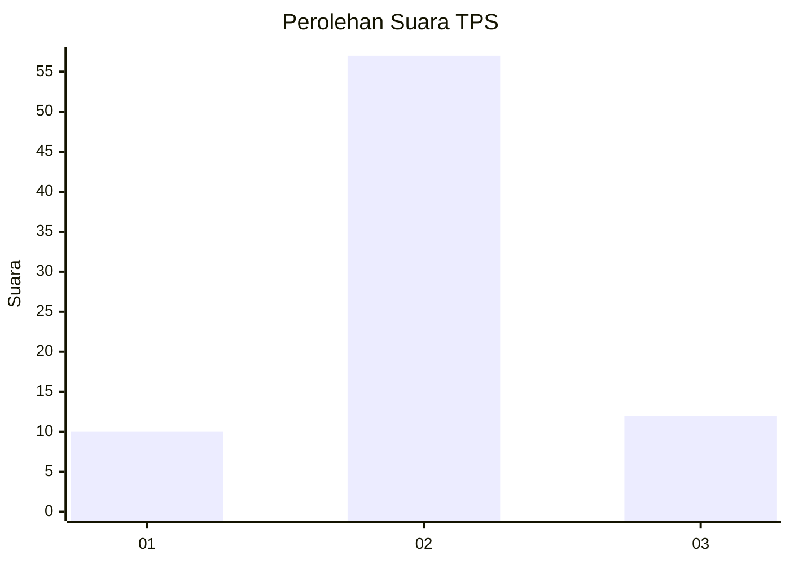
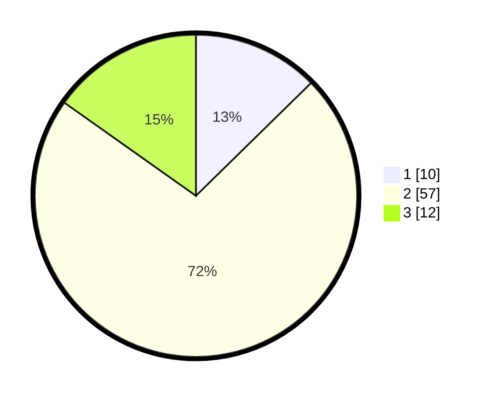

# Hasil

## Grafik

## Tabel

| No. | Nama Paslon    | Suara | Suara (raw) | Persentase |
|:--- |:-------------- | -----:| -----------:| ----------:|
| 1   | ANIES MUHAIMIN | 10    | [10][p-1]   | 12,66      |
| 2   | PRABOWO GIBRAN | 57    | [57][p-2]   | 72,15      |
| 3   | GANJAR MAHFUD  | 12    | [12][p-3]   | 15,19      |

[p-1]: https://github.com/gigit-pemilu/pemilu-2024-16-sumatera-selatan/blob/main/pilpres/hitung-suara/sub/16-sumatera-selatan/sub/03-muara-enim/sub/25-lubai-ulu/sub/2001-karang-agung/sub/001-tps/sub/paslon-1.txt
[p-2]: https://github.com/gigit-pemilu/pemilu-2024-16-sumatera-selatan/blob/main/pilpres/hitung-suara/sub/16-sumatera-selatan/sub/03-muara-enim/sub/25-lubai-ulu/sub/2001-karang-agung/sub/001-tps/sub/paslon-2.txt
[p-3]: https://github.com/gigit-pemilu/pemilu-2024-16-sumatera-selatan/blob/main/pilpres/hitung-suara/sub/16-sumatera-selatan/sub/03-muara-enim/sub/25-lubai-ulu/sub/2001-karang-agung/sub/001-tps/sub/paslon-3.txt

## Foto C Plano

https://sirekap-obj-formc.kpu.go.id/a89e/pemilu/ppwp/16/03/25/20/01/1603252001001-20240219-203843--df20157b-aa89-4706-b02e-91ee8f197233.jpg

https://sirekap-obj-formc.kpu.go.id/a89e/pemilu/ppwp/16/03/25/20/01/1603252001001-20240219-203919--a25e629e-dd4d-46a1-931c-95422b1a26ef.jpg

https://sirekap-obj-formc.kpu.go.id/a89e/pemilu/ppwp/16/03/25/20/01/1603252001001-20240219-204106--d5d96f4a-9934-4ce3-a255-09f8b9651e78.jpg

## Metadata

| Key        | Value               |
| ---------- | ------------------- |
| Time Stamp | 2024-02-24 22:31:28 |

