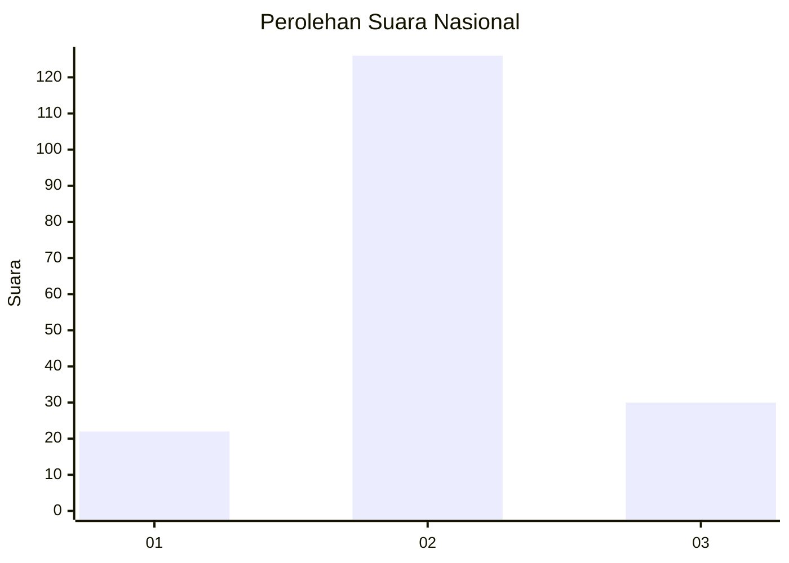
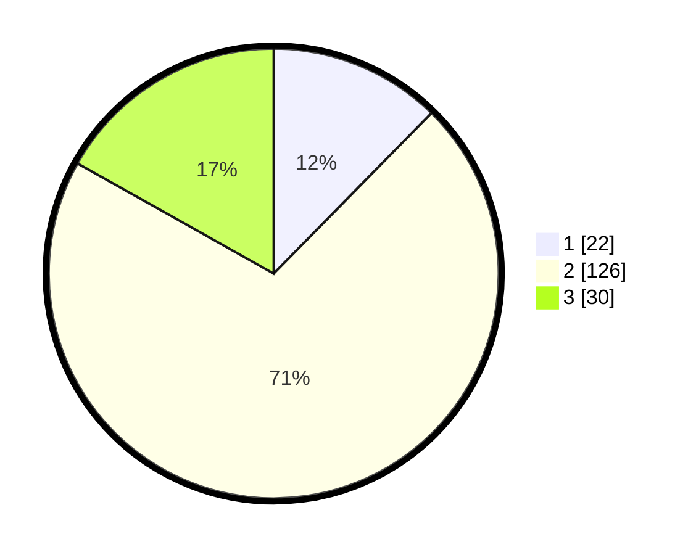

# Hasil

## Grafik

## Tabel

| No. | Nama Paslon    | Suara | Suara (raw) | Persentase |
|:--- |:-------------- | -----:| -----------:| ----------:|
| 1   | ANIES MUHAIMIN | 22    | [22][p-1]   | 12,36      |
| 2   | PRABOWO GIBRAN | 126   | [126][p-2]  | 70,79      |
| 3   | GANJAR MAHFUD  | 30    | [30][p-3]   | 16,85      |

[p-1]: https://github.com/gigit-pemilu/pemilu-2024/blob/main/pilpres/hitung-suara/sub/16-sumatera-selatan/sub/03-muara-enim/sub/25-lubai-ulu/sub/2001-karang-agung/sub/002-tps/sub/paslon-1.txt
[p-2]: https://github.com/gigit-pemilu/pemilu-2024/blob/main/pilpres/hitung-suara/sub/16-sumatera-selatan/sub/03-muara-enim/sub/25-lubai-ulu/sub/2001-karang-agung/sub/002-tps/sub/paslon-2.txt
[p-3]: https://github.com/gigit-pemilu/pemilu-2024/blob/main/pilpres/hitung-suara/sub/16-sumatera-selatan/sub/03-muara-enim/sub/25-lubai-ulu/sub/2001-karang-agung/sub/002-tps/sub/paslon-3.txt

## Foto C Plano

https://sirekap-obj-formc.kpu.go.id/2c14/pemilu/ppwp/16/03/25/20/01/1603252001002-20240219-204319--ad553d94-79bd-4887-88e5-2644addbede4.jpg

https://sirekap-obj-formc.kpu.go.id/2c14/pemilu/ppwp/16/03/25/20/01/1603252001002-20240219-204411--2bbf3acb-c237-4638-9d03-92f0d097eb4a.jpg

https://sirekap-obj-formc.kpu.go.id/2c14/pemilu/ppwp/16/03/25/20/01/1603252001002-20240219-204447--888e090f-6f79-47dc-a574-d0af1468e87b.jpg

## Metadata

| Key        | Value               |
| ---------- | ------------------- |
| Time Stamp | 2024-02-25 12:00:00 |

