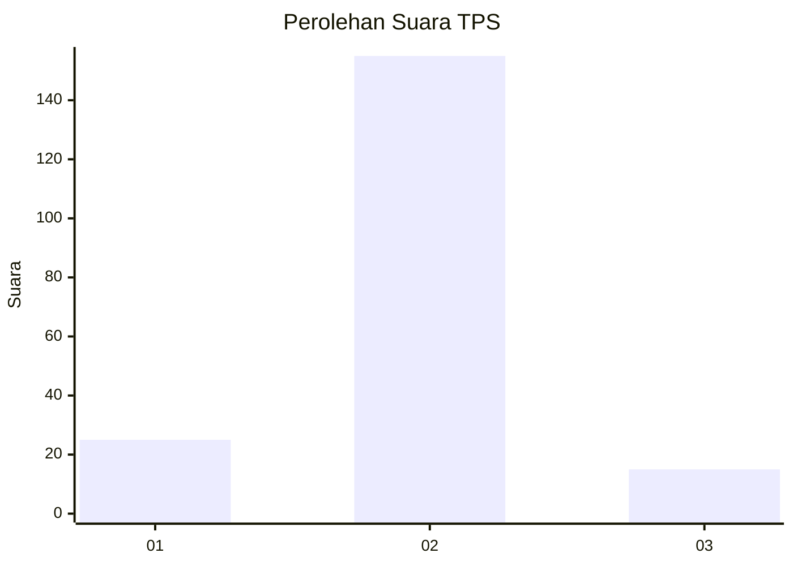
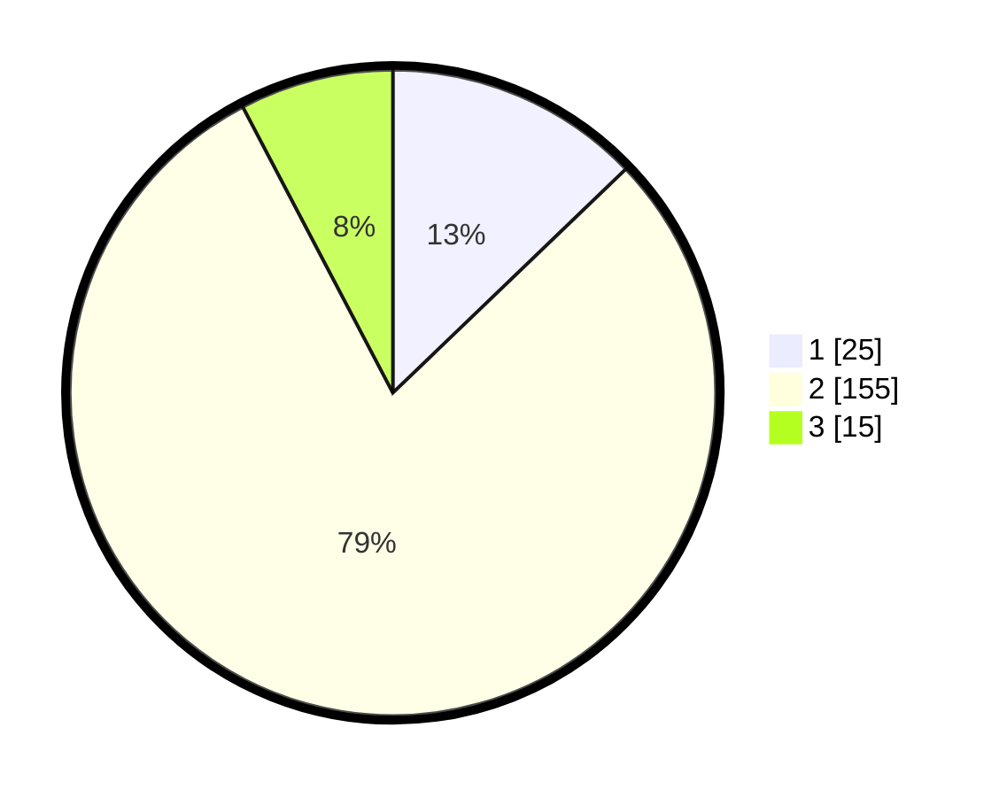

# Hasil

## Grafik

## Tabel

| No. | Nama Paslon    | Suara | Suara (raw) | Persentase |
|:--- |:-------------- | -----:| -----------:| ----------:|
| 1   | ANIES MUHAIMIN | 25    | [25][p-1]   | 12,82      |
| 2   | PRABOWO GIBRAN | 155   | [155][p-2]  | 79,49      |
| 3   | GANJAR MAHFUD  | 15    | [15][p-3]   | 7,69       |

[p-1]: https://github.com/gigit-pemilu/pemilu-2024-16-sumatera-selatan/blob/main/pilpres/hitung-suara/sub/16-sumatera-selatan/sub/03-muara-enim/sub/25-lubai-ulu/sub/2001-karang-agung/sub/003-tps/sub/paslon-1.txt
[p-2]: https://github.com/gigit-pemilu/pemilu-2024-16-sumatera-selatan/blob/main/pilpres/hitung-suara/sub/16-sumatera-selatan/sub/03-muara-enim/sub/25-lubai-ulu/sub/2001-karang-agung/sub/003-tps/sub/paslon-2.txt
[p-3]: https://github.com/gigit-pemilu/pemilu-2024-16-sumatera-selatan/blob/main/pilpres/hitung-suara/sub/16-sumatera-selatan/sub/03-muara-enim/sub/25-lubai-ulu/sub/2001-karang-agung/sub/003-tps/sub/paslon-3.txt

## Foto C Plano

https://sirekap-obj-formc.kpu.go.id/7ab9/pemilu/ppwp/16/03/25/20/01/1603252001003-20240219-204622--9714ce53-b26e-4f75-9428-ae9a72ff88a5.jpg

https://sirekap-obj-formc.kpu.go.id/7ab9/pemilu/ppwp/16/03/25/20/01/1603252001003-20240219-204702--45a58d99-f309-4fc5-8f91-49c2fdfb20a9.jpg

https://sirekap-obj-formc.kpu.go.id/7ab9/pemilu/ppwp/16/03/25/20/01/1603252001003-20240219-204735--1b760b90-2405-4f00-81ee-0326cea0e329.jpg

## Metadata

| Key        | Value               |
| ---------- | ------------------- |
| Time Stamp | 2024-02-25 16:00:00 |

