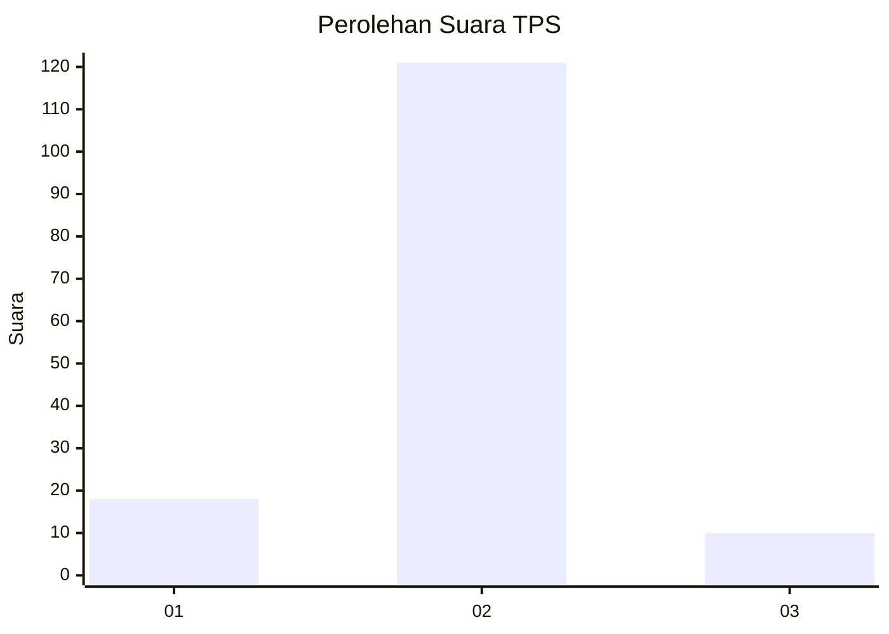
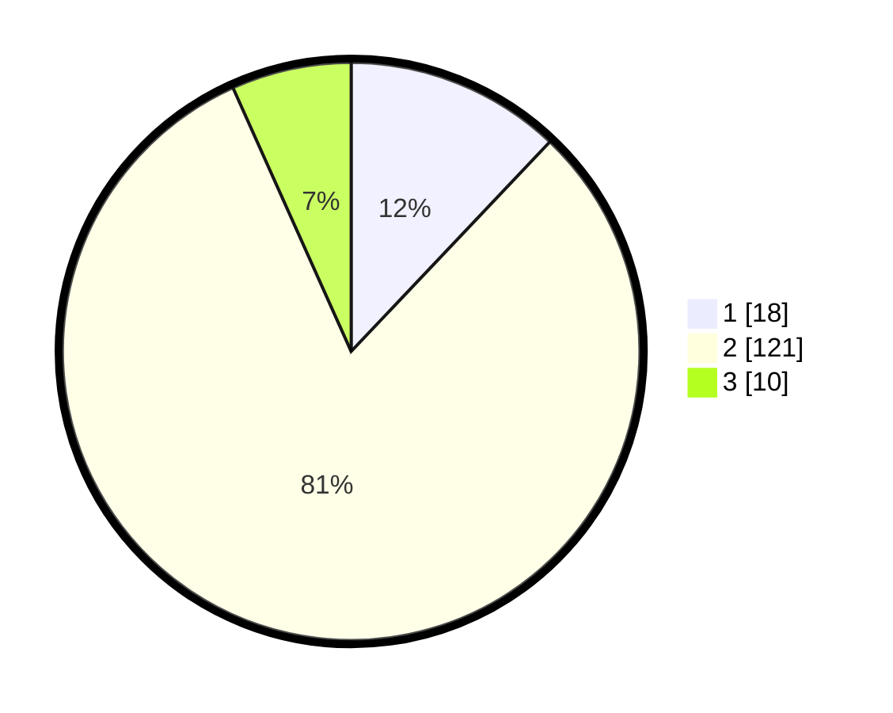

# Hasil

## Grafik

## Tabel

| No. | Nama Paslon    | Suara | Suara (raw) | Persentase |
|:--- |:-------------- | -----:| -----------:| ----------:|
| 1   | ANIES MUHAIMIN | 18    | [18][p-1]   | 12,08      |
| 2   | PRABOWO GIBRAN | 121   | [121][p-2]  | 81,21      |
| 3   | GANJAR MAHFUD  | 10    | [10][p-3]   | 6,71       |

[p-1]: https://github.com/gigit-pemilu/pemilu-2024-16-sumatera-selatan/blob/main/pilpres/hitung-suara/sub/16-sumatera-selatan/sub/03-muara-enim/sub/25-lubai-ulu/sub/2001-karang-agung/sub/004-tps/sub/paslon-1.txt
[p-2]: https://github.com/gigit-pemilu/pemilu-2024-16-sumatera-selatan/blob/main/pilpres/hitung-suara/sub/16-sumatera-selatan/sub/03-muara-enim/sub/25-lubai-ulu/sub/2001-karang-agung/sub/004-tps/sub/paslon-2.txt
[p-3]: https://github.com/gigit-pemilu/pemilu-2024-16-sumatera-selatan/blob/main/pilpres/hitung-suara/sub/16-sumatera-selatan/sub/03-muara-enim/sub/25-lubai-ulu/sub/2001-karang-agung/sub/004-tps/sub/paslon-3.txt

## Foto C Plano

https://sirekap-obj-formc.kpu.go.id/efc7/pemilu/ppwp/16/03/25/20/01/1603252001004-20240219-205030--45a41400-d48c-438d-a382-ded0e0caae50.jpg

https://sirekap-obj-formc.kpu.go.id/efc7/pemilu/ppwp/16/03/25/20/01/1603252001004-20240219-205110--b66ecc60-deb5-44eb-a57f-3325a238a949.jpg

https://sirekap-obj-formc.kpu.go.id/efc7/pemilu/ppwp/16/03/25/20/01/1603252001004-20240219-205152--d58c6c13-e823-4e0d-8401-ed0836bc8005.jpg

## Metadata

| Key        | Value               |
| ---------- | ------------------- |
| Time Stamp | 2024-02-25 12:00:00 |

