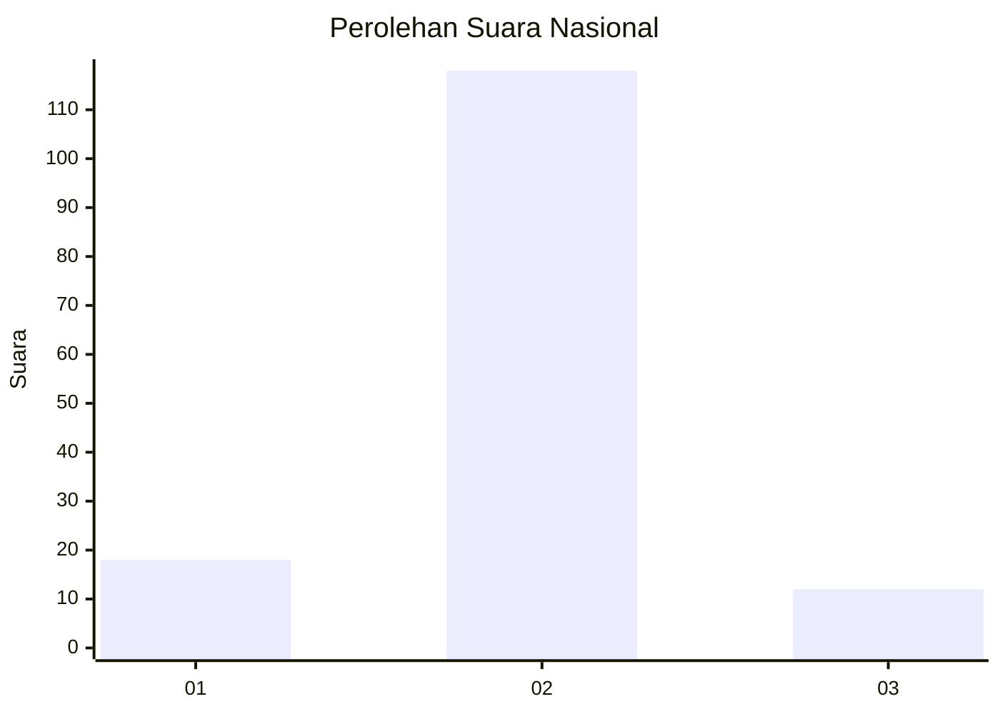
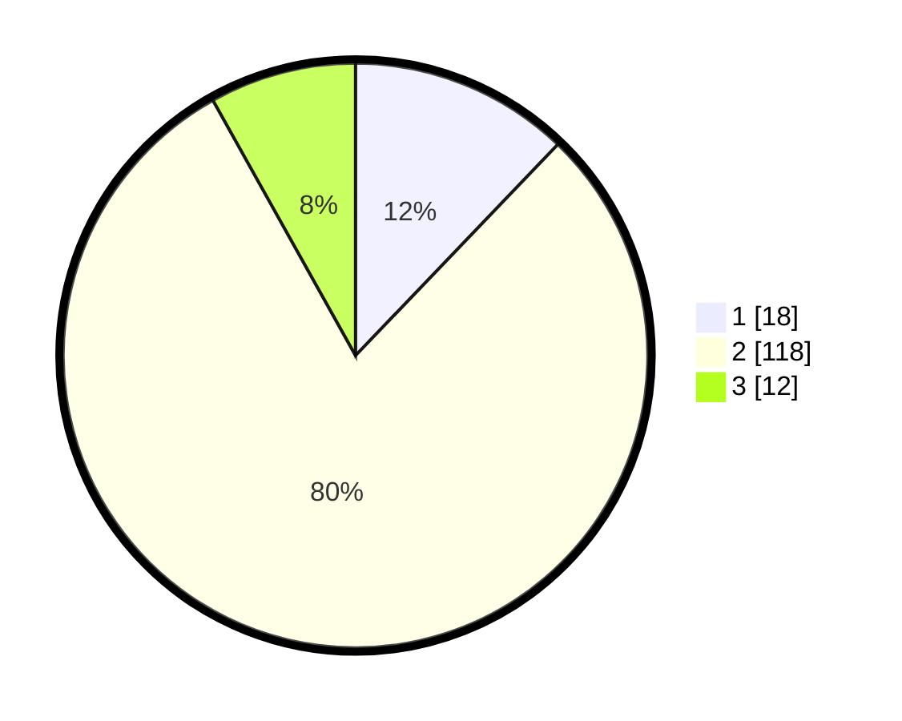

# Hasil

## Grafik

## Tabel

| No. | Nama Paslon    | Suara | Suara (raw) | Persentase |
|:--- |:-------------- | -----:| -----------:| ----------:|
| 1   | ANIES MUHAIMIN | 18    | [18][p-1]   | 12,16      |
| 2   | PRABOWO GIBRAN | 118   | [118][p-2]  | 79,73      |
| 3   | GANJAR MAHFUD  | 12    | [12][p-3]   | 8,11       |

[p-1]: https://github.com/gigit-pemilu/pemilu-2024/blob/main/pilpres/hitung-suara/sub/16-sumatera-selatan/sub/03-muara-enim/sub/25-lubai-ulu/sub/2001-karang-agung/sub/005-tps/sub/paslon-1.txt
[p-2]: https://github.com/gigit-pemilu/pemilu-2024/blob/main/pilpres/hitung-suara/sub/16-sumatera-selatan/sub/03-muara-enim/sub/25-lubai-ulu/sub/2001-karang-agung/sub/005-tps/sub/paslon-2.txt
[p-3]: https://github.com/gigit-pemilu/pemilu-2024/blob/main/pilpres/hitung-suara/sub/16-sumatera-selatan/sub/03-muara-enim/sub/25-lubai-ulu/sub/2001-karang-agung/sub/005-tps/sub/paslon-3.txt

## Foto C Plano

https://sirekap-obj-formc.kpu.go.id/5d62/pemilu/ppwp/16/03/25/20/01/1603252001005-20240219-205458--546d4074-417a-440c-9adc-95a16eb4c23c.jpg

https://sirekap-obj-formc.kpu.go.id/5d62/pemilu/ppwp/16/03/25/20/01/1603252001005-20240219-205533--aca8ea67-a269-48cf-b72f-1ae88d8d813d.jpg

https://sirekap-obj-formc.kpu.go.id/5d62/pemilu/ppwp/16/03/25/20/01/1603252001005-20240219-205627--2d3a1fef-f7cf-4701-a3ea-a83ec8660ed7.jpg

## Metadata

| Key        | Value               |
| ---------- | ------------------- |
| Time Stamp | 2024-02-25 18:00:00 |

