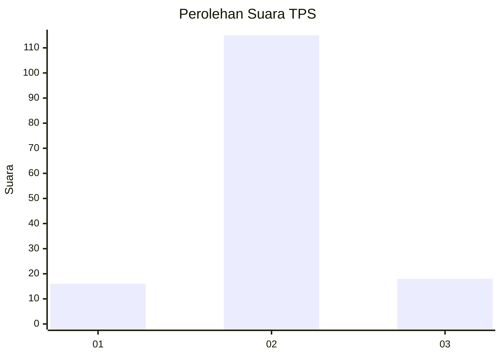
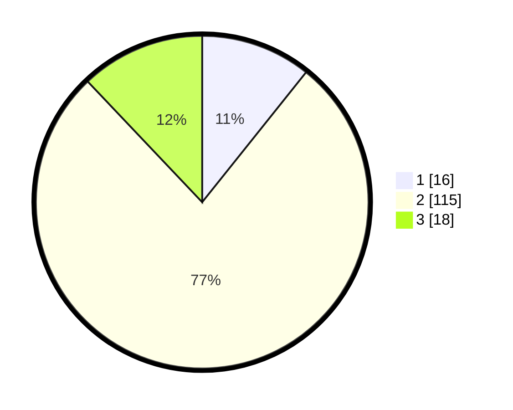

# Hasil

## Grafik

## Tabel

| No. | Nama Paslon    | Suara | Suara (raw) | Persentase |
|:--- |:-------------- | -----:| -----------:| ----------:|
| 1   | ANIES MUHAIMIN | 16    | [16][p-1]   | 10,74      |
| 2   | PRABOWO GIBRAN | 115   | [115][p-2]  | 77,18      |
| 3   | GANJAR MAHFUD  | 18    | [18][p-3]   | 12,08      |

[p-1]: https://github.com/gigit-pemilu/pemilu-2024-16-sumatera-selatan/blob/main/pilpres/hitung-suara/sub/16-sumatera-selatan/sub/03-muara-enim/sub/25-lubai-ulu/sub/2001-karang-agung/sub/008-tps/sub/paslon-1.txt
[p-2]: https://github.com/gigit-pemilu/pemilu-2024-16-sumatera-selatan/blob/main/pilpres/hitung-suara/sub/16-sumatera-selatan/sub/03-muara-enim/sub/25-lubai-ulu/sub/2001-karang-agung/sub/008-tps/sub/paslon-2.txt
[p-3]: https://github.com/gigit-pemilu/pemilu-2024-16-sumatera-selatan/blob/main/pilpres/hitung-suara/sub/16-sumatera-selatan/sub/03-muara-enim/sub/25-lubai-ulu/sub/2001-karang-agung/sub/008-tps/sub/paslon-3.txt

## Foto C Plano

https://sirekap-obj-formc.kpu.go.id/e363/pemilu/ppwp/16/03/25/20/01/1603252001008-20240219-230712--a24edc9c-beda-4504-9d8a-f17733ae58a1.jpg

https://sirekap-obj-formc.kpu.go.id/e363/pemilu/ppwp/16/03/25/20/01/1603252001008-20240219-230750--d9686a54-6fc0-42dc-9026-4e15393f3d5d.jpg

https://sirekap-obj-formc.kpu.go.id/e363/pemilu/ppwp/16/03/25/20/01/1603252001008-20240219-230844--0a962d3f-4650-48a1-b47b-a21ddda8c023.jpg

## Metadata

| Key        | Value               |
| ---------- | ------------------- |
| Time Stamp | 2024-02-25 15:00:00 |

