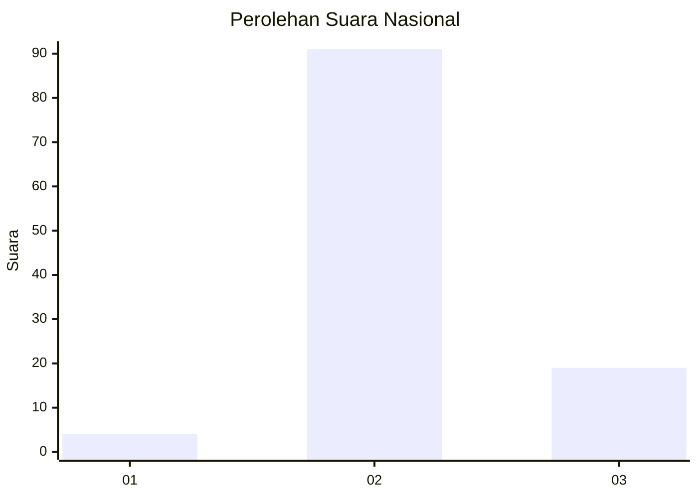
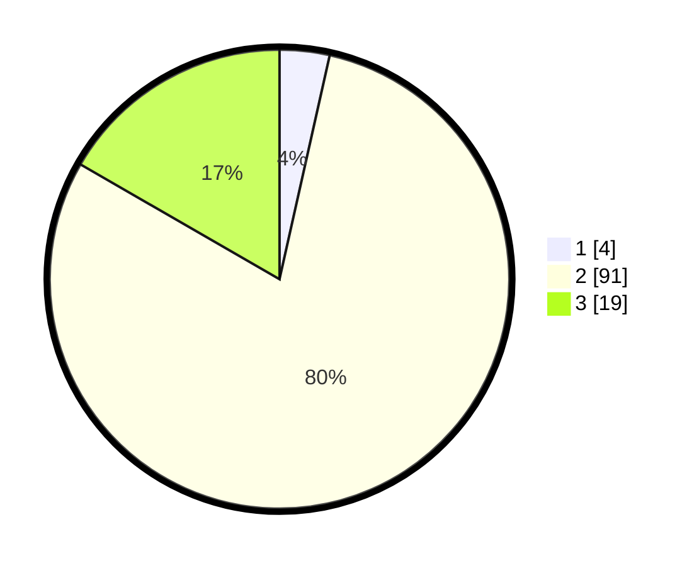

# Hasil

## Grafik

## Tabel

| No. | Nama Paslon    | Suara | Suara (raw) | Persentase |
|:--- |:-------------- | -----:| -----------:| ----------:|
| 1   | ANIES MUHAIMIN | 4     | [4][p-1]    | 3,51       |
| 2   | PRABOWO GIBRAN | 91    | [91][p-2]   | 79,82      |
| 3   | GANJAR MAHFUD  | 19    | [19][p-3]   | 16,67      |

[p-1]: https://github.com/gigit-pemilu/pemilu-2024/blob/main/pilpres/hitung-suara/sub/16-sumatera-selatan/sub/03-muara-enim/sub/25-lubai-ulu/sub/2001-karang-agung/sub/013-tps/sub/paslon-1.txt
[p-2]: https://github.com/gigit-pemilu/pemilu-2024/blob/main/pilpres/hitung-suara/sub/16-sumatera-selatan/sub/03-muara-enim/sub/25-lubai-ulu/sub/2001-karang-agung/sub/013-tps/sub/paslon-2.txt
[p-3]: https://github.com/gigit-pemilu/pemilu-2024/blob/main/pilpres/hitung-suara/sub/16-sumatera-selatan/sub/03-muara-enim/sub/25-lubai-ulu/sub/2001-karang-agung/sub/013-tps/sub/paslon-3.txt

## Foto C Plano

https://sirekap-obj-formc.kpu.go.id/f827/pemilu/ppwp/16/03/25/20/01/1603252001013-20240219-233740--14fd19cc-3f4d-4c65-a6d0-825d753ab2d2.jpg

https://sirekap-obj-formc.kpu.go.id/f827/pemilu/ppwp/16/03/25/20/01/1603252001013-20240219-233846--11ce5426-c566-4760-98d1-5b8e104c0ff4.jpg

https://sirekap-obj-formc.kpu.go.id/f827/pemilu/ppwp/16/03/25/20/01/1603252001013-20240219-233920--9e4e5f21-5e8d-4d90-833f-0690ee38df6c.jpg

## Metadata

| Key        | Value               |
| ---------- | ------------------- |
| Time Stamp | 2024-02-25 17:00:00 |

