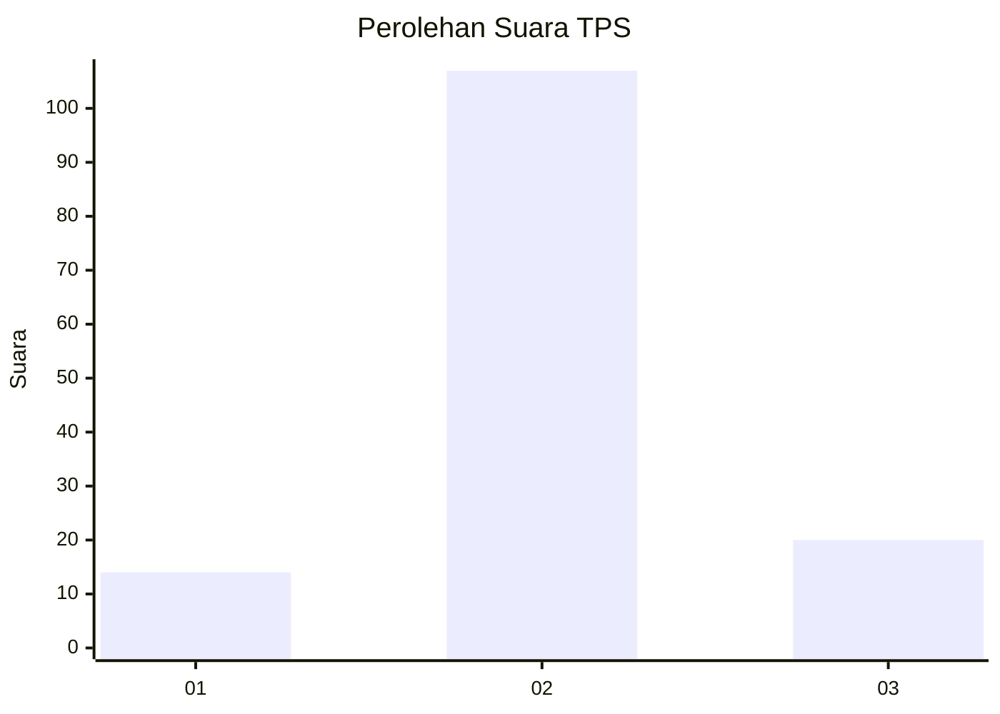
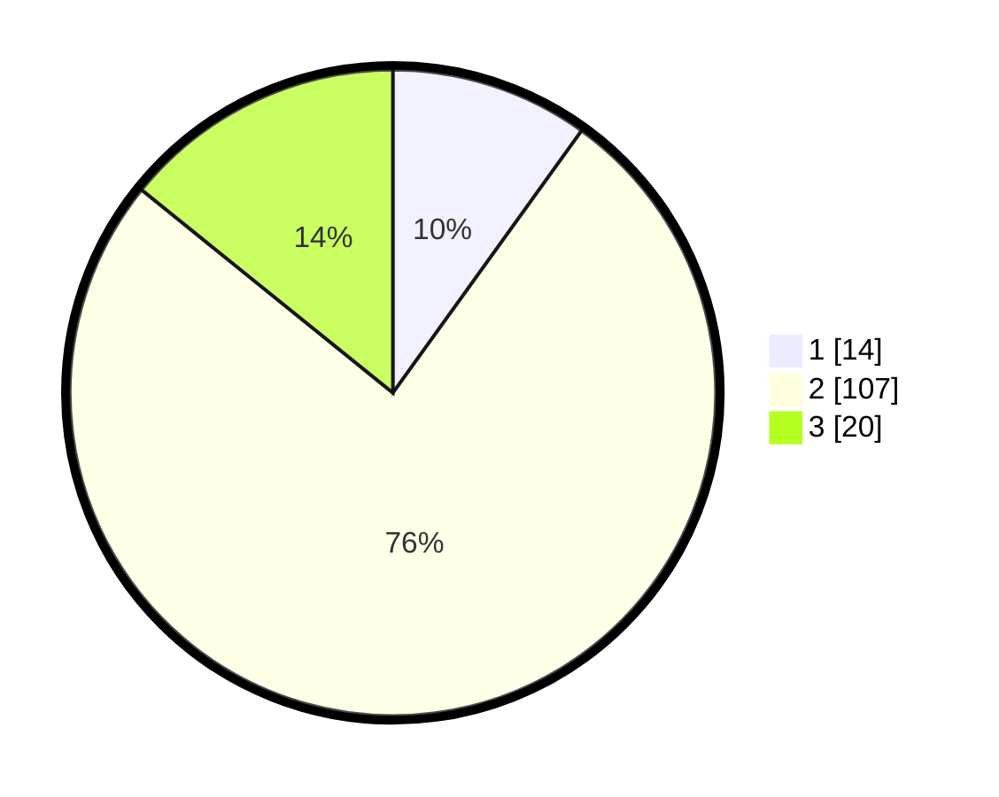

# Hasil

## Grafik

## Tabel

| No. | Nama Paslon    | Suara | Suara (raw) | Persentase |
|:--- |:-------------- | -----:| -----------:| ----------:|
| 1   | ANIES MUHAIMIN | 14    | [14][p-1]   | 9,93       |
| 2   | PRABOWO GIBRAN | 107   | [107][p-2]  | 75,89      |
| 3   | GANJAR MAHFUD  | 20    | [20][p-3]   | 14,18      |

[p-1]: https://github.com/gigit-pemilu/pemilu-2024-16-sumatera-selatan/blob/main/pilpres/hitung-suara/sub/16-sumatera-selatan/sub/03-muara-enim/sub/25-lubai-ulu/sub/2001-karang-agung/sub/018-tps/sub/paslon-1.txt
[p-2]: https://github.com/gigit-pemilu/pemilu-2024-16-sumatera-selatan/blob/main/pilpres/hitung-suara/sub/16-sumatera-selatan/sub/03-muara-enim/sub/25-lubai-ulu/sub/2001-karang-agung/sub/018-tps/sub/paslon-2.txt
[p-3]: https://github.com/gigit-pemilu/pemilu-2024-16-sumatera-selatan/blob/main/pilpres/hitung-suara/sub/16-sumatera-selatan/sub/03-muara-enim/sub/25-lubai-ulu/sub/2001-karang-agung/sub/018-tps/sub/paslon-3.txt

## Foto C Plano

https://sirekap-obj-formc.kpu.go.id/0d59/pemilu/ppwp/16/03/25/20/01/1603252001018-20240219-235900--c459ddaa-f5fc-4142-8ee2-d4a3abea9ce8.jpg

https://sirekap-obj-formc.kpu.go.id/0d59/pemilu/ppwp/16/03/25/20/01/1603252001018-20240219-235956--d8cab633-9fdd-454f-9b25-524f00e33905.jpg

https://sirekap-obj-formc.kpu.go.id/0d59/pemilu/ppwp/16/03/25/20/01/1603252001018-20240220-000037--a9ccc355-00db-4ab7-a40c-6d7370ecf17b.jpg

## Metadata

| Key        | Value               |
| ---------- | ------------------- |
| Time Stamp | 2024-02-25 16:00:00 |

