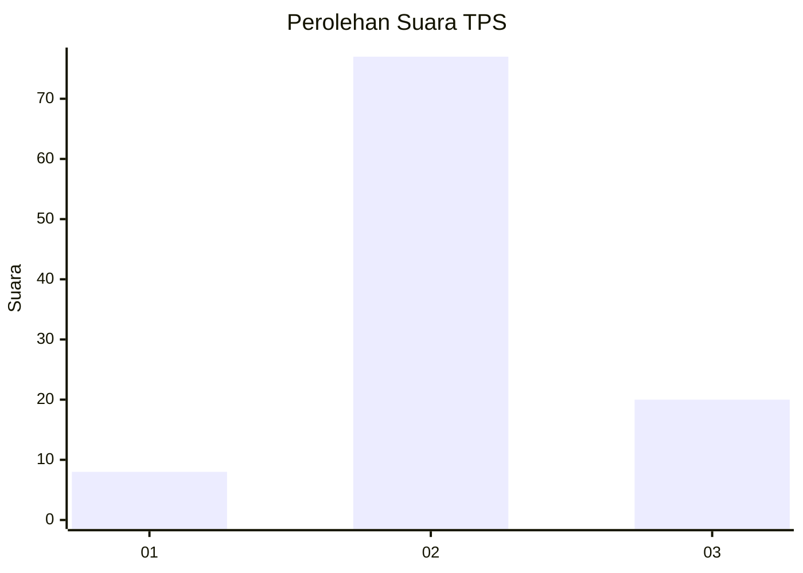
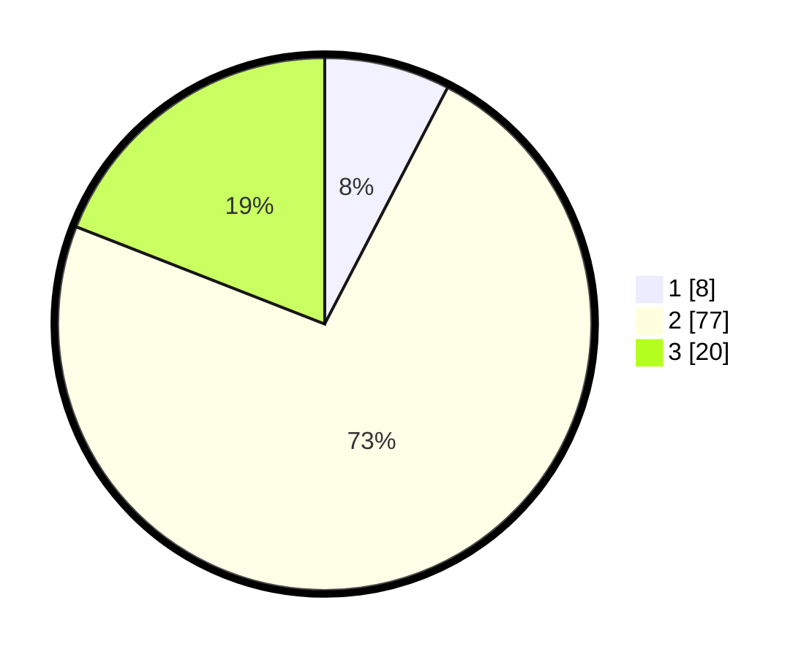

# Hasil

## Grafik

## Tabel

| No. | Nama Paslon    | Suara | Suara (raw) | Persentase |
|:--- |:-------------- | -----:| -----------:| ----------:|
| 1   | ANIES MUHAIMIN | 8     | [8][p-1]    | 7,62       |
| 2   | PRABOWO GIBRAN | 77    | [77][p-2]   | 73,33      |
| 3   | GANJAR MAHFUD  | 20    | [20][p-3]   | 19,05      |

[p-1]: https://github.com/gigit-pemilu/pemilu-2024-16-sumatera-selatan/blob/main/pilpres/hitung-suara/sub/16-sumatera-selatan/sub/03-muara-enim/sub/25-lubai-ulu/sub/2001-karang-agung/sub/020-tps/sub/paslon-1.txt
[p-2]: https://github.com/gigit-pemilu/pemilu-2024-16-sumatera-selatan/blob/main/pilpres/hitung-suara/sub/16-sumatera-selatan/sub/03-muara-enim/sub/25-lubai-ulu/sub/2001-karang-agung/sub/020-tps/sub/paslon-2.txt
[p-3]: https://github.com/gigit-pemilu/pemilu-2024-16-sumatera-selatan/blob/main/pilpres/hitung-suara/sub/16-sumatera-selatan/sub/03-muara-enim/sub/25-lubai-ulu/sub/2001-karang-agung/sub/020-tps/sub/paslon-3.txt

## Foto C Plano

https://sirekap-obj-formc.kpu.go.id/936d/pemilu/ppwp/16/03/25/20/01/1603252001020-20240220-000513--981a2d0b-7d2f-4065-9b54-92fbac540462.jpg

https://sirekap-obj-formc.kpu.go.id/936d/pemilu/ppwp/16/03/25/20/01/1603252001020-20240220-000605--b0f06cc1-79fe-4c8e-bca0-da0ad59d2f8b.jpg

https://sirekap-obj-formc.kpu.go.id/936d/pemilu/ppwp/16/03/25/20/01/1603252001020-20240220-000654--2b00fb34-a8fc-4fac-a13d-88b79faecdff.jpg

## Metadata

| Key        | Value               |
| ---------- | ------------------- |
| Time Stamp | 2024-02-25 18:00:00 |

