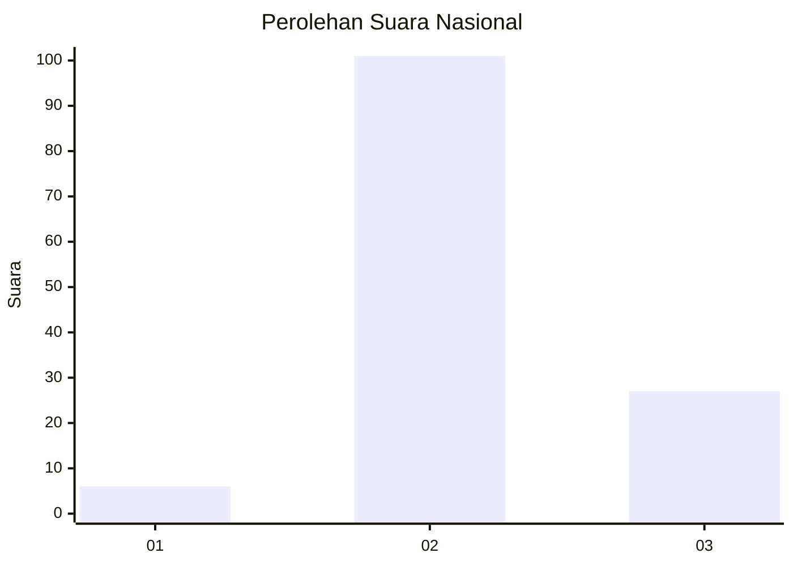

# Hasil

## Grafik

## Tabel

| No. | Nama Paslon    | Suara | Suara (raw) | Persentase |
|:--- |:-------------- | -----:| -----------:| ----------:|
| 1   | ANIES MUHAIMIN | 6     | [6][p-1]    | 4,48       |
| 2   | PRABOWO GIBRAN | 101   | [101][p-2]  | 75,37      |
| 3   | GANJAR MAHFUD  | 27    | [27][p-3]   | 20,15      |

[p-1]: https://github.com/gigit-pemilu/pemilu-2024/blob/main/pilpres/hitung-suara/sub/16-sumatera-selatan/sub/03-muara-enim/sub/25-lubai-ulu/sub/2001-karang-agung/sub/021-tps/sub/paslon-1.txt
[p-2]: https://github.com/gigit-pemilu/pemilu-2024/blob/main/pilpres/hitung-suara/sub/16-sumatera-selatan/sub/03-muara-enim/sub/25-lubai-ulu/sub/2001-karang-agung/sub/021-tps/sub/paslon-2.txt
[p-3]: https://github.com/gigit-pemilu/pemilu-2024/blob/main/pilpres/hitung-suara/sub/16-sumatera-selatan/sub/03-muara-enim/sub/25-lubai-ulu/sub/2001-karang-agung/sub/021-tps/sub/paslon-3.txt

## Foto C Plano

https://sirekap-obj-formc.kpu.go.id/3fa9/pemilu/ppwp/16/03/25/20/01/1603252001021-20240220-000825--79c7ab6e-ffe8-4630-94ea-b07d954c8680.jpg

https://sirekap-obj-formc.kpu.go.id/3fa9/pemilu/ppwp/16/03/25/20/01/1603252001021-20240220-000952--b0cb5b69-6185-437f-b2b9-19c0ed2ea59d.jpg

https://sirekap-obj-formc.kpu.go.id/3fa9/pemilu/ppwp/16/03/25/20/01/1603252001021-20240220-001050--7941b3be-d3ce-4ae4-9197-2087f5ff1ba7.jpg

## Metadata

| Key        | Value               |
| ---------- | ------------------- |
| Time Stamp | 2024-02-24 23:00:00 |

