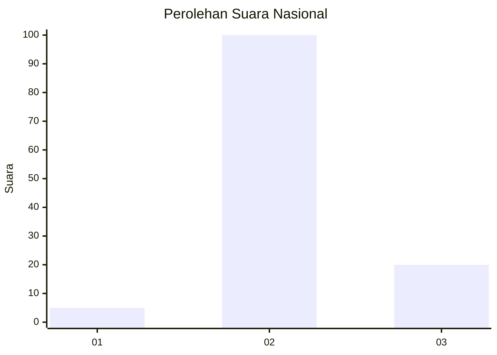
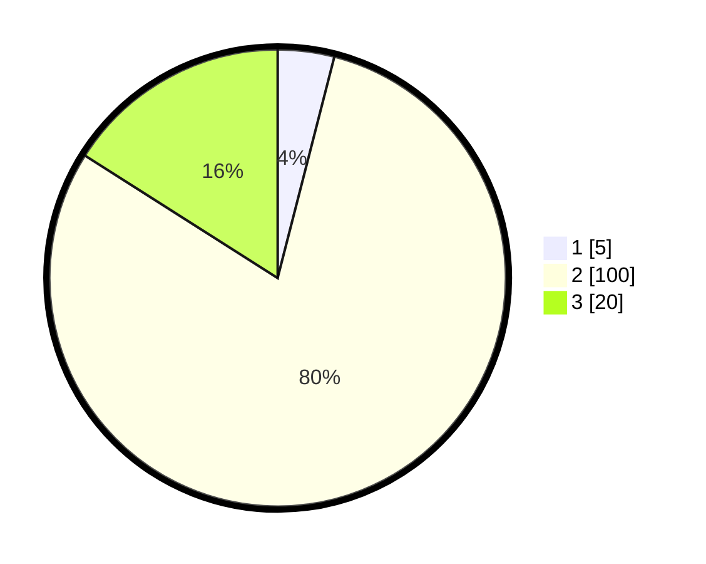

# Hasil

## Grafik

## Tabel

| No. | Nama Paslon    | Suara | Suara (raw) | Persentase |
|:--- |:-------------- | -----:| -----------:| ----------:|
| 1   | ANIES MUHAIMIN | 5     | [5][p-1]    | 4,00       |
| 2   | PRABOWO GIBRAN | 100   | [100][p-2]  | 80,00      |
| 3   | GANJAR MAHFUD  | 20    | [20][p-3]   | 16,00      |

[p-1]: https://github.com/gigit-pemilu/pemilu-2024/blob/main/pilpres/hitung-suara/sub/16-sumatera-selatan/sub/03-muara-enim/sub/25-lubai-ulu/sub/2001-karang-agung/sub/022-tps/sub/paslon-1.txt
[p-2]: https://github.com/gigit-pemilu/pemilu-2024/blob/main/pilpres/hitung-suara/sub/16-sumatera-selatan/sub/03-muara-enim/sub/25-lubai-ulu/sub/2001-karang-agung/sub/022-tps/sub/paslon-2.txt
[p-3]: https://github.com/gigit-pemilu/pemilu-2024/blob/main/pilpres/hitung-suara/sub/16-sumatera-selatan/sub/03-muara-enim/sub/25-lubai-ulu/sub/2001-karang-agung/sub/022-tps/sub/paslon-3.txt

## Foto C Plano

https://sirekap-obj-formc.kpu.go.id/0818/pemilu/ppwp/16/03/25/20/01/1603252001022-20240220-001155--219df84e-f33d-40f7-9058-a7cf52cf5ddd.jpg

https://sirekap-obj-formc.kpu.go.id/0818/pemilu/ppwp/16/03/25/20/01/1603252001022-20240220-001240--8a89cd5f-c86b-4aaf-bd1e-28319895df94.jpg

https://sirekap-obj-formc.kpu.go.id/0818/pemilu/ppwp/16/03/25/20/01/1603252001022-20240220-001339--38d91027-72fd-4d11-b13e-f7c3dbac02df.jpg

## Metadata

| Key        | Value               |
| ---------- | ------------------- |
| Time Stamp | 2024-02-24 23:00:00 |

