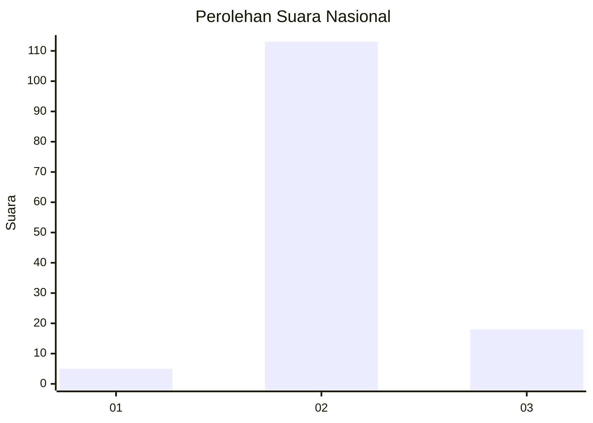
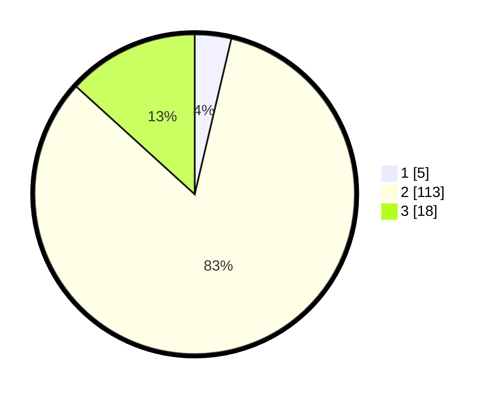

# Hasil

## Grafik

## Tabel

| No. | Nama Paslon    | Suara | Suara (raw) | Persentase |
|:--- |:-------------- | -----:| -----------:| ----------:|
| 1   | ANIES MUHAIMIN | 5     | [5][p-1]    | 3,68       |
| 2   | PRABOWO GIBRAN | 113   | [113][p-2]  | 83,09      |
| 3   | GANJAR MAHFUD  | 18    | [18][p-3]   | 13,24      |

[p-1]: https://github.com/gigit-pemilu/pemilu-2024/blob/main/pilpres/hitung-suara/sub/16-sumatera-selatan/sub/03-muara-enim/sub/25-lubai-ulu/sub/2004-sumber-mulya/sub/008-tps/sub/paslon-1.txt
[p-2]: https://github.com/gigit-pemilu/pemilu-2024/blob/main/pilpres/hitung-suara/sub/16-sumatera-selatan/sub/03-muara-enim/sub/25-lubai-ulu/sub/2004-sumber-mulya/sub/008-tps/sub/paslon-2.txt
[p-3]: https://github.com/gigit-pemilu/pemilu-2024/blob/main/pilpres/hitung-suara/sub/16-sumatera-selatan/sub/03-muara-enim/sub/25-lubai-ulu/sub/2004-sumber-mulya/sub/008-tps/sub/paslon-3.txt

## Foto C Plano

https://sirekap-obj-formc.kpu.go.id/8860/pemilu/ppwp/16/03/25/20/04/1603252004008-20240221-195012--bf5f81fc-2e40-4930-96ca-2e761def1de7.jpg

https://sirekap-obj-formc.kpu.go.id/8860/pemilu/ppwp/16/03/25/20/04/1603252004008-20240221-172016--84471a61-979d-4f5c-9e5e-a7e335f243cd.jpg

https://sirekap-obj-formc.kpu.go.id/8860/pemilu/ppwp/16/03/25/20/04/1603252004008-20240221-172058--2c4402e3-c553-46b7-917b-d788cee4ae08.jpg

## Metadata

| Key        | Value               |
| ---------- | ------------------- |
| Time Stamp | 2024-02-24 22:31:28 |

