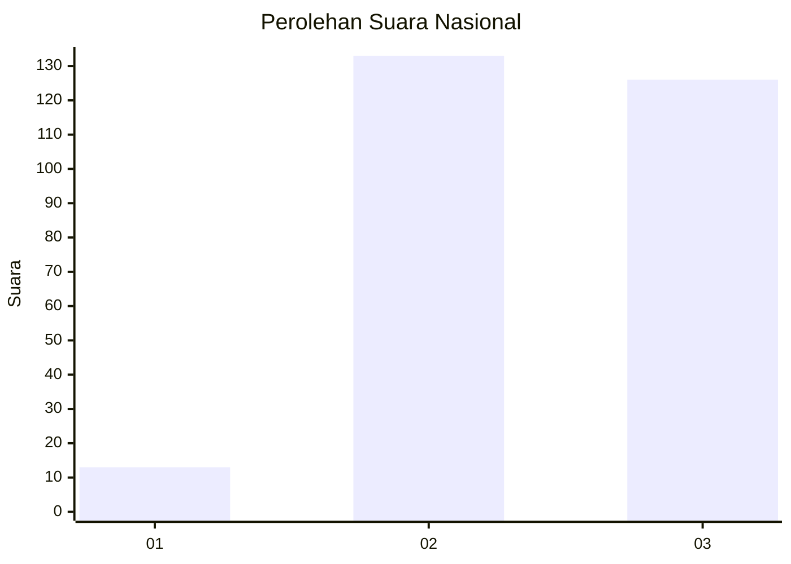
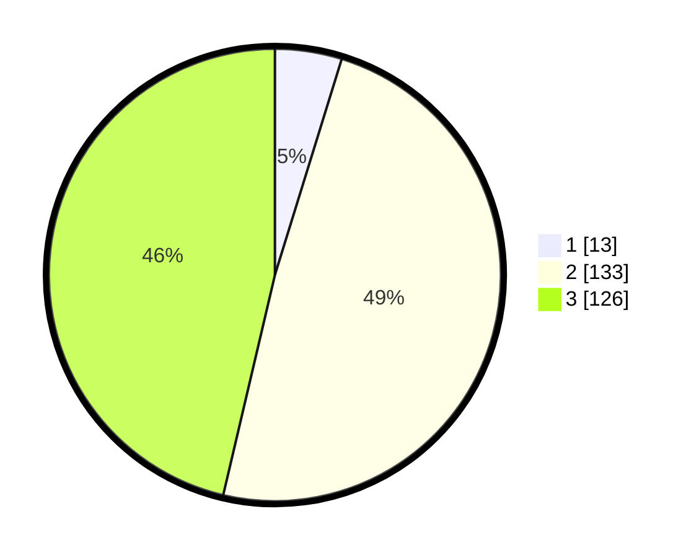

# Hasil

## Grafik

## Tabel

| No. | Nama Paslon    | Suara | Suara (raw) | Persentase |
|:--- |:-------------- | -----:| -----------:| ----------:|
| 1   | ANIES MUHAIMIN | 13    | [13][p-1]   | 4,78       |
| 2   | PRABOWO GIBRAN | 133   | [133][p-2]  | 48,90      |
| 3   | GANJAR MAHFUD  | 126   | [126][p-3]  | 46,32      |

[p-1]: https://github.com/gigit-pemilu/pemilu-2024/blob/main/pilpres/hitung-suara/sub/16-sumatera-selatan/sub/03-muara-enim/sub/25-lubai-ulu/sub/2004-sumber-mulya/sub/009-tps/sub/paslon-1.txt
[p-2]: https://github.com/gigit-pemilu/pemilu-2024/blob/main/pilpres/hitung-suara/sub/16-sumatera-selatan/sub/03-muara-enim/sub/25-lubai-ulu/sub/2004-sumber-mulya/sub/009-tps/sub/paslon-2.txt
[p-3]: https://github.com/gigit-pemilu/pemilu-2024/blob/main/pilpres/hitung-suara/sub/16-sumatera-selatan/sub/03-muara-enim/sub/25-lubai-ulu/sub/2004-sumber-mulya/sub/009-tps/sub/paslon-3.txt

## Foto C Plano

https://sirekap-obj-formc.kpu.go.id/e996/pemilu/ppwp/16/03/25/20/04/1603252004009-20240221-195149--39678635-8301-4650-a2b1-f0fd04deae82.jpg

https://sirekap-obj-formc.kpu.go.id/e996/pemilu/ppwp/16/03/25/20/04/1603252004009-20240221-195221--00425784-08c8-4a5c-a1d3-f2fab42c557d.jpg

https://sirekap-obj-formc.kpu.go.id/e996/pemilu/ppwp/16/03/25/20/04/1603252004009-20240221-195256--a4ffc5cb-d087-4864-9cc8-755170b0cc1b.jpg

## Metadata

| Key        | Value               |
| ---------- | ------------------- |
| Time Stamp | 2024-02-25 16:00:00 |

