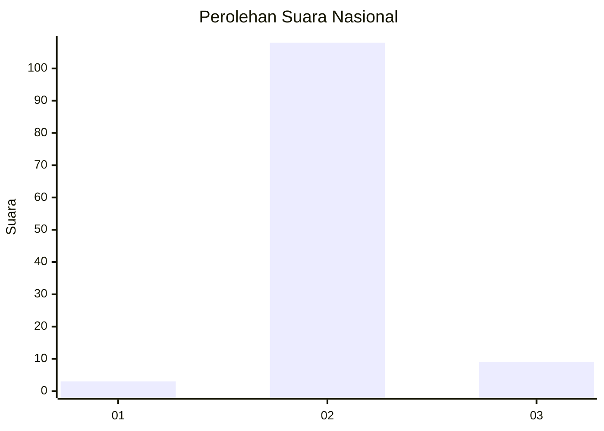
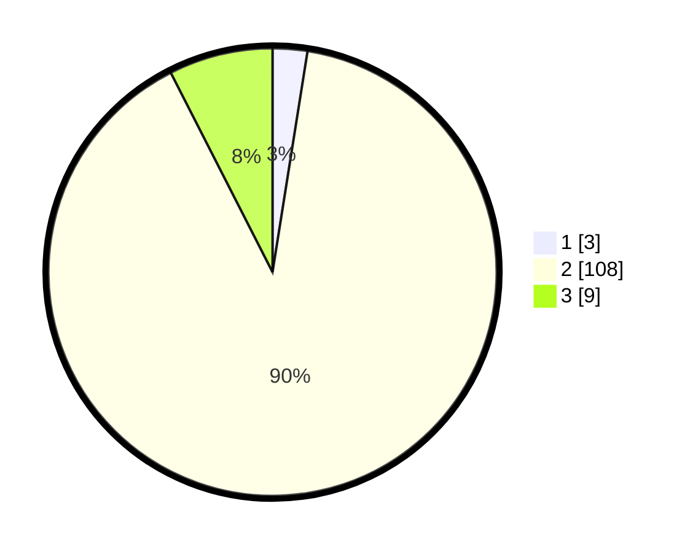

# Hasil

## Grafik

## Tabel

| No. | Nama Paslon    | Suara | Suara (raw) | Persentase |
|:--- |:-------------- | -----:| -----------:| ----------:|
| 1   | ANIES MUHAIMIN | 3     | [3][p-1]    | 2,50       |
| 2   | PRABOWO GIBRAN | 108   | [108][p-2]  | 90,00      |
| 3   | GANJAR MAHFUD  | 9     | [9][p-3]    | 7,50       |

[p-1]: https://github.com/gigit-pemilu/pemilu-2024/blob/main/pilpres/hitung-suara/sub/16-sumatera-selatan/sub/03-muara-enim/sub/25-lubai-ulu/sub/2004-sumber-mulya/sub/010-tps/sub/paslon-1.txt
[p-2]: https://github.com/gigit-pemilu/pemilu-2024/blob/main/pilpres/hitung-suara/sub/16-sumatera-selatan/sub/03-muara-enim/sub/25-lubai-ulu/sub/2004-sumber-mulya/sub/010-tps/sub/paslon-2.txt
[p-3]: https://github.com/gigit-pemilu/pemilu-2024/blob/main/pilpres/hitung-suara/sub/16-sumatera-selatan/sub/03-muara-enim/sub/25-lubai-ulu/sub/2004-sumber-mulya/sub/010-tps/sub/paslon-3.txt

## Foto C Plano

https://sirekap-obj-formc.kpu.go.id/64d0/pemilu/ppwp/16/03/25/20/04/1603252004010-20240221-195539--0bf2fb1a-ce10-423c-9e17-4c7e380b845e.jpg

https://sirekap-obj-formc.kpu.go.id/64d0/pemilu/ppwp/16/03/25/20/04/1603252004010-20240221-195623--f13c3096-53fb-48f0-b690-3d5851bb3120.jpg

https://sirekap-obj-formc.kpu.go.id/64d0/pemilu/ppwp/16/03/25/20/04/1603252004010-20240221-195702--e38b02ed-d3bf-40c0-be99-a664ad432ce3.jpg

## Metadata

| Key        | Value               |
| ---------- | ------------------- |
| Time Stamp | 2024-02-25 18:00:00 |

