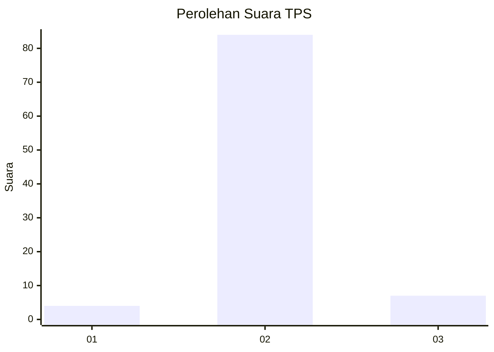
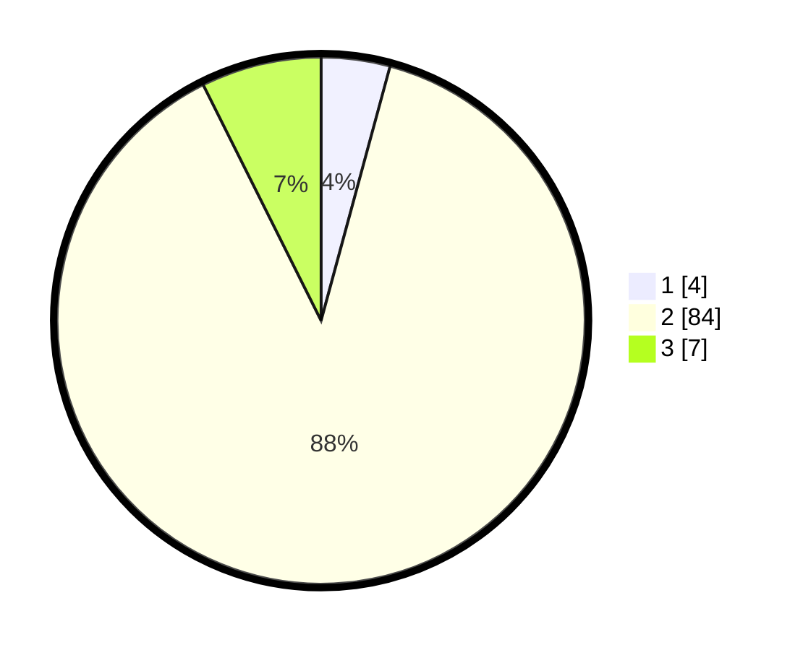

# Hasil

## Grafik

## Tabel

| No. | Nama Paslon    | Suara | Suara (raw) | Persentase |
|:--- |:-------------- | -----:| -----------:| ----------:|
| 1   | ANIES MUHAIMIN | 4     | [4][p-1]    | 4,21       |
| 2   | PRABOWO GIBRAN | 84    | [84][p-2]   | 88,42      |
| 3   | GANJAR MAHFUD  | 7     | [7][p-3]    | 7,37       |

[p-1]: https://github.com/gigit-pemilu/pemilu-2024-16-sumatera-selatan/blob/main/pilpres/hitung-suara/sub/16-sumatera-selatan/sub/03-muara-enim/sub/25-lubai-ulu/sub/2004-sumber-mulya/sub/011-tps/sub/paslon-1.txt
[p-2]: https://github.com/gigit-pemilu/pemilu-2024-16-sumatera-selatan/blob/main/pilpres/hitung-suara/sub/16-sumatera-selatan/sub/03-muara-enim/sub/25-lubai-ulu/sub/2004-sumber-mulya/sub/011-tps/sub/paslon-2.txt
[p-3]: https://github.com/gigit-pemilu/pemilu-2024-16-sumatera-selatan/blob/main/pilpres/hitung-suara/sub/16-sumatera-selatan/sub/03-muara-enim/sub/25-lubai-ulu/sub/2004-sumber-mulya/sub/011-tps/sub/paslon-3.txt

## Foto C Plano

https://sirekap-obj-formc.kpu.go.id/ff01/pemilu/ppwp/16/03/25/20/04/1603252004011-20240221-195921--b1e0eb28-e7b7-4af1-8055-a68b9509169f.jpg

https://sirekap-obj-formc.kpu.go.id/ff01/pemilu/ppwp/16/03/25/20/04/1603252004011-20240221-200008--3e51caa4-6b92-4cd7-930b-287321c20a67.jpg

https://sirekap-obj-formc.kpu.go.id/ff01/pemilu/ppwp/16/03/25/20/04/1603252004011-20240221-200037--6456a82e-f7a5-4800-84cf-cafc9334ca18.jpg

## Metadata

| Key        | Value               |
| ---------- | ------------------- |
| Time Stamp | 2024-02-24 22:31:28 |

