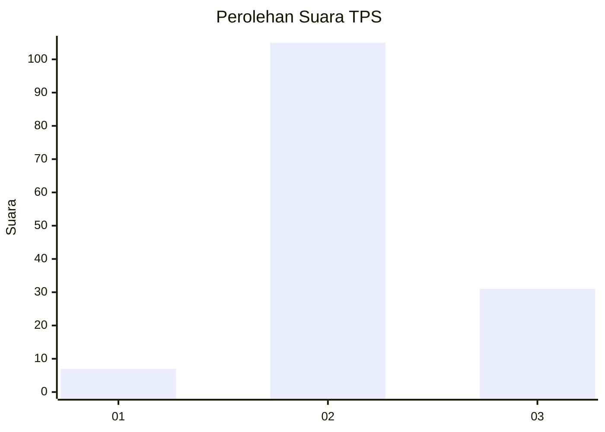

# Hasil

## Grafik

## Tabel

| No. | Nama Paslon    | Suara | Suara (raw) | Persentase |
|:--- |:-------------- | -----:| -----------:| ----------:|
| 1   | ANIES MUHAIMIN | 7     | [7][p-1]    | 4,90       |
| 2   | PRABOWO GIBRAN | 105   | [105][p-2]  | 73,43      |
| 3   | GANJAR MAHFUD  | 31    | [31][p-3]   | 21,68      |

[p-1]: https://github.com/gigit-pemilu/pemilu-2024-16-sumatera-selatan/blob/main/pilpres/hitung-suara/sub/16-sumatera-selatan/sub/03-muara-enim/sub/25-lubai-ulu/sub/2004-sumber-mulya/sub/018-tps/sub/paslon-1.txt
[p-2]: https://github.com/gigit-pemilu/pemilu-2024-16-sumatera-selatan/blob/main/pilpres/hitung-suara/sub/16-sumatera-selatan/sub/03-muara-enim/sub/25-lubai-ulu/sub/2004-sumber-mulya/sub/018-tps/sub/paslon-2.txt
[p-3]: https://github.com/gigit-pemilu/pemilu-2024-16-sumatera-selatan/blob/main/pilpres/hitung-suara/sub/16-sumatera-selatan/sub/03-muara-enim/sub/25-lubai-ulu/sub/2004-sumber-mulya/sub/018-tps/sub/paslon-3.txt

## Foto C Plano

https://sirekap-obj-formc.kpu.go.id/0163/pemilu/ppwp/16/03/25/20/04/1603252004018-20240222-101914--7ca84edc-af24-4e84-a1ef-b0a076af9767.jpg

https://sirekap-obj-formc.kpu.go.id/0163/pemilu/ppwp/16/03/25/20/04/1603252004018-20240222-102043--8a87990d-e0da-4e0c-848f-0ce0b4aced4c.jpg

https://sirekap-obj-formc.kpu.go.id/0163/pemilu/ppwp/16/03/25/20/04/1603252004018-20240222-102227--acb3eabc-a438-47db-846c-8beec29d9b72.jpg

## Metadata

| Key        | Value               |
| ---------- | ------------------- |
| Time Stamp | 2024-02-25 16:00:00 |

