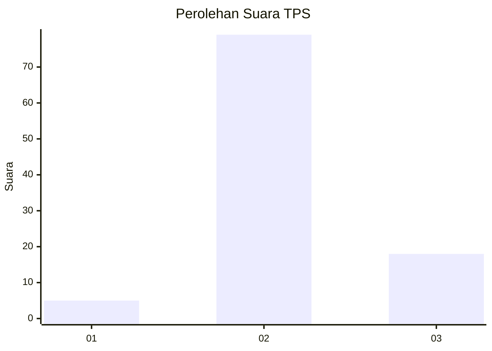
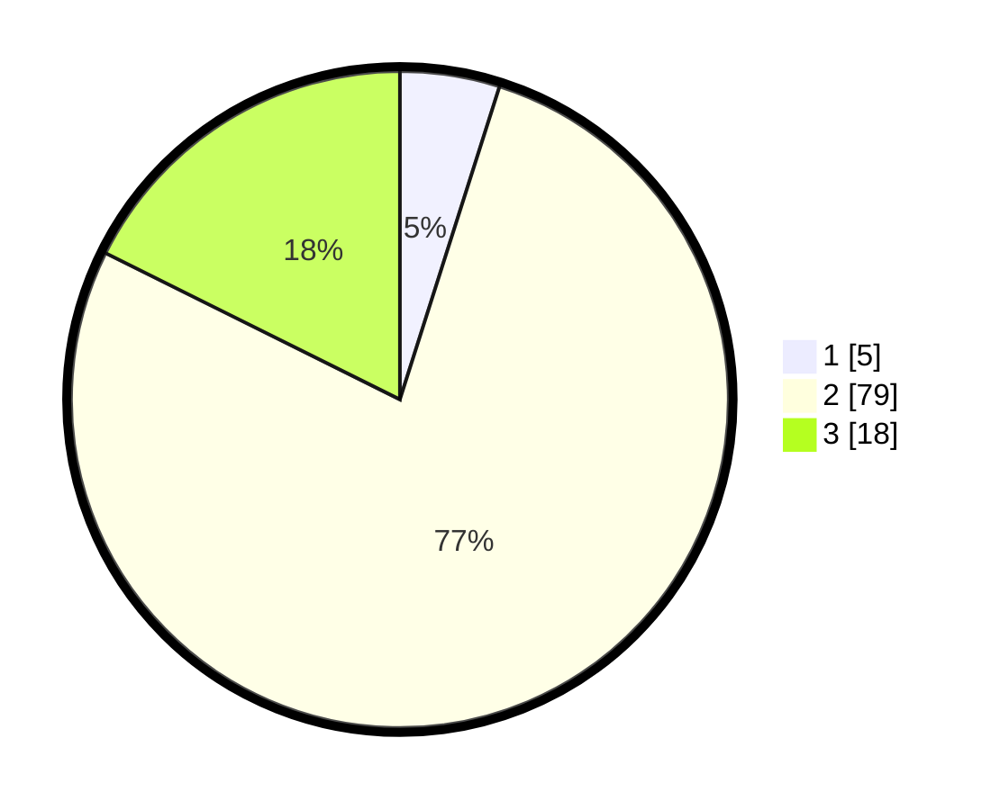

# Hasil

## Grafik

## Tabel

| No. | Nama Paslon    | Suara | Suara (raw) | Persentase |
|:--- |:-------------- | -----:| -----------:| ----------:|
| 1   | ANIES MUHAIMIN | 5     | [5][p-1]    | 4,90       |
| 2   | PRABOWO GIBRAN | 79    | [79][p-2]   | 77,45      |
| 3   | GANJAR MAHFUD  | 18    | [18][p-3]   | 17,65      |

[p-1]: https://github.com/gigit-pemilu/pemilu-2024-16-sumatera-selatan/blob/main/pilpres/hitung-suara/sub/16-sumatera-selatan/sub/03-muara-enim/sub/25-lubai-ulu/sub/2004-sumber-mulya/sub/019-tps/sub/paslon-1.txt
[p-2]: https://github.com/gigit-pemilu/pemilu-2024-16-sumatera-selatan/blob/main/pilpres/hitung-suara/sub/16-sumatera-selatan/sub/03-muara-enim/sub/25-lubai-ulu/sub/2004-sumber-mulya/sub/019-tps/sub/paslon-2.txt
[p-3]: https://github.com/gigit-pemilu/pemilu-2024-16-sumatera-selatan/blob/main/pilpres/hitung-suara/sub/16-sumatera-selatan/sub/03-muara-enim/sub/25-lubai-ulu/sub/2004-sumber-mulya/sub/019-tps/sub/paslon-3.txt

## Foto C Plano

https://sirekap-obj-formc.kpu.go.id/8bf7/pemilu/ppwp/16/03/25/20/04/1603252004019-20240221-204336--f1f2f182-80f1-48ca-8caa-8c61294b564e.jpg

https://sirekap-obj-formc.kpu.go.id/8bf7/pemilu/ppwp/16/03/25/20/04/1603252004019-20240221-204500--a19041b2-4b9d-434d-914d-5280431e8ab9.jpg

https://sirekap-obj-formc.kpu.go.id/8bf7/pemilu/ppwp/16/03/25/20/04/1603252004019-20240221-204537--7b2ff13a-4bd6-47a6-8a20-408d032b3970.jpg

## Metadata

| Key        | Value               |
| ---------- | ------------------- |
| Time Stamp | 2024-02-24 23:00:00 |

