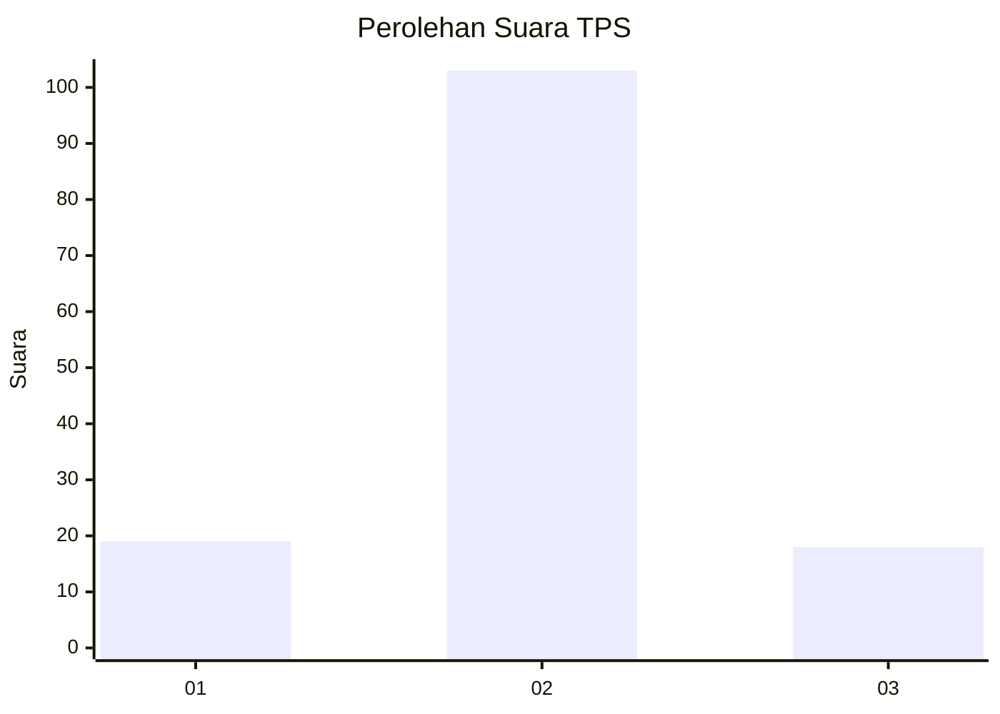
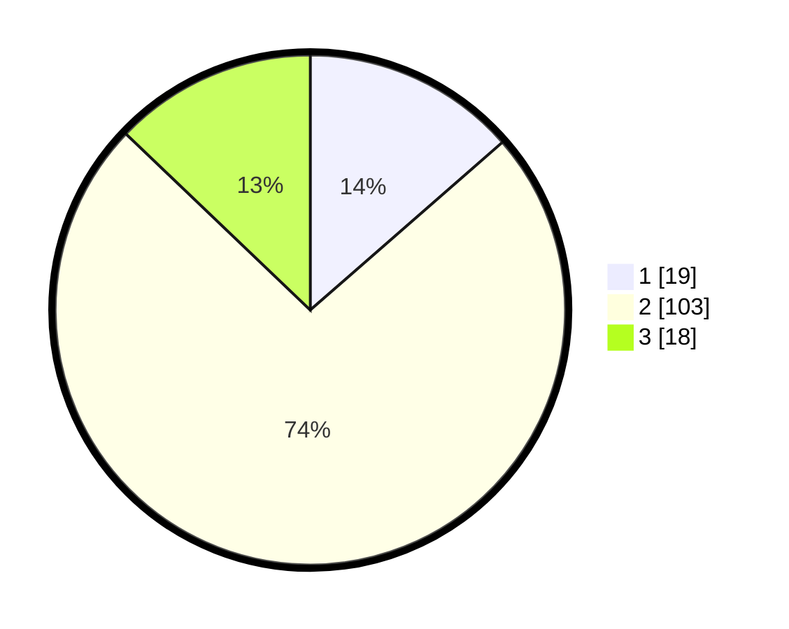

# Hasil

## Grafik

## Tabel

| No. | Nama Paslon    | Suara | Suara (raw) | Persentase |
|:--- |:-------------- | -----:| -----------:| ----------:|
| 1   | ANIES MUHAIMIN | 19    | [19][p-1]   | 13,57      |
| 2   | PRABOWO GIBRAN | 103   | [103][p-2]  | 73,57      |
| 3   | GANJAR MAHFUD  | 18    | [18][p-3]   | 12,86      |

[p-1]: https://github.com/gigit-pemilu/pemilu-2024-16-sumatera-selatan/blob/main/pilpres/hitung-suara/sub/16-sumatera-selatan/sub/03-muara-enim/sub/25-lubai-ulu/sub/2005-sumber-asri/sub/001-tps/sub/paslon-1.txt
[p-2]: https://github.com/gigit-pemilu/pemilu-2024-16-sumatera-selatan/blob/main/pilpres/hitung-suara/sub/16-sumatera-selatan/sub/03-muara-enim/sub/25-lubai-ulu/sub/2005-sumber-asri/sub/001-tps/sub/paslon-2.txt
[p-3]: https://github.com/gigit-pemilu/pemilu-2024-16-sumatera-selatan/blob/main/pilpres/hitung-suara/sub/16-sumatera-selatan/sub/03-muara-enim/sub/25-lubai-ulu/sub/2005-sumber-asri/sub/001-tps/sub/paslon-3.txt

## Foto C Plano

https://sirekap-obj-formc.kpu.go.id/1b59/pemilu/ppwp/16/03/25/20/05/1603252005001-20240220-204144--d065a3ed-bc07-4897-a678-70e98cfb0e7e.jpg

https://sirekap-obj-formc.kpu.go.id/1b59/pemilu/ppwp/16/03/25/20/05/1603252005001-20240220-204430--40c225c0-6a2e-433f-a512-d80bb41064ea.jpg

https://sirekap-obj-formc.kpu.go.id/1b59/pemilu/ppwp/16/03/25/20/05/1603252005001-20240220-204446--4e6d05aa-c55e-4f4f-b324-9295584c03f7.jpg

## Metadata

| Key        | Value               |
| ---------- | ------------------- |
| Time Stamp | 2024-02-24 23:00:00 |

