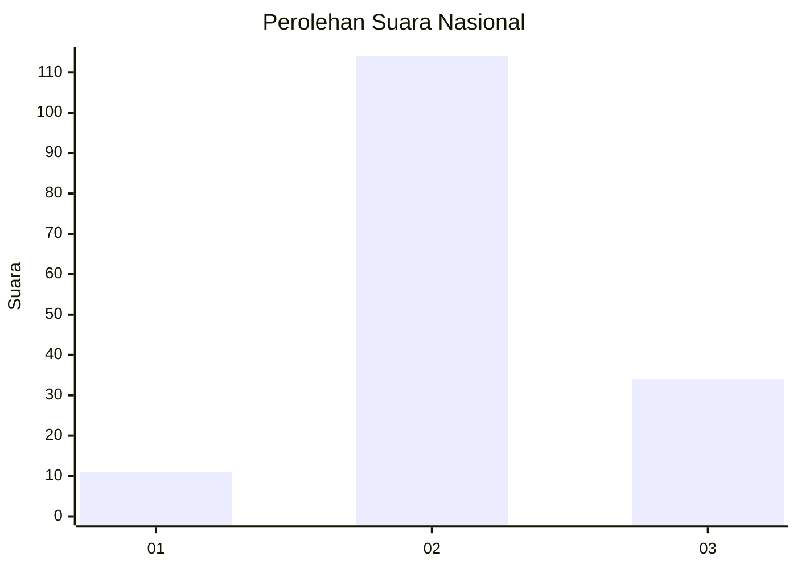
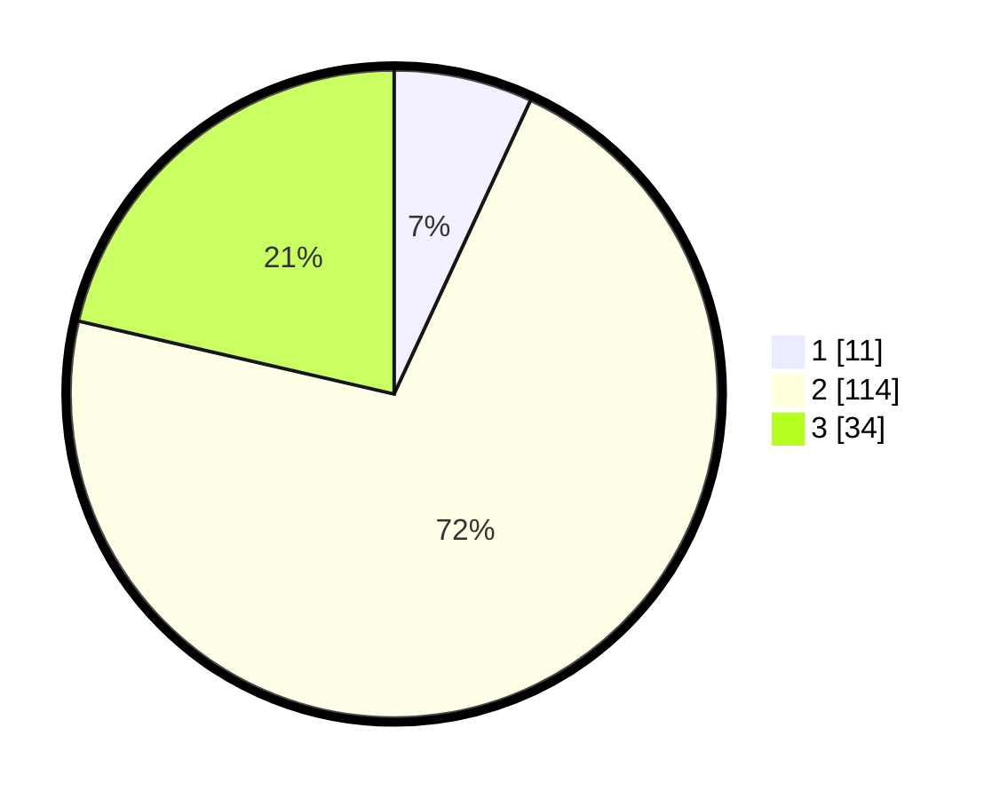

# Hasil

## Grafik

## Tabel

| No. | Nama Paslon    | Suara | Suara (raw) | Persentase |
|:--- |:-------------- | -----:| -----------:| ----------:|
| 1   | ANIES MUHAIMIN | 11    | [11][p-1]   | 6,92       |
| 2   | PRABOWO GIBRAN | 114   | [114][p-2]  | 71,70      |
| 3   | GANJAR MAHFUD  | 34    | [34][p-3]   | 21,38      |

[p-1]: https://github.com/gigit-pemilu/pemilu-2024/blob/main/pilpres/hitung-suara/sub/16-sumatera-selatan/sub/03-muara-enim/sub/25-lubai-ulu/sub/2005-sumber-asri/sub/002-tps/sub/paslon-1.txt
[p-2]: https://github.com/gigit-pemilu/pemilu-2024/blob/main/pilpres/hitung-suara/sub/16-sumatera-selatan/sub/03-muara-enim/sub/25-lubai-ulu/sub/2005-sumber-asri/sub/002-tps/sub/paslon-2.txt
[p-3]: https://github.com/gigit-pemilu/pemilu-2024/blob/main/pilpres/hitung-suara/sub/16-sumatera-selatan/sub/03-muara-enim/sub/25-lubai-ulu/sub/2005-sumber-asri/sub/002-tps/sub/paslon-3.txt

## Foto C Plano

https://sirekap-obj-formc.kpu.go.id/4d89/pemilu/ppwp/16/03/25/20/05/1603252005002-20240220-205206--0f09f129-de51-4aee-9072-730e0af4b299.jpg

https://sirekap-obj-formc.kpu.go.id/4d89/pemilu/ppwp/16/03/25/20/05/1603252005002-20240220-205540--be988742-6d8a-4755-b8e2-fc29dad8b3e4.jpg

https://sirekap-obj-formc.kpu.go.id/4d89/pemilu/ppwp/16/03/25/20/05/1603252005002-20240220-205625--972fe184-d0c5-472b-9985-972a65327142.jpg

## Metadata

| Key        | Value               |
| ---------- | ------------------- |
| Time Stamp | 2024-02-25 23:00:00 |

