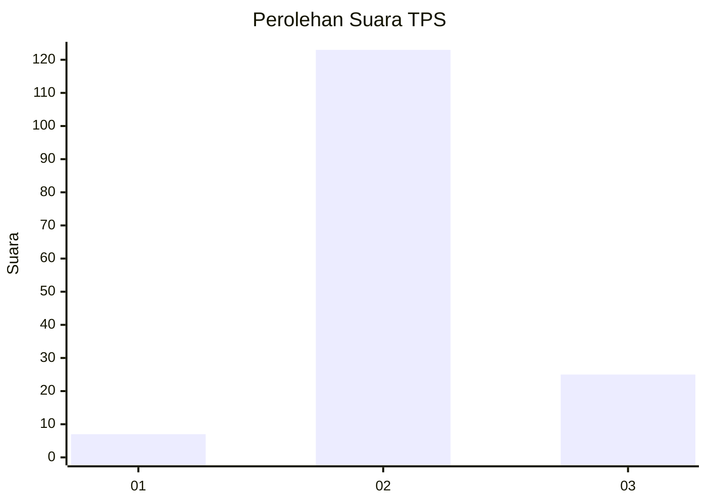
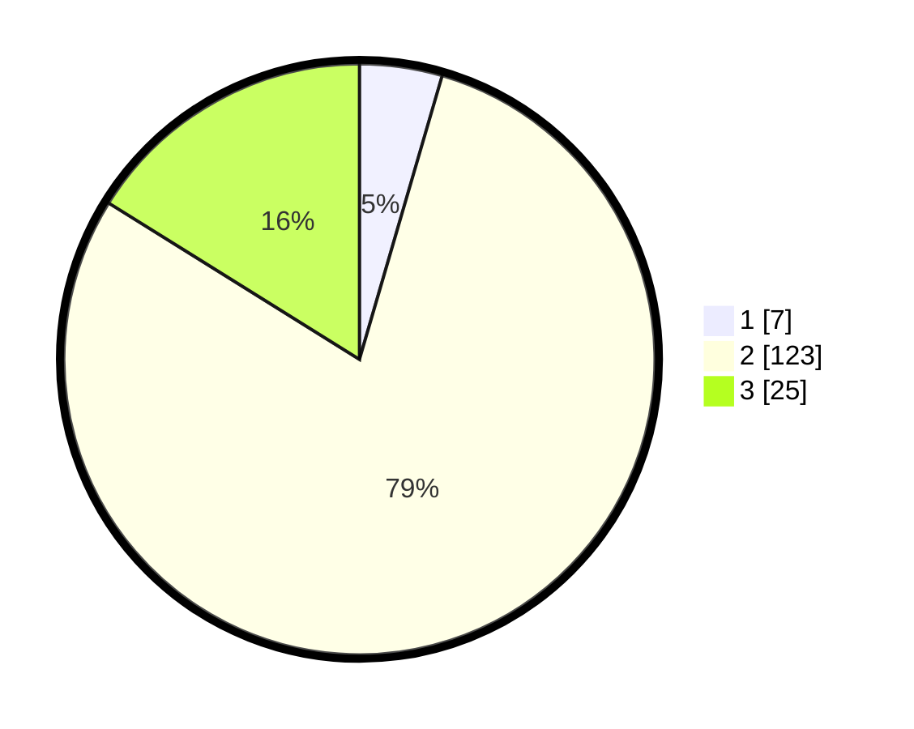

# Hasil

## Grafik

## Tabel

| No. | Nama Paslon    | Suara | Suara (raw) | Persentase |
|:--- |:-------------- | -----:| -----------:| ----------:|
| 1   | ANIES MUHAIMIN | 7     | [7][p-1]    | 4,52       |
| 2   | PRABOWO GIBRAN | 123   | [123][p-2]  | 79,35      |
| 3   | GANJAR MAHFUD  | 25    | [25][p-3]   | 16,13      |

[p-1]: https://github.com/gigit-pemilu/pemilu-2024-16-sumatera-selatan/blob/main/pilpres/hitung-suara/sub/16-sumatera-selatan/sub/03-muara-enim/sub/25-lubai-ulu/sub/2005-sumber-asri/sub/004-tps/sub/paslon-1.txt
[p-2]: https://github.com/gigit-pemilu/pemilu-2024-16-sumatera-selatan/blob/main/pilpres/hitung-suara/sub/16-sumatera-selatan/sub/03-muara-enim/sub/25-lubai-ulu/sub/2005-sumber-asri/sub/004-tps/sub/paslon-2.txt
[p-3]: https://github.com/gigit-pemilu/pemilu-2024-16-sumatera-selatan/blob/main/pilpres/hitung-suara/sub/16-sumatera-selatan/sub/03-muara-enim/sub/25-lubai-ulu/sub/2005-sumber-asri/sub/004-tps/sub/paslon-3.txt

## Foto C Plano

https://sirekap-obj-formc.kpu.go.id/5aaf/pemilu/ppwp/16/03/25/20/05/1603252005004-20240220-210229--bfa96d8f-1fba-4b51-8de9-6a0e2e636617.jpg

https://sirekap-obj-formc.kpu.go.id/5aaf/pemilu/ppwp/16/03/25/20/05/1603252005004-20240220-210312--ed084643-5a5c-4b28-b11d-b5130b29cc26.jpg

https://sirekap-obj-formc.kpu.go.id/5aaf/pemilu/ppwp/16/03/25/20/05/1603252005004-20240220-210339--84df7a01-350d-4dfb-a0f9-c4d8812d2245.jpg

## Metadata

| Key        | Value               |
| ---------- | ------------------- |
| Time Stamp | 2024-02-25 21:00:00 |

