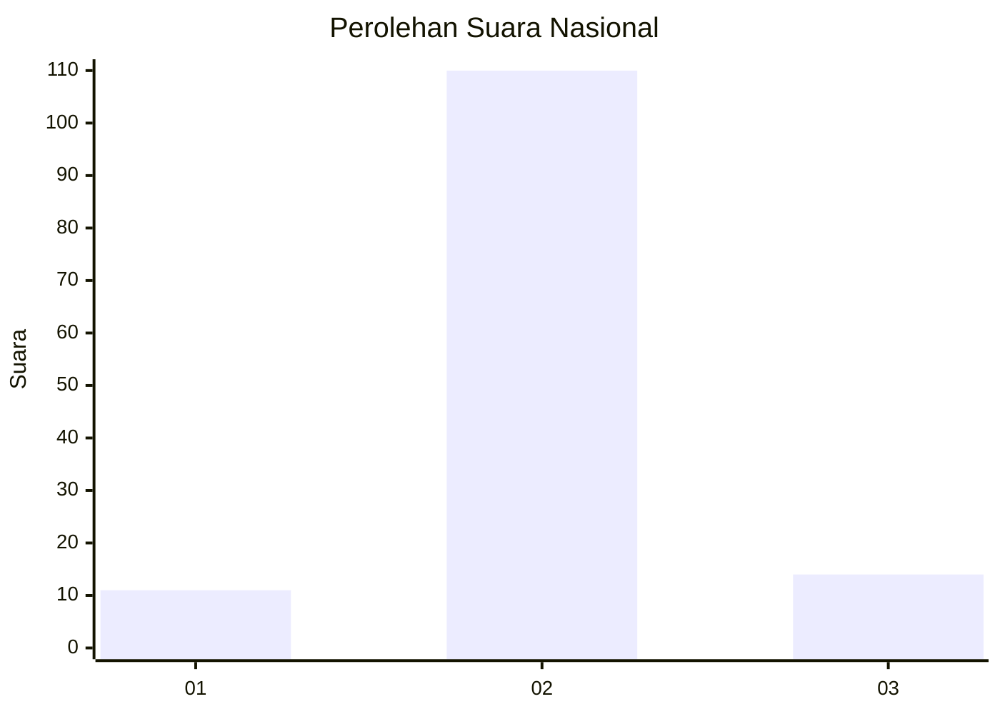
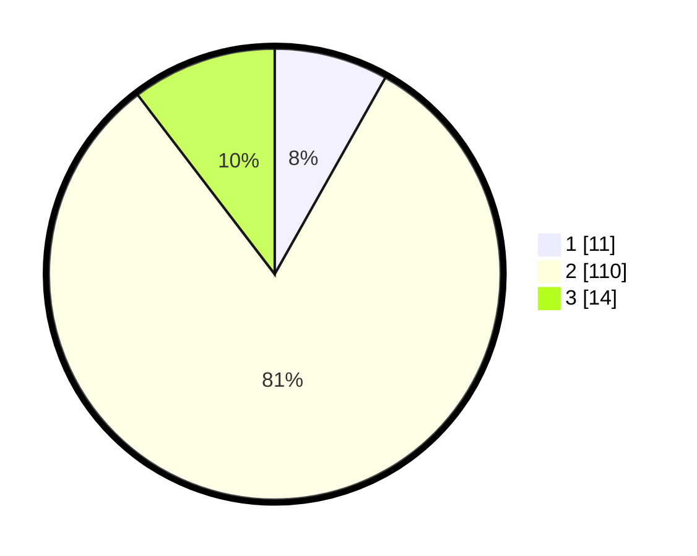

# Hasil

## Grafik

## Tabel

| No. | Nama Paslon    | Suara | Suara (raw) | Persentase |
|:--- |:-------------- | -----:| -----------:| ----------:|
| 1   | ANIES MUHAIMIN | 11    | [11][p-1]   | 8,15       |
| 2   | PRABOWO GIBRAN | 110   | [110][p-2]  | 81,48      |
| 3   | GANJAR MAHFUD  | 14    | [14][p-3]   | 10,37      |

[p-1]: https://github.com/gigit-pemilu/pemilu-2024/blob/main/pilpres/hitung-suara/sub/16-sumatera-selatan/sub/03-muara-enim/sub/25-lubai-ulu/sub/2005-sumber-asri/sub/005-tps/sub/paslon-1.txt
[p-2]: https://github.com/gigit-pemilu/pemilu-2024/blob/main/pilpres/hitung-suara/sub/16-sumatera-selatan/sub/03-muara-enim/sub/25-lubai-ulu/sub/2005-sumber-asri/sub/005-tps/sub/paslon-2.txt
[p-3]: https://github.com/gigit-pemilu/pemilu-2024/blob/main/pilpres/hitung-suara/sub/16-sumatera-selatan/sub/03-muara-enim/sub/25-lubai-ulu/sub/2005-sumber-asri/sub/005-tps/sub/paslon-3.txt

## Foto C Plano

https://sirekap-obj-formc.kpu.go.id/7ee8/pemilu/ppwp/16/03/25/20/05/1603252005005-20240220-210707--f6926d50-9ce8-48af-b615-58eda331ce51.jpg

https://sirekap-obj-formc.kpu.go.id/7ee8/pemilu/ppwp/16/03/25/20/05/1603252005005-20240220-211623--a8fad865-58b3-4543-924e-eea5ce80c811.jpg

https://sirekap-obj-formc.kpu.go.id/7ee8/pemilu/ppwp/16/03/25/20/05/1603252005005-20240220-211711--5123a889-d83e-487b-a87e-2777a6827c04.jpg

## Metadata

| Key        | Value               |
| ---------- | ------------------- |
| Time Stamp | 2024-02-24 22:31:28 |

