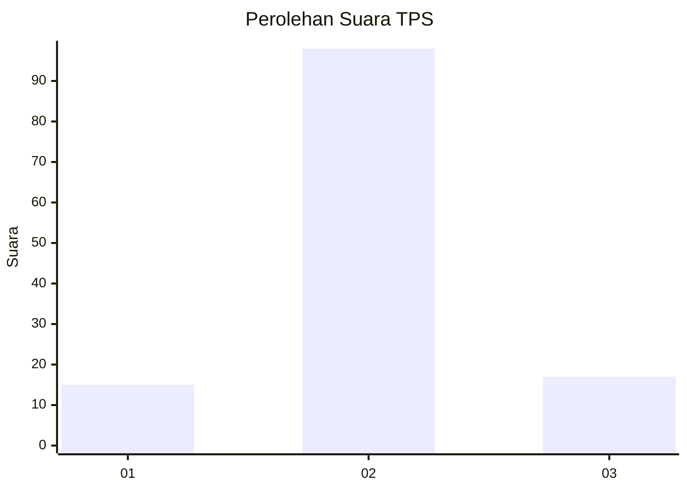
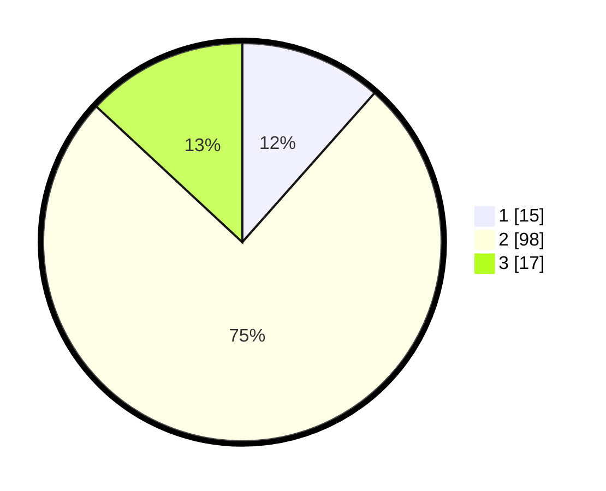

# Hasil

## Grafik

## Tabel

| No. | Nama Paslon    | Suara | Suara (raw) | Persentase |
|:--- |:-------------- | -----:| -----------:| ----------:|
| 1   | ANIES MUHAIMIN | 15    | [15][p-1]   | 11,54      |
| 2   | PRABOWO GIBRAN | 98    | [98][p-2]   | 75,38      |
| 3   | GANJAR MAHFUD  | 17    | [17][p-3]   | 13,08      |

[p-1]: https://github.com/gigit-pemilu/pemilu-2024-16-sumatera-selatan/blob/main/pilpres/hitung-suara/sub/16-sumatera-selatan/sub/03-muara-enim/sub/25-lubai-ulu/sub/2005-sumber-asri/sub/006-tps/sub/paslon-1.txt
[p-2]: https://github.com/gigit-pemilu/pemilu-2024-16-sumatera-selatan/blob/main/pilpres/hitung-suara/sub/16-sumatera-selatan/sub/03-muara-enim/sub/25-lubai-ulu/sub/2005-sumber-asri/sub/006-tps/sub/paslon-2.txt
[p-3]: https://github.com/gigit-pemilu/pemilu-2024-16-sumatera-selatan/blob/main/pilpres/hitung-suara/sub/16-sumatera-selatan/sub/03-muara-enim/sub/25-lubai-ulu/sub/2005-sumber-asri/sub/006-tps/sub/paslon-3.txt

## Foto C Plano

https://sirekap-obj-formc.kpu.go.id/bc99/pemilu/ppwp/16/03/25/20/05/1603252005006-20240220-215809--d27f59b3-6b1c-4f3b-a18a-a1617da1428f.jpg

https://sirekap-obj-formc.kpu.go.id/bc99/pemilu/ppwp/16/03/25/20/05/1603252005006-20240220-215953--0b0837e5-7133-431d-abfd-9762f0158eef.jpg

https://sirekap-obj-formc.kpu.go.id/bc99/pemilu/ppwp/16/03/25/20/05/1603252005006-20240220-221001--39aab12d-72ce-4ee3-8ab2-0a658d6fddc3.jpg

## Metadata

| Key        | Value               |
| ---------- | ------------------- |
| Time Stamp | 2024-02-25 21:00:00 |

