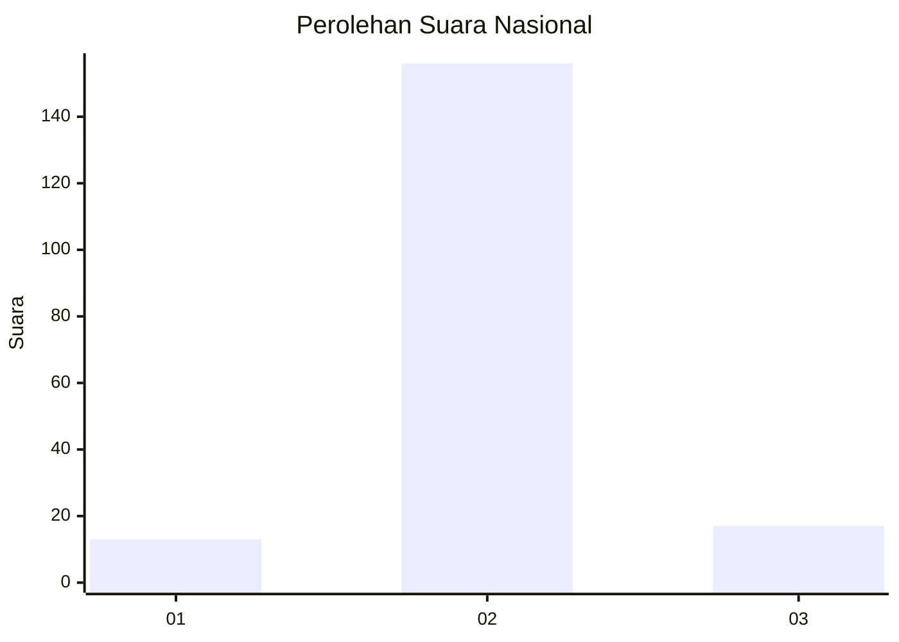
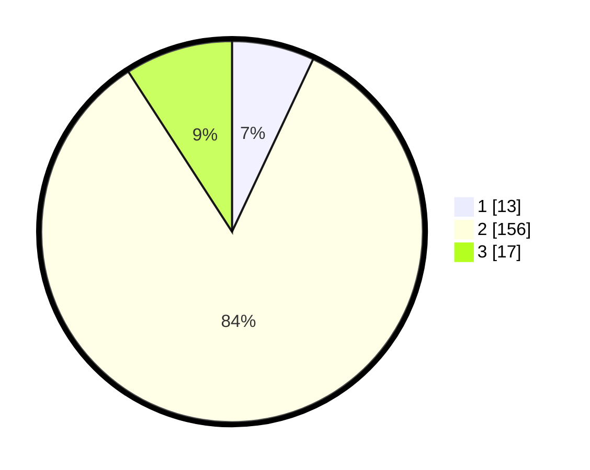

# Hasil

## Grafik

## Tabel

| No. | Nama Paslon    | Suara | Suara (raw) | Persentase |
|:--- |:-------------- | -----:| -----------:| ----------:|
| 1   | ANIES MUHAIMIN | 13    | [13][p-1]   | 6,99       |
| 2   | PRABOWO GIBRAN | 156   | [156][p-2]  | 83,87      |
| 3   | GANJAR MAHFUD  | 17    | [17][p-3]   | 9,14       |

[p-1]: https://github.com/gigit-pemilu/pemilu-2024/blob/main/pilpres/hitung-suara/sub/16-sumatera-selatan/sub/03-muara-enim/sub/25-lubai-ulu/sub/2006-pagar-dewa/sub/003-tps/sub/paslon-1.txt
[p-2]: https://github.com/gigit-pemilu/pemilu-2024/blob/main/pilpres/hitung-suara/sub/16-sumatera-selatan/sub/03-muara-enim/sub/25-lubai-ulu/sub/2006-pagar-dewa/sub/003-tps/sub/paslon-2.txt
[p-3]: https://github.com/gigit-pemilu/pemilu-2024/blob/main/pilpres/hitung-suara/sub/16-sumatera-selatan/sub/03-muara-enim/sub/25-lubai-ulu/sub/2006-pagar-dewa/sub/003-tps/sub/paslon-3.txt

## Foto C Plano

https://sirekap-obj-formc.kpu.go.id/3cae/pemilu/ppwp/16/03/25/20/06/1603252006003-20240220-095602--f18e03ad-ec83-47f8-b07a-a9327fdeecf8.jpg

https://sirekap-obj-formc.kpu.go.id/3cae/pemilu/ppwp/16/03/25/20/06/1603252006003-20240220-095625--4cc16063-4854-4a70-a1b7-604fba494eaf.jpg

https://sirekap-obj-formc.kpu.go.id/3cae/pemilu/ppwp/16/03/25/20/06/1603252006003-20240220-095848--e560f1ee-a1e4-4b2d-a5ef-c99a224ae558.jpg

## Metadata

| Key        | Value               |
| ---------- | ------------------- |
| Time Stamp | 2024-02-24 22:31:28 |

