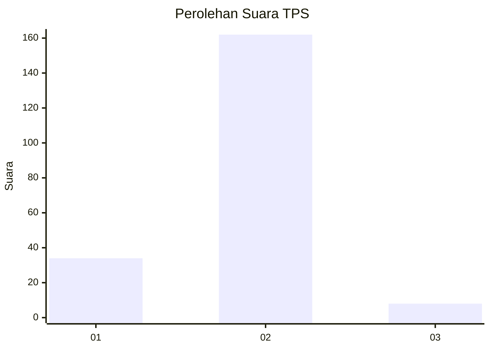
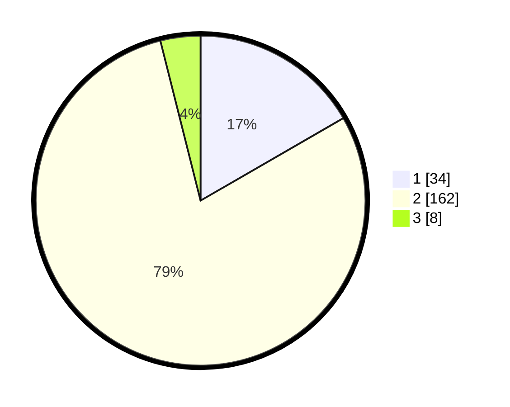

# Hasil

## Grafik

## Tabel

| No. | Nama Paslon    | Suara | Suara (raw) | Persentase |
|:--- |:-------------- | -----:| -----------:| ----------:|
| 1   | ANIES MUHAIMIN | 34    | [34][p-1]   | 16,67      |
| 2   | PRABOWO GIBRAN | 162   | [162][p-2]  | 79,41      |
| 3   | GANJAR MAHFUD  | 8     | [8][p-3]    | 3,92       |

[p-1]: https://github.com/gigit-pemilu/pemilu-2024-16-sumatera-selatan/blob/main/pilpres/hitung-suara/sub/16-sumatera-selatan/sub/03-muara-enim/sub/25-lubai-ulu/sub/2007-prabumenang/sub/003-tps/sub/paslon-1.txt
[p-2]: https://github.com/gigit-pemilu/pemilu-2024-16-sumatera-selatan/blob/main/pilpres/hitung-suara/sub/16-sumatera-selatan/sub/03-muara-enim/sub/25-lubai-ulu/sub/2007-prabumenang/sub/003-tps/sub/paslon-2.txt
[p-3]: https://github.com/gigit-pemilu/pemilu-2024-16-sumatera-selatan/blob/main/pilpres/hitung-suara/sub/16-sumatera-selatan/sub/03-muara-enim/sub/25-lubai-ulu/sub/2007-prabumenang/sub/003-tps/sub/paslon-3.txt

## Foto C Plano

https://sirekap-obj-formc.kpu.go.id/d7b6/pemilu/ppwp/16/03/25/20/07/1603252007003-20240218-225508--b3f2160f-20b7-4261-8f3a-b5b838229fdc.jpg

https://sirekap-obj-formc.kpu.go.id/d7b6/pemilu/ppwp/16/03/25/20/07/1603252007003-20240218-225532--46b5af4c-59fc-4ebb-94b1-7d487fb30916.jpg

https://sirekap-obj-formc.kpu.go.id/d7b6/pemilu/ppwp/16/03/25/20/07/1603252007003-20240218-225550--69a5a0fa-aeee-4f3f-ba5a-0b04e2cda6e1.jpg

## Metadata

| Key        | Value               |
| ---------- | ------------------- |
| Time Stamp | 2024-02-25 21:00:00 |

