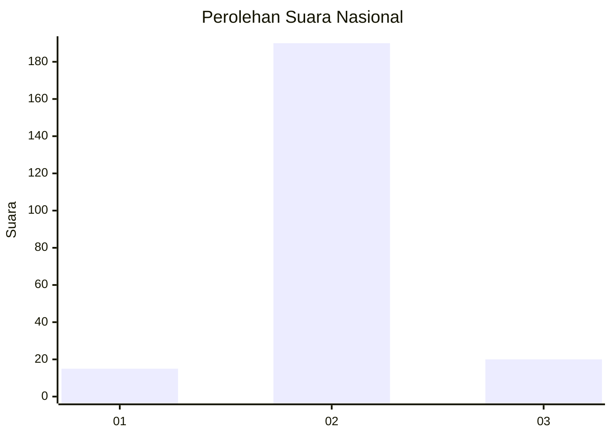
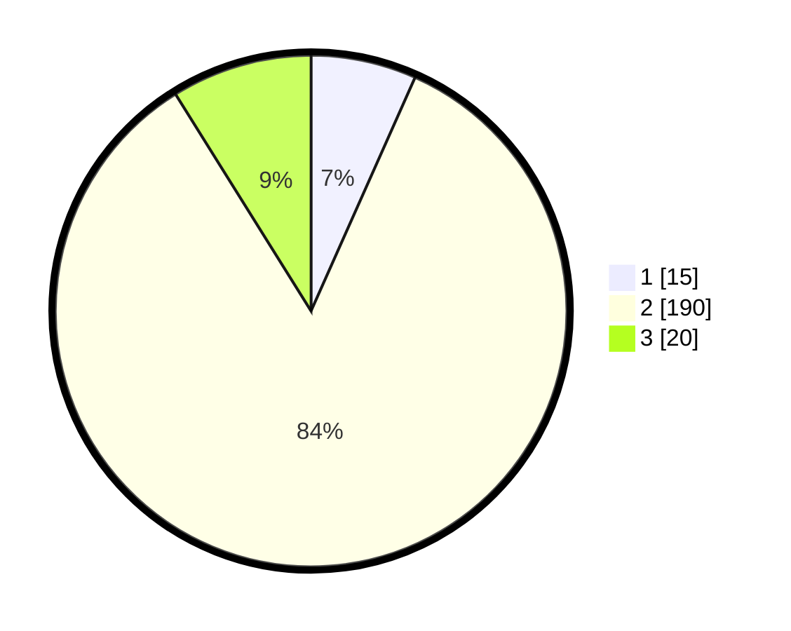

# Hasil

## Grafik

## Tabel

| No. | Nama Paslon    | Suara | Suara (raw) | Persentase |
|:--- |:-------------- | -----:| -----------:| ----------:|
| 1   | ANIES MUHAIMIN | 15    | [15][p-1]   | 6,67       |
| 2   | PRABOWO GIBRAN | 190   | [190][p-2]  | 84,44      |
| 3   | GANJAR MAHFUD  | 20    | [20][p-3]   | 8,89       |

[p-1]: https://github.com/gigit-pemilu/pemilu-2024/blob/main/pilpres/hitung-suara/sub/16-sumatera-selatan/sub/03-muara-enim/sub/25-lubai-ulu/sub/2008-lecah/sub/001-tps/sub/paslon-1.txt
[p-2]: https://github.com/gigit-pemilu/pemilu-2024/blob/main/pilpres/hitung-suara/sub/16-sumatera-selatan/sub/03-muara-enim/sub/25-lubai-ulu/sub/2008-lecah/sub/001-tps/sub/paslon-2.txt
[p-3]: https://github.com/gigit-pemilu/pemilu-2024/blob/main/pilpres/hitung-suara/sub/16-sumatera-selatan/sub/03-muara-enim/sub/25-lubai-ulu/sub/2008-lecah/sub/001-tps/sub/paslon-3.txt

## Foto C Plano

https://sirekap-obj-formc.kpu.go.id/0b4f/pemilu/ppwp/16/03/25/20/08/1603252008001-20240218-222640--afe51d21-f389-417b-829e-4047f1012865.jpg

https://sirekap-obj-formc.kpu.go.id/0b4f/pemilu/ppwp/16/03/25/20/08/1603252008001-20240218-222441--e0d4cfb9-9b7a-46a5-92a7-18c43950d5ad.jpg

https://sirekap-obj-formc.kpu.go.id/0b4f/pemilu/ppwp/16/03/25/20/08/1603252008001-20240218-222438--68508141-7f7a-4001-83a3-84b51b870e89.jpg

## Metadata

| Key        | Value               |
| ---------- | ------------------- |
| Time Stamp | 2024-02-26 00:00:00 |

