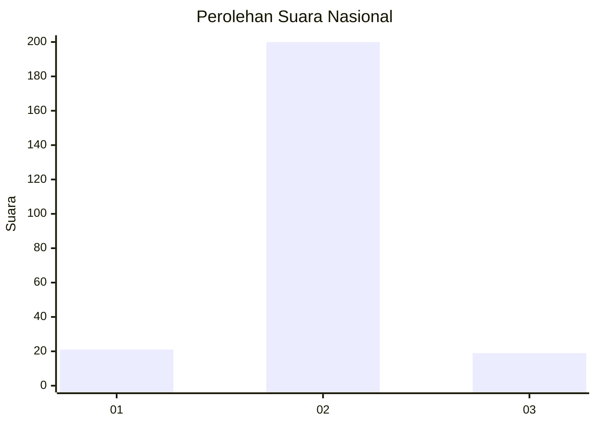
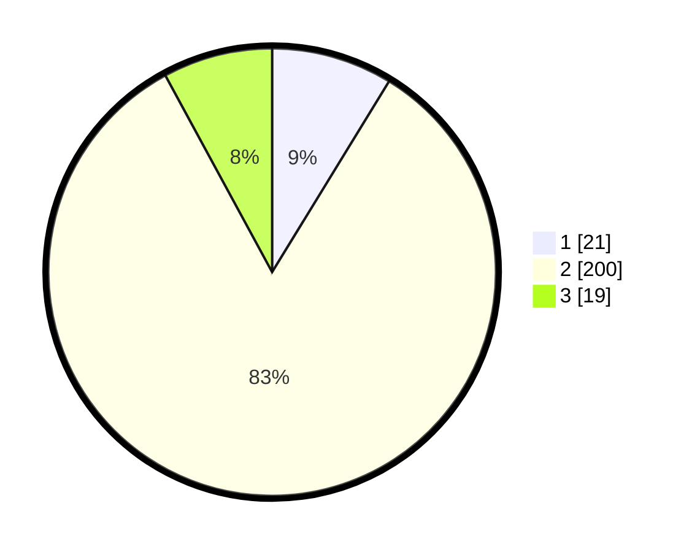

# Hasil

## Grafik

## Tabel

| No. | Nama Paslon    | Suara | Suara (raw) | Persentase |
|:--- |:-------------- | -----:| -----------:| ----------:|
| 1   | ANIES MUHAIMIN | 21    | [21][p-1]   | 8,75       |
| 2   | PRABOWO GIBRAN | 200   | [200][p-2]  | 83,33      |
| 3   | GANJAR MAHFUD  | 19    | [19][p-3]   | 7,92       |

[p-1]: https://github.com/gigit-pemilu/pemilu-2024/blob/main/pilpres/hitung-suara/sub/16-sumatera-selatan/sub/03-muara-enim/sub/25-lubai-ulu/sub/2008-lecah/sub/003-tps/sub/paslon-1.txt
[p-2]: https://github.com/gigit-pemilu/pemilu-2024/blob/main/pilpres/hitung-suara/sub/16-sumatera-selatan/sub/03-muara-enim/sub/25-lubai-ulu/sub/2008-lecah/sub/003-tps/sub/paslon-2.txt
[p-3]: https://github.com/gigit-pemilu/pemilu-2024/blob/main/pilpres/hitung-suara/sub/16-sumatera-selatan/sub/03-muara-enim/sub/25-lubai-ulu/sub/2008-lecah/sub/003-tps/sub/paslon-3.txt

## Foto C Plano

https://sirekap-obj-formc.kpu.go.id/dae8/pemilu/ppwp/16/03/25/20/08/1603252008003-20240218-222940--40ae2154-4573-490c-a1a7-28010ebc9ac4.jpg

https://sirekap-obj-formc.kpu.go.id/dae8/pemilu/ppwp/16/03/25/20/08/1603252008003-20240218-222955--cd98556c-cd23-46df-ad6b-65866f85a134.jpg

https://sirekap-obj-formc.kpu.go.id/dae8/pemilu/ppwp/16/03/25/20/08/1603252008003-20240218-223101--d7a2d000-ed03-4dc2-bab4-43a57b3c6220.jpg

## Metadata

| Key        | Value               |
| ---------- | ------------------- |
| Time Stamp | 2024-02-25 16:00:00 |

