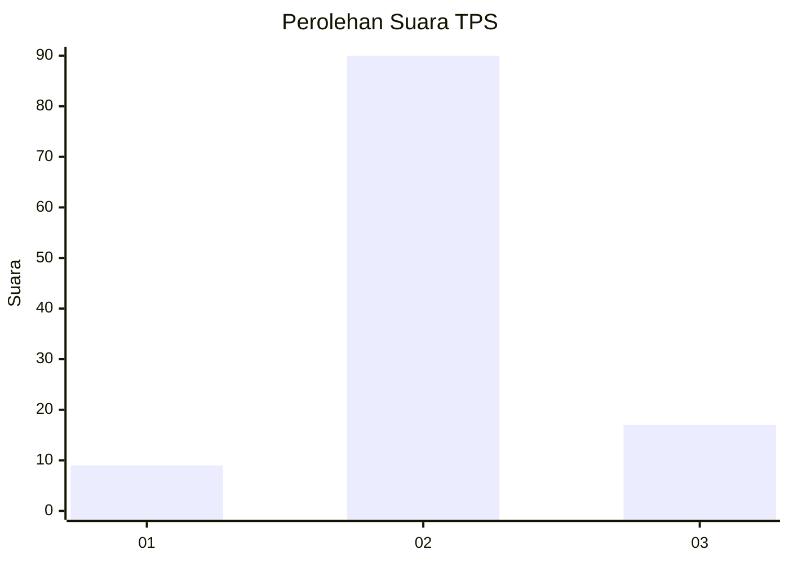

# Hasil

## Grafik

## Tabel

| No. | Nama Paslon    | Suara | Suara (raw) | Persentase |
|:--- |:-------------- | -----:| -----------:| ----------:|
| 1   | ANIES MUHAIMIN | 9     | [9][p-1]    | 7,76       |
| 2   | PRABOWO GIBRAN | 90    | [90][p-2]   | 77,59      |
| 3   | GANJAR MAHFUD  | 17    | [17][p-3]   | 14,66      |

[p-1]: https://github.com/gigit-pemilu/pemilu-2024-16-sumatera-selatan/blob/main/pilpres/hitung-suara/sub/16-sumatera-selatan/sub/03-muara-enim/sub/25-lubai-ulu/sub/2008-lecah/sub/006-tps/sub/paslon-1.txt
[p-2]: https://github.com/gigit-pemilu/pemilu-2024-16-sumatera-selatan/blob/main/pilpres/hitung-suara/sub/16-sumatera-selatan/sub/03-muara-enim/sub/25-lubai-ulu/sub/2008-lecah/sub/006-tps/sub/paslon-2.txt
[p-3]: https://github.com/gigit-pemilu/pemilu-2024-16-sumatera-selatan/blob/main/pilpres/hitung-suara/sub/16-sumatera-selatan/sub/03-muara-enim/sub/25-lubai-ulu/sub/2008-lecah/sub/006-tps/sub/paslon-3.txt

## Foto C Plano

https://sirekap-obj-formc.kpu.go.id/f270/pemilu/ppwp/16/03/25/20/08/1603252008006-20240218-223632--b18bfe40-72bd-4c20-98c1-d18f0194ecd3.jpg

https://sirekap-obj-formc.kpu.go.id/f270/pemilu/ppwp/16/03/25/20/08/1603252008006-20240218-223706--b70be9a4-9cf8-4055-9560-d1407dfc6ab5.jpg

https://sirekap-obj-formc.kpu.go.id/f270/pemilu/ppwp/16/03/25/20/08/1603252008006-20240218-223728--5a1eef4e-a63b-4624-848e-f316ed8f0a9d.jpg

## Metadata

| Key        | Value               |
| ---------- | ------------------- |
| Time Stamp | 2024-02-25 12:00:00 |

