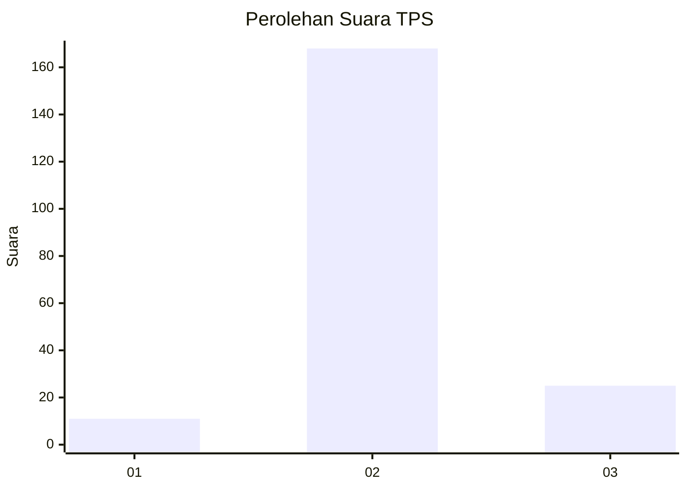
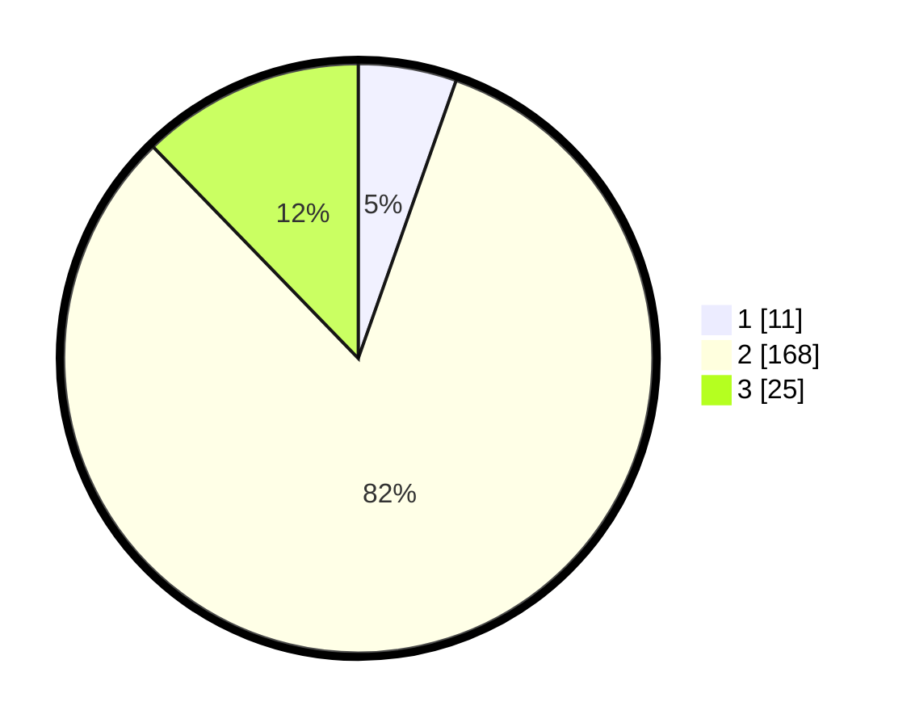

# Hasil

## Grafik

## Tabel

| No. | Nama Paslon    | Suara | Suara (raw) | Persentase |
|:--- |:-------------- | -----:| -----------:| ----------:|
| 1   | ANIES MUHAIMIN | 11    | [11][p-1]   | 5,39       |
| 2   | PRABOWO GIBRAN | 168   | [168][p-2]  | 82,35      |
| 3   | GANJAR MAHFUD  | 25    | [25][p-3]   | 12,25      |

[p-1]: https://github.com/gigit-pemilu/pemilu-2024-16-sumatera-selatan/blob/main/pilpres/hitung-suara/sub/16-sumatera-selatan/sub/03-muara-enim/sub/26-empat-petulai-dangku/sub/2001-muara-niru/sub/001-tps/sub/paslon-1.txt
[p-2]: https://github.com/gigit-pemilu/pemilu-2024-16-sumatera-selatan/blob/main/pilpres/hitung-suara/sub/16-sumatera-selatan/sub/03-muara-enim/sub/26-empat-petulai-dangku/sub/2001-muara-niru/sub/001-tps/sub/paslon-2.txt
[p-3]: https://github.com/gigit-pemilu/pemilu-2024-16-sumatera-selatan/blob/main/pilpres/hitung-suara/sub/16-sumatera-selatan/sub/03-muara-enim/sub/26-empat-petulai-dangku/sub/2001-muara-niru/sub/001-tps/sub/paslon-3.txt

## Foto C Plano

https://sirekap-obj-formc.kpu.go.id/7cd2/pemilu/ppwp/16/03/26/20/01/1603262001001-20240215-011422--09cd720d-9802-4959-acfb-229ed7841659.jpg

https://sirekap-obj-formc.kpu.go.id/7cd2/pemilu/ppwp/16/03/26/20/01/1603262001001-20240215-012008--91f9b09e-0334-4613-85de-0897491493c8.jpg

https://sirekap-obj-formc.kpu.go.id/7cd2/pemilu/ppwp/16/03/26/20/01/1603262001001-20240215-012221--d0bd9add-a0ed-4afe-9873-fbd0c4f8b44b.jpg

## Metadata

| Key        | Value               |
| ---------- | ------------------- |
| Time Stamp | 2024-02-24 22:31:28 |

