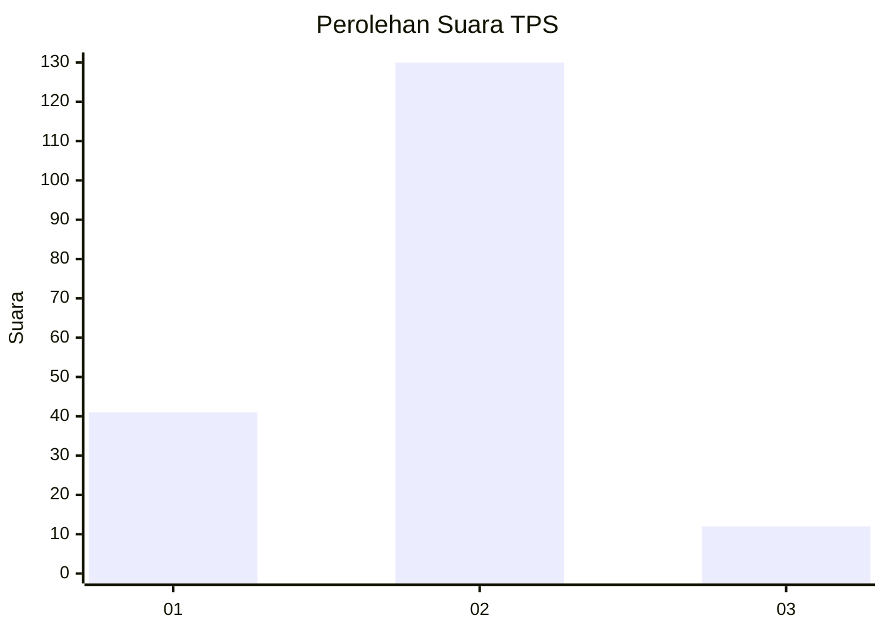

# Hasil

## Grafik

## Tabel

| No. | Nama Paslon    | Suara | Suara (raw) | Persentase |
|:--- |:-------------- | -----:| -----------:| ----------:|
| 1   | ANIES MUHAIMIN | 41    | [41][p-1]   | 22,40      |
| 2   | PRABOWO GIBRAN | 130   | [130][p-2]  | 71,04      |
| 3   | GANJAR MAHFUD  | 12    | [12][p-3]   | 6,56       |

[p-1]: https://github.com/gigit-pemilu/pemilu-2024-16-sumatera-selatan/blob/main/pilpres/hitung-suara/sub/16-sumatera-selatan/sub/03-muara-enim/sub/26-empat-petulai-dangku/sub/2002-kahuripan-baru/sub/001-tps/sub/paslon-1.txt
[p-2]: https://github.com/gigit-pemilu/pemilu-2024-16-sumatera-selatan/blob/main/pilpres/hitung-suara/sub/16-sumatera-selatan/sub/03-muara-enim/sub/26-empat-petulai-dangku/sub/2002-kahuripan-baru/sub/001-tps/sub/paslon-2.txt
[p-3]: https://github.com/gigit-pemilu/pemilu-2024-16-sumatera-selatan/blob/main/pilpres/hitung-suara/sub/16-sumatera-selatan/sub/03-muara-enim/sub/26-empat-petulai-dangku/sub/2002-kahuripan-baru/sub/001-tps/sub/paslon-3.txt

## Foto C Plano

https://sirekap-obj-formc.kpu.go.id/f4bf/pemilu/ppwp/16/03/26/20/02/1603262002001-20240214-222050--fbbd9c73-b34d-4ab1-b40d-836cfa6bad02.jpg

https://sirekap-obj-formc.kpu.go.id/f4bf/pemilu/ppwp/16/03/26/20/02/1603262002001-20240214-223828--85f1166b-89e6-4a32-a8a1-9925d371d0ce.jpg

https://sirekap-obj-formc.kpu.go.id/f4bf/pemilu/ppwp/16/03/26/20/02/1603262002001-20240214-211324--665565b7-9761-45f3-84cb-391aa145e2f3.jpg

## Metadata

| Key        | Value               |
| ---------- | ------------------- |
| Time Stamp | 2024-02-15 22:40:13 |

