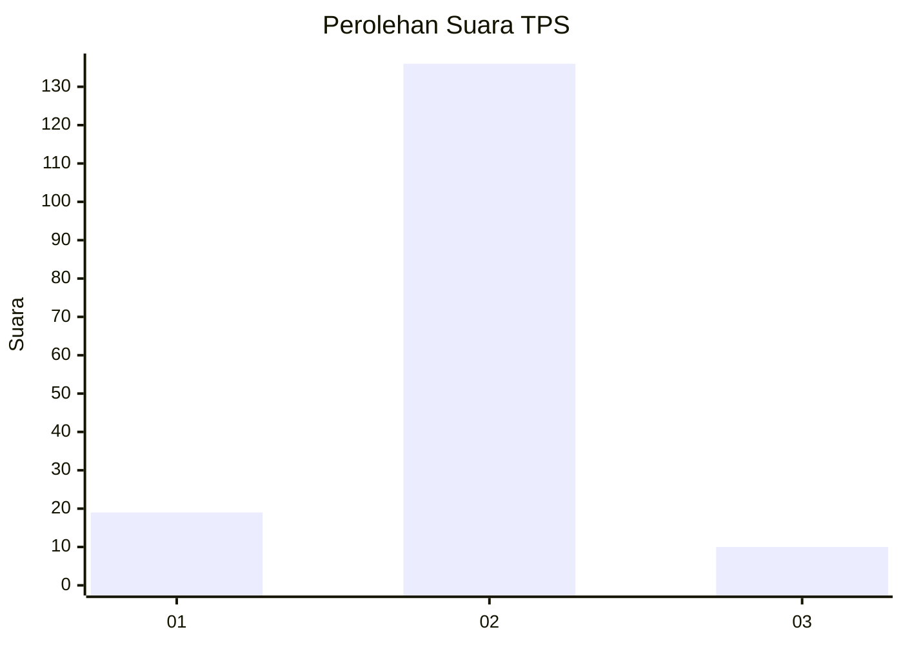
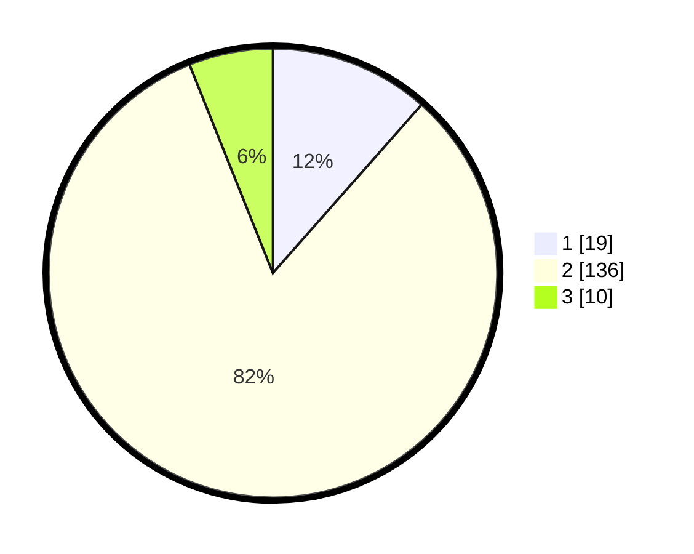

# Hasil

## Grafik

## Tabel

| No. | Nama Paslon    | Suara | Suara (raw) | Persentase |
|:--- |:-------------- | -----:| -----------:| ----------:|
| 1   | ANIES MUHAIMIN | 19    | [19][p-1]   | 11,52      |
| 2   | PRABOWO GIBRAN | 136   | [136][p-2]  | 82,42      |
| 3   | GANJAR MAHFUD  | 10    | [10][p-3]   | 6,06       |

[p-1]: https://github.com/gigit-pemilu/pemilu-2024-16-sumatera-selatan/blob/main/pilpres/hitung-suara/sub/16-sumatera-selatan/sub/03-muara-enim/sub/26-empat-petulai-dangku/sub/2003-pangkalan-babat/sub/001-tps/sub/paslon-1.txt
[p-2]: https://github.com/gigit-pemilu/pemilu-2024-16-sumatera-selatan/blob/main/pilpres/hitung-suara/sub/16-sumatera-selatan/sub/03-muara-enim/sub/26-empat-petulai-dangku/sub/2003-pangkalan-babat/sub/001-tps/sub/paslon-2.txt
[p-3]: https://github.com/gigit-pemilu/pemilu-2024-16-sumatera-selatan/blob/main/pilpres/hitung-suara/sub/16-sumatera-selatan/sub/03-muara-enim/sub/26-empat-petulai-dangku/sub/2003-pangkalan-babat/sub/001-tps/sub/paslon-3.txt

## Foto C Plano

https://sirekap-obj-formc.kpu.go.id/8328/pemilu/ppwp/16/03/26/20/03/1603262003001-20240218-092451--d121453f-9c9f-42db-a28b-a92fe570b49a.jpg

https://sirekap-obj-formc.kpu.go.id/8328/pemilu/ppwp/16/03/26/20/03/1603262003001-20240218-092609--23455c4e-8766-441d-a16f-caa222e2e5d7.jpg

https://sirekap-obj-formc.kpu.go.id/8328/pemilu/ppwp/16/03/26/20/03/1603262003001-20240218-092729--90111ab6-35fa-4051-b662-c75bcb4dd389.jpg

## Metadata

| Key        | Value               |
| ---------- | ------------------- |
| Time Stamp | 2024-02-25 16:00:00 |

