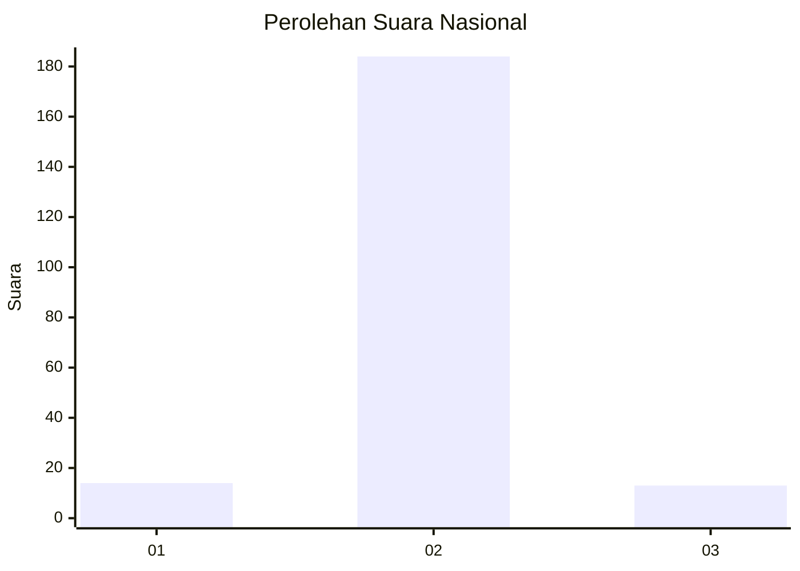
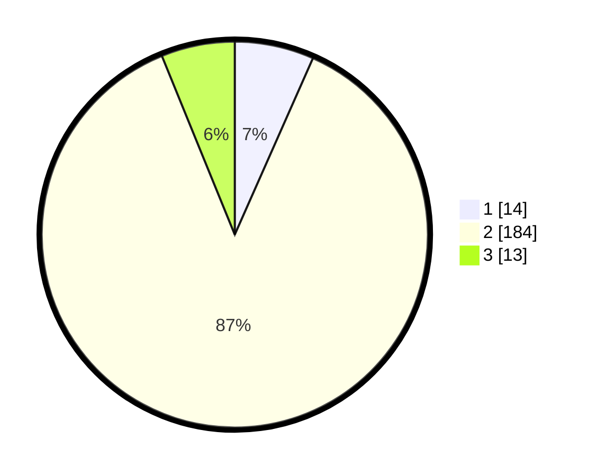

# Hasil

## Grafik

## Tabel

| No. | Nama Paslon    | Suara | Suara (raw) | Persentase |
|:--- |:-------------- | -----:| -----------:| ----------:|
| 1   | ANIES MUHAIMIN | 14    | [14][p-1]   | 6,64       |
| 2   | PRABOWO GIBRAN | 184   | [184][p-2]  | 87,20      |
| 3   | GANJAR MAHFUD  | 13    | [13][p-3]   | 6,16       |

[p-1]: https://github.com/gigit-pemilu/pemilu-2024/blob/main/pilpres/hitung-suara/sub/16-sumatera-selatan/sub/03-muara-enim/sub/26-empat-petulai-dangku/sub/2005-banuayu/sub/005-tps/sub/paslon-1.txt
[p-2]: https://github.com/gigit-pemilu/pemilu-2024/blob/main/pilpres/hitung-suara/sub/16-sumatera-selatan/sub/03-muara-enim/sub/26-empat-petulai-dangku/sub/2005-banuayu/sub/005-tps/sub/paslon-2.txt
[p-3]: https://github.com/gigit-pemilu/pemilu-2024/blob/main/pilpres/hitung-suara/sub/16-sumatera-selatan/sub/03-muara-enim/sub/26-empat-petulai-dangku/sub/2005-banuayu/sub/005-tps/sub/paslon-3.txt

## Foto C Plano

https://sirekap-obj-formc.kpu.go.id/7f38/pemilu/ppwp/16/03/26/20/05/1603262005005-20240215-042327--4842f04a-d3ba-424b-a686-87cb8ed40d7d.jpg

https://sirekap-obj-formc.kpu.go.id/7f38/pemilu/ppwp/16/03/26/20/05/1603262005005-20240215-042457--26c6c081-858f-4033-812c-4c73a8b92fe4.jpg

https://sirekap-obj-formc.kpu.go.id/7f38/pemilu/ppwp/16/03/26/20/05/1603262005005-20240215-042631--3316b40e-66f4-41e5-bac6-bc25817aa914.jpg

## Metadata

| Key        | Value               |
| ---------- | ------------------- |
| Time Stamp | 2024-02-25 16:00:00 |

