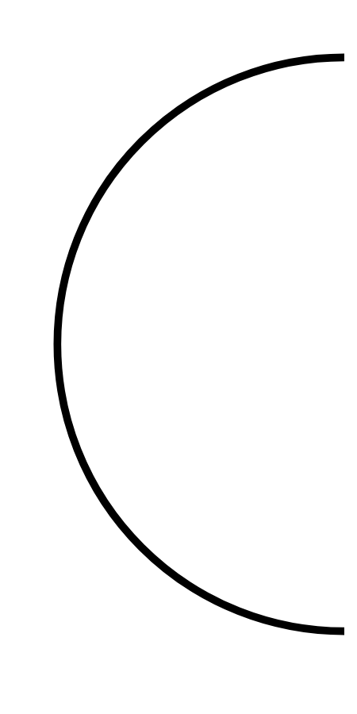

# Hasil

## Grafik

```mermaid
xychart-beta
    title "Perolehan Suara Nasional"
    x-axis []
    y-axis "Suara" 0 --> 0
    bar []
```



## Tabel

| No. | Nama Paslon | Suara | Suara (raw) | Persentase |
|:--- |:----------- | -----:| -----------:| ----------:|


[p-1]: https://github.com/gigit-pemilu/pemilu-2024/blob/main/pilpres/hitung-suara/sub/16-sumatera-selatan/sub/03-muara-enim/sub/26-empat-petulai-dangku/sub/2008-batu-raja/sub/003-tps/sub/paslon-1.txt
[p-2]: https://github.com/gigit-pemilu/pemilu-2024/blob/main/pilpres/hitung-suara/sub/16-sumatera-selatan/sub/03-muara-enim/sub/26-empat-petulai-dangku/sub/2008-batu-raja/sub/003-tps/sub/paslon-2.txt
[p-3]: https://github.com/gigit-pemilu/pemilu-2024/blob/main/pilpres/hitung-suara/sub/16-sumatera-selatan/sub/03-muara-enim/sub/26-empat-petulai-dangku/sub/2008-batu-raja/sub/003-tps/sub/paslon-3.txt

## Foto C Plano

https://sirekap-obj-formc.kpu.go.id/e4bd/pemilu/ppwp/16/03/26/20/08/1603262008003-20240215-100958--a52db514-92b0-4dbf-b3a7-693004ebd3b8.jpg

https://sirekap-obj-formc.kpu.go.id/e4bd/pemilu/ppwp/16/03/26/20/08/1603262008003-20240216-222306--35919fc3-d04d-465c-a2dd-c56202b1034f.jpg

https://sirekap-obj-formc.kpu.go.id/e4bd/pemilu/ppwp/16/03/26/20/08/1603262008003-20240215-101420--63db70a8-0a6d-4ebd-a4b4-abefda64c8f2.jpg


## Metadata

| Key        | Value               |
| ---------- | ------------------- |
| Time Stamp | 2024-02-17 06:00:03 |


