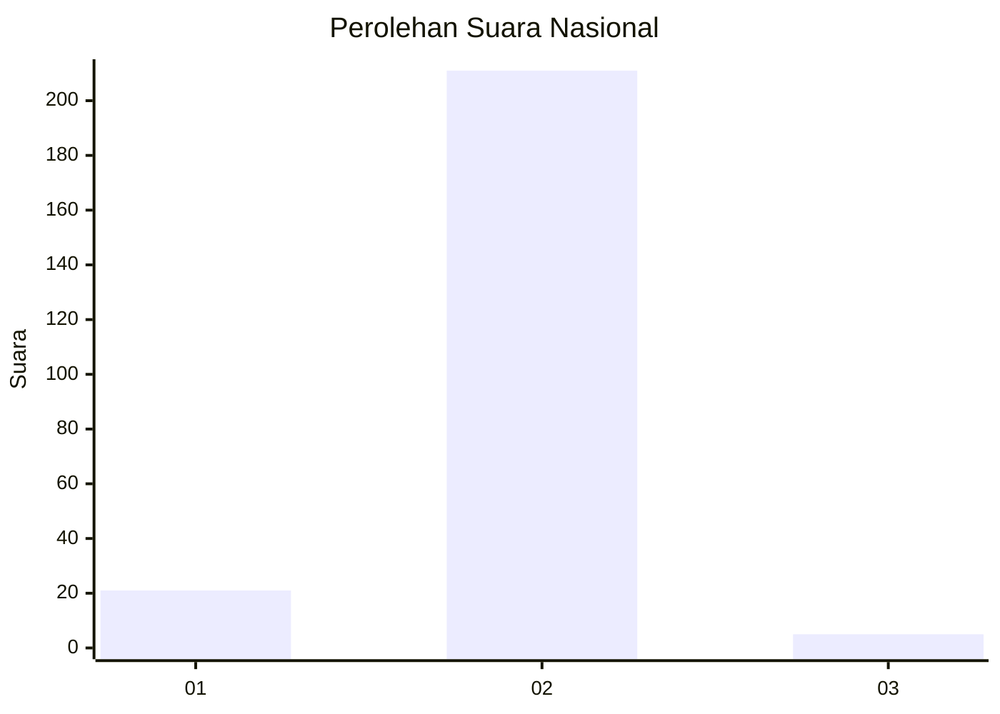
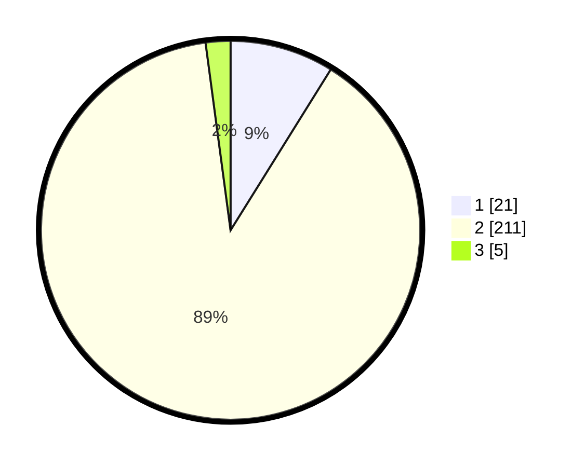

# Hasil

## Grafik

## Tabel

| No. | Nama Paslon    | Suara | Suara (raw) | Persentase |
|:--- |:-------------- | -----:| -----------:| ----------:|
| 1   | ANIES MUHAIMIN | 21    | [21][p-1]   | 8,86       |
| 2   | PRABOWO GIBRAN | 211   | [211][p-2]  | 89,03      |
| 3   | GANJAR MAHFUD  | 5     | [5][p-3]    | 2,11       |

[p-1]: https://github.com/gigit-pemilu/pemilu-2024/blob/main/pilpres/hitung-suara/sub/16-sumatera-selatan/sub/03-muara-enim/sub/26-empat-petulai-dangku/sub/2009-dangku/sub/004-tps/sub/paslon-1.txt
[p-2]: https://github.com/gigit-pemilu/pemilu-2024/blob/main/pilpres/hitung-suara/sub/16-sumatera-selatan/sub/03-muara-enim/sub/26-empat-petulai-dangku/sub/2009-dangku/sub/004-tps/sub/paslon-2.txt
[p-3]: https://github.com/gigit-pemilu/pemilu-2024/blob/main/pilpres/hitung-suara/sub/16-sumatera-selatan/sub/03-muara-enim/sub/26-empat-petulai-dangku/sub/2009-dangku/sub/004-tps/sub/paslon-3.txt

## Foto C Plano

https://sirekap-obj-formc.kpu.go.id/aad5/pemilu/ppwp/16/03/26/20/09/1603262009004-20240214-184514--7360e087-8b1b-4fe0-879d-c3a3f96322f6.jpg

https://sirekap-obj-formc.kpu.go.id/aad5/pemilu/ppwp/16/03/26/20/09/1603262009004-20240215-061937--8e41ca42-c716-4061-b902-2a7bb5419bca.jpg

https://sirekap-obj-formc.kpu.go.id/aad5/pemilu/ppwp/16/03/26/20/09/1603262009004-20240215-062044--d147c0b1-3304-49ba-b0cf-7d72e9cfc21b.jpg

## Metadata

| Key        | Value               |
| ---------- | ------------------- |
| Time Stamp | 2024-02-25 13:00:00 |

