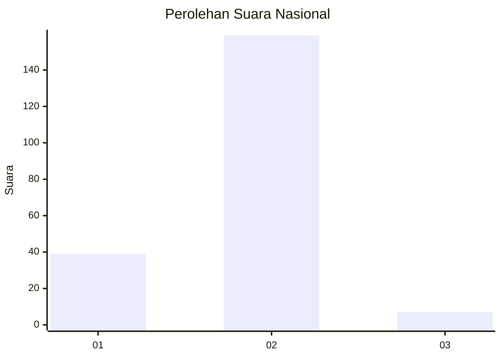
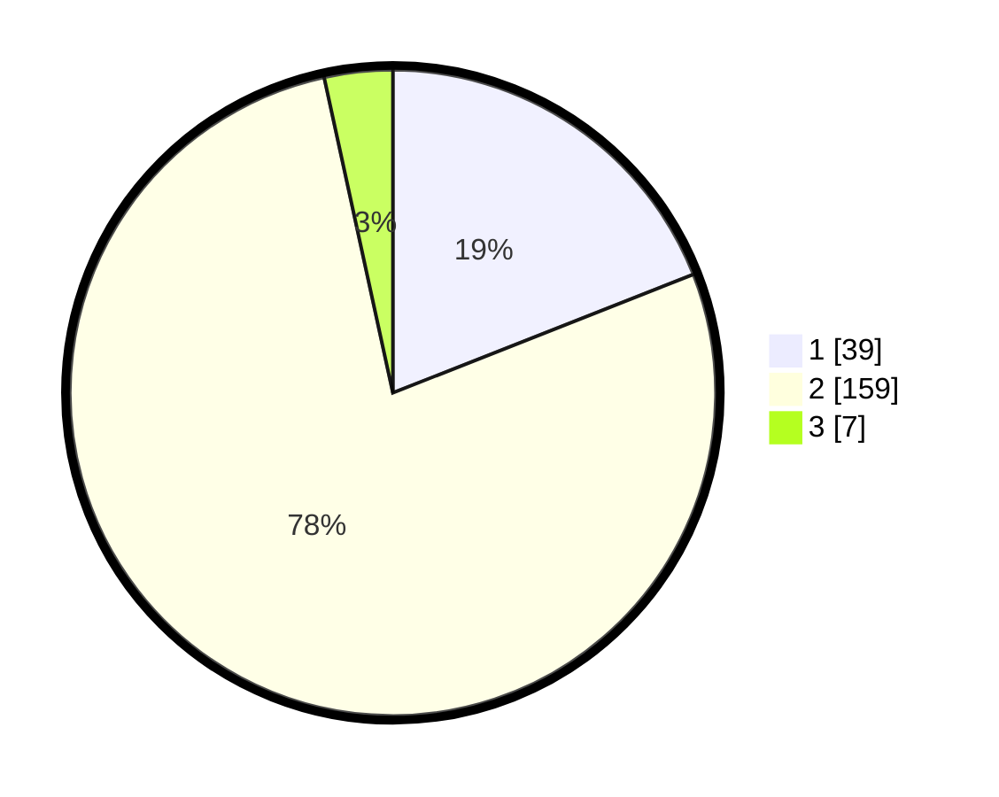

# Hasil

## Grafik

## Tabel

| No. | Nama Paslon    | Suara | Suara (raw) | Persentase |
|:--- |:-------------- | -----:| -----------:| ----------:|
| 1   | ANIES MUHAIMIN | 39    | [39][p-1]   | 19,02      |
| 2   | PRABOWO GIBRAN | 159   | [159][p-2]  | 77,56      |
| 3   | GANJAR MAHFUD  | 7     | [7][p-3]    | 3,41       |

[p-1]: https://github.com/gigit-pemilu/pemilu-2024/blob/main/pilpres/hitung-suara/sub/16-sumatera-selatan/sub/03-muara-enim/sub/27-panang-enim/sub/2001-lebak-budi/sub/004-tps/sub/paslon-1.txt
[p-2]: https://github.com/gigit-pemilu/pemilu-2024/blob/main/pilpres/hitung-suara/sub/16-sumatera-selatan/sub/03-muara-enim/sub/27-panang-enim/sub/2001-lebak-budi/sub/004-tps/sub/paslon-2.txt
[p-3]: https://github.com/gigit-pemilu/pemilu-2024/blob/main/pilpres/hitung-suara/sub/16-sumatera-selatan/sub/03-muara-enim/sub/27-panang-enim/sub/2001-lebak-budi/sub/004-tps/sub/paslon-3.txt

## Foto C Plano

https://sirekap-obj-formc.kpu.go.id/a5f8/pemilu/ppwp/16/03/27/20/01/1603272001004-20240215-050801--883bbe20-496a-4ad5-8842-b6bc14c6fcfe.jpg

https://sirekap-obj-formc.kpu.go.id/a5f8/pemilu/ppwp/16/03/27/20/01/1603272001004-20240215-050856--15a3a9c9-9c8e-4659-b436-a20b3c579ab4.jpg

https://sirekap-obj-formc.kpu.go.id/a5f8/pemilu/ppwp/16/03/27/20/01/1603272001004-20240215-051007--d871e8f9-d17d-438e-b55e-fb35b11e330d.jpg

## Metadata

| Key        | Value               |
| ---------- | ------------------- |
| Time Stamp | 2024-02-25 11:00:00 |

