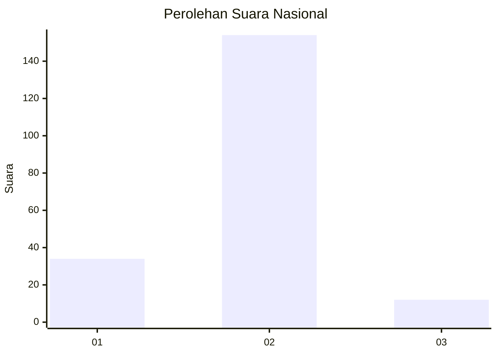
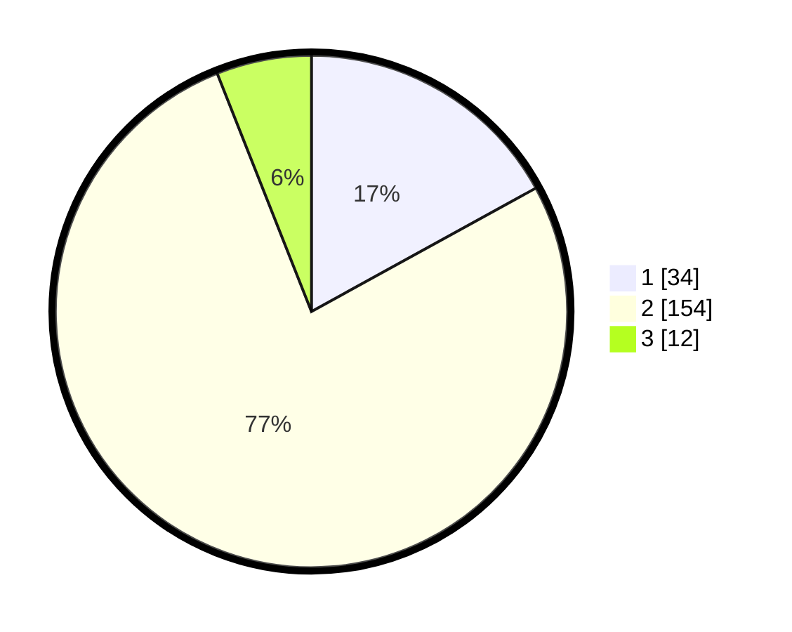

# Hasil

## Grafik

## Tabel

| No. | Nama Paslon    | Suara | Suara (raw) | Persentase |
|:--- |:-------------- | -----:| -----------:| ----------:|
| 1   | ANIES MUHAIMIN | 34    | [34][p-1]   | 17,00      |
| 2   | PRABOWO GIBRAN | 154   | [154][p-2]  | 77,00      |
| 3   | GANJAR MAHFUD  | 12    | [12][p-3]   | 6,00       |

[p-1]: https://github.com/gigit-pemilu/pemilu-2024/blob/main/pilpres/hitung-suara/sub/16-sumatera-selatan/sub/03-muara-enim/sub/27-panang-enim/sub/2001-lebak-budi/sub/005-tps/sub/paslon-1.txt
[p-2]: https://github.com/gigit-pemilu/pemilu-2024/blob/main/pilpres/hitung-suara/sub/16-sumatera-selatan/sub/03-muara-enim/sub/27-panang-enim/sub/2001-lebak-budi/sub/005-tps/sub/paslon-2.txt
[p-3]: https://github.com/gigit-pemilu/pemilu-2024/blob/main/pilpres/hitung-suara/sub/16-sumatera-selatan/sub/03-muara-enim/sub/27-panang-enim/sub/2001-lebak-budi/sub/005-tps/sub/paslon-3.txt

## Foto C Plano

https://sirekap-obj-formc.kpu.go.id/bcaf/pemilu/ppwp/16/03/27/20/01/1603272001005-20240215-023348--71546652-84f3-4f25-b93e-62c640497523.jpg

https://sirekap-obj-formc.kpu.go.id/bcaf/pemilu/ppwp/16/03/27/20/01/1603272001005-20240215-023507--713aff86-c7dc-4e6c-9860-e4fe402f07bc.jpg

https://sirekap-obj-formc.kpu.go.id/bcaf/pemilu/ppwp/16/03/27/20/01/1603272001005-20240215-023606--09ed6ada-4f50-4a04-99a5-d795c794cb1a.jpg

## Metadata

| Key        | Value               |
| ---------- | ------------------- |
| Time Stamp | 2024-02-24 22:31:28 |

