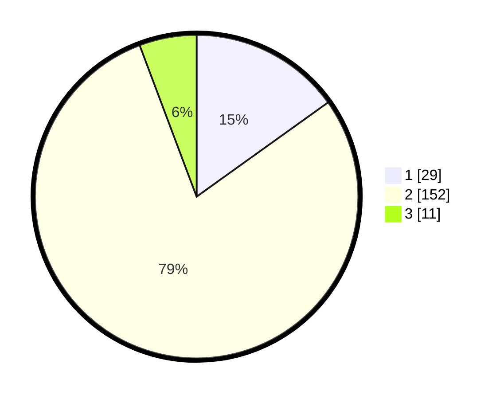

# Hasil

## Grafik

## Tabel

| No. | Nama Paslon    | Suara | Suara (raw) | Persentase |
|:--- |:-------------- | -----:| -----------:| ----------:|
| 1   | ANIES MUHAIMIN | 29    | [29][p-1]   | 15,10      |
| 2   | PRABOWO GIBRAN | 152   | [152][p-2]  | 79,17      |
| 3   | GANJAR MAHFUD  | 11    | [11][p-3]   | 5,73       |

[p-1]: https://github.com/gigit-pemilu/pemilu-2024-16-sumatera-selatan/blob/main/pilpres/hitung-suara/sub/16-sumatera-selatan/sub/03-muara-enim/sub/27-panang-enim/sub/2001-lebak-budi/sub/007-tps/sub/paslon-1.txt
[p-2]: https://github.com/gigit-pemilu/pemilu-2024-16-sumatera-selatan/blob/main/pilpres/hitung-suara/sub/16-sumatera-selatan/sub/03-muara-enim/sub/27-panang-enim/sub/2001-lebak-budi/sub/007-tps/sub/paslon-2.txt
[p-3]: https://github.com/gigit-pemilu/pemilu-2024-16-sumatera-selatan/blob/main/pilpres/hitung-suara/sub/16-sumatera-selatan/sub/03-muara-enim/sub/27-panang-enim/sub/2001-lebak-budi/sub/007-tps/sub/paslon-3.txt

## Foto C Plano

https://sirekap-obj-formc.kpu.go.id/db68/pemilu/ppwp/16/03/27/20/01/1603272001007-20240215-133043--b67dd3dc-f586-427c-81fe-cbc34dc3ea29.jpg

https://sirekap-obj-formc.kpu.go.id/db68/pemilu/ppwp/16/03/27/20/01/1603272001007-20240215-003132--3508363d-b267-4f43-9ea3-cb5a35a2b449.jpg

https://sirekap-obj-formc.kpu.go.id/db68/pemilu/ppwp/16/03/27/20/01/1603272001007-20240214-211245--3872b74f-e4ee-4306-8dc2-e8af2626bc54.jpg

## Metadata

| Key        | Value               |
| ---------- | ------------------- |
| Time Stamp | 2024-02-25 00:00:00 |

