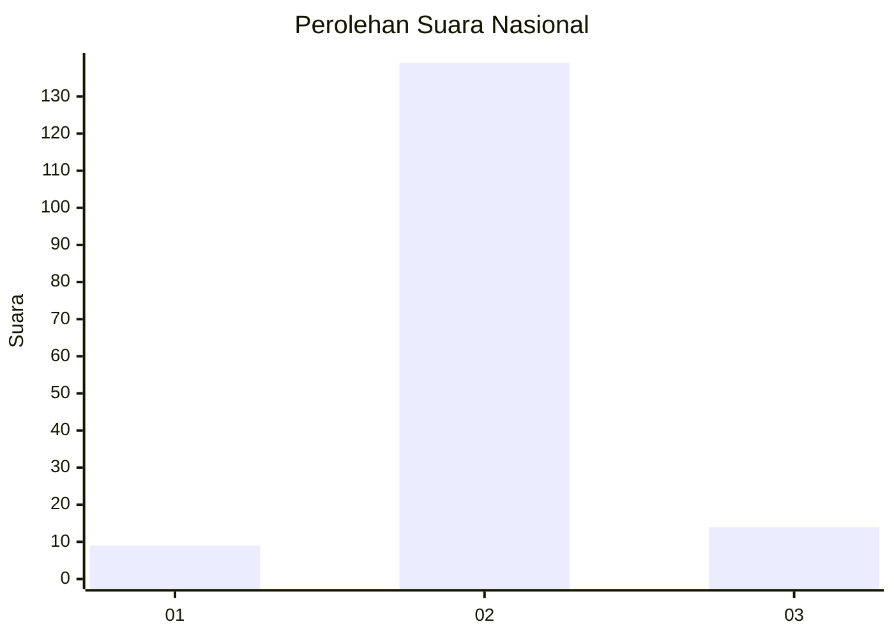
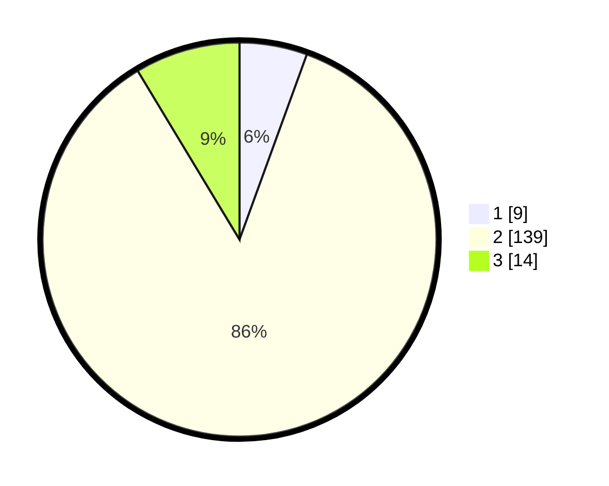

# Hasil

## Grafik

## Tabel

| No. | Nama Paslon    | Suara | Suara (raw) | Persentase |
|:--- |:-------------- | -----:| -----------:| ----------:|
| 1   | ANIES MUHAIMIN | 9     | [9][p-1]    | 5,56       |
| 2   | PRABOWO GIBRAN | 139   | [139][p-2]  | 85,80      |
| 3   | GANJAR MAHFUD  | 14    | [14][p-3]   | 8,64       |

[p-1]: https://github.com/gigit-pemilu/pemilu-2024/blob/main/pilpres/hitung-suara/sub/16-sumatera-selatan/sub/03-muara-enim/sub/27-panang-enim/sub/2002-lambur/sub/002-tps/sub/paslon-1.txt
[p-2]: https://github.com/gigit-pemilu/pemilu-2024/blob/main/pilpres/hitung-suara/sub/16-sumatera-selatan/sub/03-muara-enim/sub/27-panang-enim/sub/2002-lambur/sub/002-tps/sub/paslon-2.txt
[p-3]: https://github.com/gigit-pemilu/pemilu-2024/blob/main/pilpres/hitung-suara/sub/16-sumatera-selatan/sub/03-muara-enim/sub/27-panang-enim/sub/2002-lambur/sub/002-tps/sub/paslon-3.txt

## Foto C Plano

https://sirekap-obj-formc.kpu.go.id/c1b4/pemilu/ppwp/16/03/27/20/02/1603272002002-20240215-080745--9296cc9b-0bb0-4eef-95b0-64af60f68c67.jpg

https://sirekap-obj-formc.kpu.go.id/c1b4/pemilu/ppwp/16/03/27/20/02/1603272002002-20240215-080845--fe04e7af-2734-405d-b431-b296d6d09f6f.jpg

https://sirekap-obj-formc.kpu.go.id/c1b4/pemilu/ppwp/16/03/27/20/02/1603272002002-20240215-080953--865627fa-0d45-464f-b810-8ff3e781aad0.jpg

## Metadata

| Key        | Value               |
| ---------- | ------------------- |
| Time Stamp | 2024-02-25 16:00:00 |

