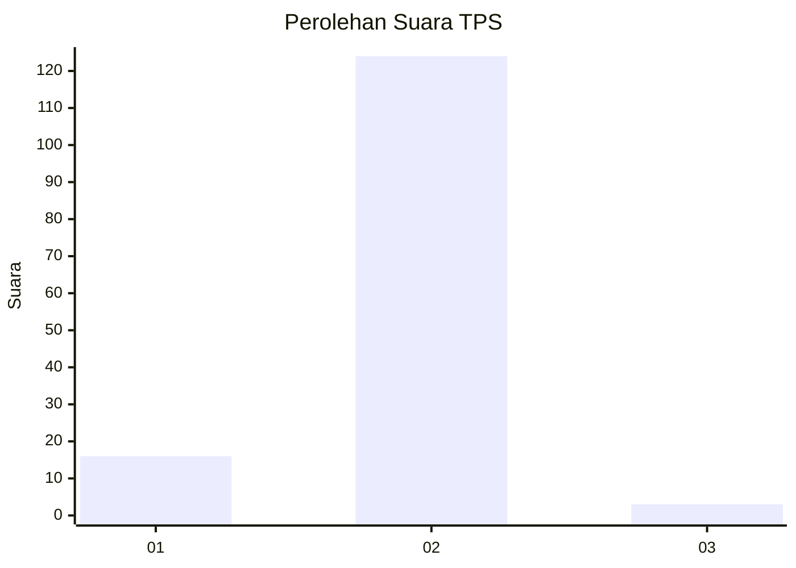
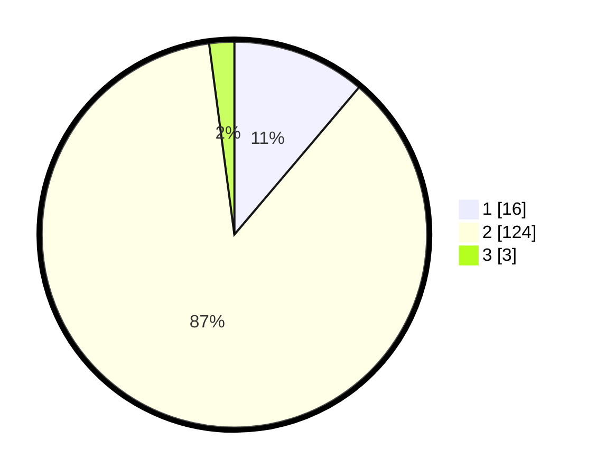

# Hasil

## Grafik

## Tabel

| No. | Nama Paslon    | Suara | Suara (raw) | Persentase |
|:--- |:-------------- | -----:| -----------:| ----------:|
| 1   | ANIES MUHAIMIN | 16    | [16][p-1]   | 11,19      |
| 2   | PRABOWO GIBRAN | 124   | [124][p-2]  | 86,71      |
| 3   | GANJAR MAHFUD  | 3     | [3][p-3]    | 2,10       |

[p-1]: https://github.com/gigit-pemilu/pemilu-2024-16-sumatera-selatan/blob/main/pilpres/hitung-suara/sub/16-sumatera-selatan/sub/03-muara-enim/sub/27-panang-enim/sub/2003-pagar-jati/sub/002-tps/sub/paslon-1.txt
[p-2]: https://github.com/gigit-pemilu/pemilu-2024-16-sumatera-selatan/blob/main/pilpres/hitung-suara/sub/16-sumatera-selatan/sub/03-muara-enim/sub/27-panang-enim/sub/2003-pagar-jati/sub/002-tps/sub/paslon-2.txt
[p-3]: https://github.com/gigit-pemilu/pemilu-2024-16-sumatera-selatan/blob/main/pilpres/hitung-suara/sub/16-sumatera-selatan/sub/03-muara-enim/sub/27-panang-enim/sub/2003-pagar-jati/sub/002-tps/sub/paslon-3.txt

## Foto C Plano

https://sirekap-obj-formc.kpu.go.id/d786/pemilu/ppwp/16/03/27/20/03/1603272003002-20240214-200625--048c2f0b-ee4e-4cc1-97a0-b9b1b1d5dbaa.jpg

https://sirekap-obj-formc.kpu.go.id/d786/pemilu/ppwp/16/03/27/20/03/1603272003002-20240215-010342--316cb855-cd31-4a19-8a5c-01c024ebbd2d.jpg

https://sirekap-obj-formc.kpu.go.id/d786/pemilu/ppwp/16/03/27/20/03/1603272003002-20240214-200943--b24731a4-561c-4cd0-8d75-5898fb314eec.jpg

## Metadata

| Key        | Value               |
| ---------- | ------------------- |
| Time Stamp | 2024-02-25 17:00:00 |

