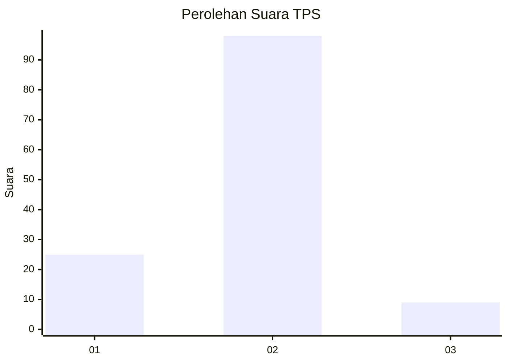
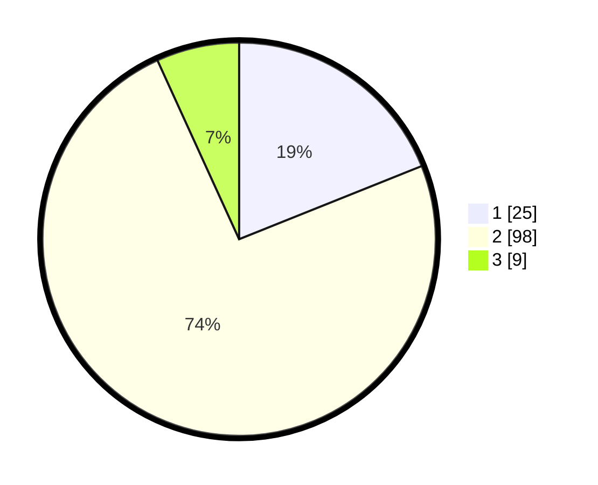

# Hasil

## Grafik

## Tabel

| No. | Nama Paslon    | Suara | Suara (raw) | Persentase |
|:--- |:-------------- | -----:| -----------:| ----------:|
| 1   | ANIES MUHAIMIN | 25    | [25][p-1]   | 18,94      |
| 2   | PRABOWO GIBRAN | 98    | [98][p-2]   | 74,24      |
| 3   | GANJAR MAHFUD  | 9     | [9][p-3]    | 6,82       |

[p-1]: https://github.com/gigit-pemilu/pemilu-2024-16-sumatera-selatan/blob/main/pilpres/hitung-suara/sub/16-sumatera-selatan/sub/03-muara-enim/sub/27-panang-enim/sub/2006-pandan-dulang/sub/002-tps/sub/paslon-1.txt
[p-2]: https://github.com/gigit-pemilu/pemilu-2024-16-sumatera-selatan/blob/main/pilpres/hitung-suara/sub/16-sumatera-selatan/sub/03-muara-enim/sub/27-panang-enim/sub/2006-pandan-dulang/sub/002-tps/sub/paslon-2.txt
[p-3]: https://github.com/gigit-pemilu/pemilu-2024-16-sumatera-selatan/blob/main/pilpres/hitung-suara/sub/16-sumatera-selatan/sub/03-muara-enim/sub/27-panang-enim/sub/2006-pandan-dulang/sub/002-tps/sub/paslon-3.txt

## Foto C Plano

https://sirekap-obj-formc.kpu.go.id/68db/pemilu/ppwp/16/03/27/20/06/1603272006002-20240214-235422--4de4891e-4bdd-4d42-87f5-afe977ddcfec.jpg

https://sirekap-obj-formc.kpu.go.id/68db/pemilu/ppwp/16/03/27/20/06/1603272006002-20240215-094652--a2bdc67f-b7e3-49fe-b428-16037af716c6.jpg

https://sirekap-obj-formc.kpu.go.id/68db/pemilu/ppwp/16/03/27/20/06/1603272006002-20240215-094844--baacd4d9-4d69-43da-893b-2de93475e1d5.jpg

## Metadata

| Key        | Value               |
| ---------- | ------------------- |
| Time Stamp | 2024-02-25 18:00:00 |

