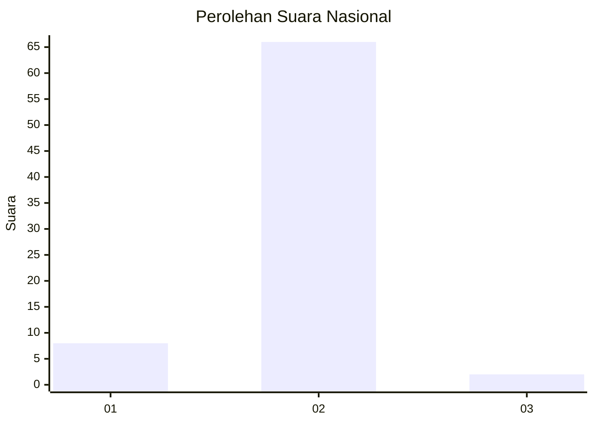
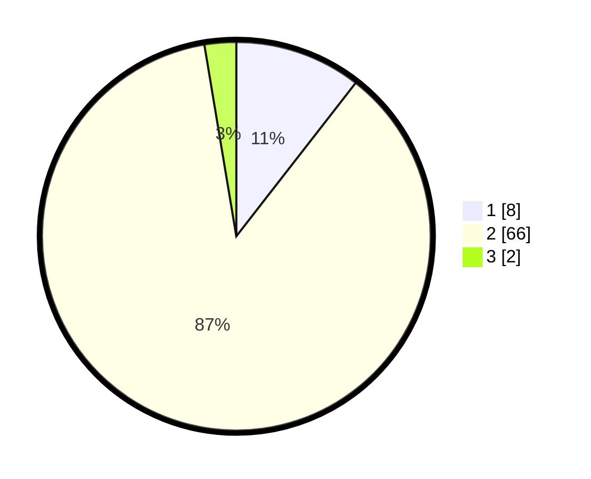

# Hasil

## Grafik

## Tabel

| No. | Nama Paslon    | Suara | Suara (raw) | Persentase |
|:--- |:-------------- | -----:| -----------:| ----------:|
| 1   | ANIES MUHAIMIN | 8     | [8][p-1]    | 10,53      |
| 2   | PRABOWO GIBRAN | 66    | [66][p-2]   | 86,84      |
| 3   | GANJAR MAHFUD  | 2     | [2][p-3]    | 2,63       |

[p-1]: https://github.com/gigit-pemilu/pemilu-2024/blob/main/pilpres/hitung-suara/sub/16-sumatera-selatan/sub/03-muara-enim/sub/27-panang-enim/sub/2011-padang-bindu/sub/004-tps/sub/paslon-1.txt
[p-2]: https://github.com/gigit-pemilu/pemilu-2024/blob/main/pilpres/hitung-suara/sub/16-sumatera-selatan/sub/03-muara-enim/sub/27-panang-enim/sub/2011-padang-bindu/sub/004-tps/sub/paslon-2.txt
[p-3]: https://github.com/gigit-pemilu/pemilu-2024/blob/main/pilpres/hitung-suara/sub/16-sumatera-selatan/sub/03-muara-enim/sub/27-panang-enim/sub/2011-padang-bindu/sub/004-tps/sub/paslon-3.txt

## Foto C Plano

https://sirekap-obj-formc.kpu.go.id/587f/pemilu/ppwp/16/03/27/20/11/1603272011004-20240214-211532--572067ce-a639-4eee-94f5-90548392101f.jpg

https://sirekap-obj-formc.kpu.go.id/587f/pemilu/ppwp/16/03/27/20/11/1603272011004-20240214-234758--fc1b037c-b073-45b8-8801-e58e0316d353.jpg

https://sirekap-obj-formc.kpu.go.id/587f/pemilu/ppwp/16/03/27/20/11/1603272011004-20240215-090452--413212d3-648f-4c8b-bfd6-cb592b4b9ee2.jpg

## Metadata

| Key        | Value               |
| ---------- | ------------------- |
| Time Stamp | 2024-02-25 12:00:00 |

