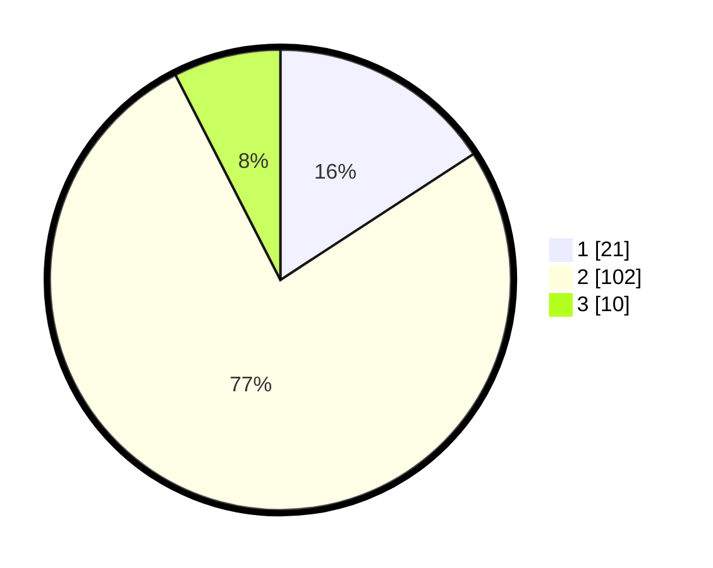

# Hasil

## Grafik

## Tabel

| No. | Nama Paslon    | Suara | Suara (raw) | Persentase |
|:--- |:-------------- | -----:| -----------:| ----------:|
| 1   | ANIES MUHAIMIN | 21    | [21][p-1]   | 15,79      |
| 2   | PRABOWO GIBRAN | 102   | [102][p-2]  | 76,69      |
| 3   | GANJAR MAHFUD  | 10    | [10][p-3]   | 7,52       |

[p-1]: https://github.com/gigit-pemilu/pemilu-2024-16-sumatera-selatan/blob/main/pilpres/hitung-suara/sub/16-sumatera-selatan/sub/04-lahat/sub/06-jarai/sub/2028-gunung-megang/sub/001-tps/sub/paslon-1.txt
[p-2]: https://github.com/gigit-pemilu/pemilu-2024-16-sumatera-selatan/blob/main/pilpres/hitung-suara/sub/16-sumatera-selatan/sub/04-lahat/sub/06-jarai/sub/2028-gunung-megang/sub/001-tps/sub/paslon-2.txt
[p-3]: https://github.com/gigit-pemilu/pemilu-2024-16-sumatera-selatan/blob/main/pilpres/hitung-suara/sub/16-sumatera-selatan/sub/04-lahat/sub/06-jarai/sub/2028-gunung-megang/sub/001-tps/sub/paslon-3.txt

## Foto C Plano

https://sirekap-obj-formc.kpu.go.id/e536/pemilu/ppwp/16/04/06/20/28/1604062028001-20240215-012502--5ccc0495-b4fe-4a6e-82a7-a848af1ee921.jpg

https://sirekap-obj-formc.kpu.go.id/e536/pemilu/ppwp/16/04/06/20/28/1604062028001-20240215-020012--a4a028e7-2d8a-406d-8766-23f3c697b7da.jpg

https://sirekap-obj-formc.kpu.go.id/e536/pemilu/ppwp/16/04/06/20/28/1604062028001-20240215-020138--e6fc7c86-4644-44ad-9795-9d6ca6116063.jpg

## Metadata

| Key        | Value               |
| ---------- | ------------------- |
| Time Stamp | 2024-02-15 12:00:28 |

