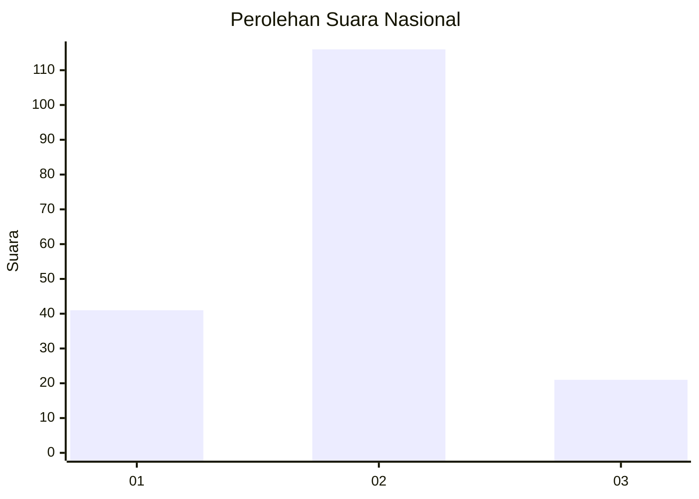
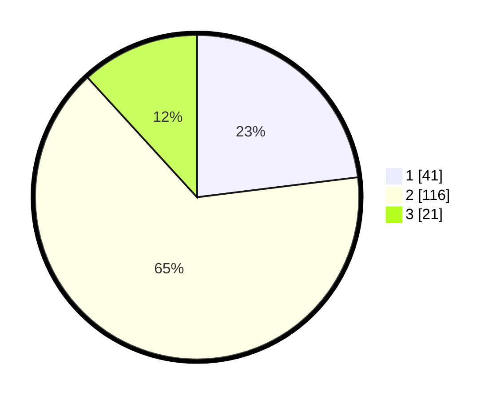

# Hasil

## Grafik

## Tabel

| No. | Nama Paslon    | Suara | Suara (raw) | Persentase |
|:--- |:-------------- | -----:| -----------:| ----------:|
| 1   | ANIES MUHAIMIN | 41    | [41][p-1]   | 23,03      |
| 2   | PRABOWO GIBRAN | 116   | [116][p-2]  | 65,17      |
| 3   | GANJAR MAHFUD  | 21    | [21][p-3]   | 11,80      |

[p-1]: https://github.com/gigit-pemilu/pemilu-2024/blob/main/pilpres/hitung-suara/sub/16-sumatera-selatan/sub/04-lahat/sub/07-kota-agung/sub/2001-bangke/sub/001-tps/sub/paslon-1.txt
[p-2]: https://github.com/gigit-pemilu/pemilu-2024/blob/main/pilpres/hitung-suara/sub/16-sumatera-selatan/sub/04-lahat/sub/07-kota-agung/sub/2001-bangke/sub/001-tps/sub/paslon-2.txt
[p-3]: https://github.com/gigit-pemilu/pemilu-2024/blob/main/pilpres/hitung-suara/sub/16-sumatera-selatan/sub/04-lahat/sub/07-kota-agung/sub/2001-bangke/sub/001-tps/sub/paslon-3.txt

## Foto C Plano

https://sirekap-obj-formc.kpu.go.id/d48e/pemilu/ppwp/16/04/07/20/01/1604072001001-20240214-211634--b7e12221-bda6-418f-8e45-7bec967b832e.jpg

https://sirekap-obj-formc.kpu.go.id/d48e/pemilu/ppwp/16/04/07/20/01/1604072001001-20240215-015021--926aae67-29c7-4b93-a69a-561d0606bd94.jpg

https://sirekap-obj-formc.kpu.go.id/d48e/pemilu/ppwp/16/04/07/20/01/1604072001001-20240215-025855--786d291f-3c49-4786-955a-78b2c3d20f82.jpg

## Metadata

| Key        | Value               |
| ---------- | ------------------- |
| Time Stamp | 2024-02-15 19:30:26 |

